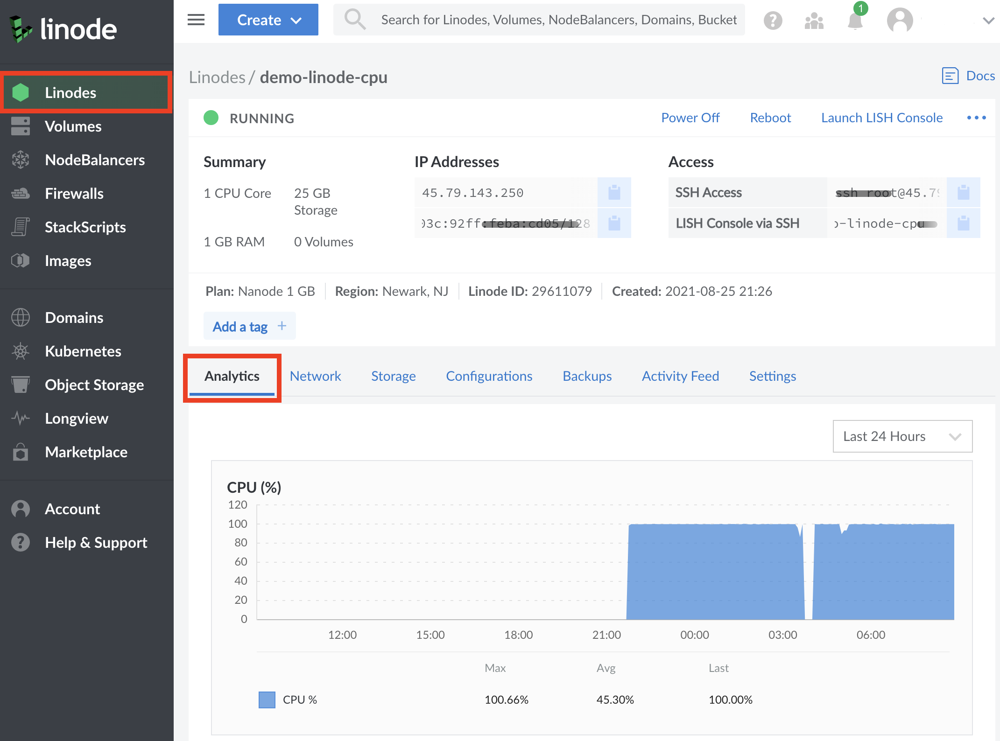

Each Linode Compute Instance is equipped with shared CPU cores or dedicated CPU cores. Understanding the difference between these is key to determining the best plan for your workloads. This guide outlines those differences and aims to help you evaluate your current cloud workloads to determine if plans with dedicated CPU cores would be beneficial.

## Comparing CPU Types

The following chart outlines the key differences between shared CPUs and dedicated CPUs, including maximum allowed utilization, CPU contention, and recommended use cases.

| | Shared CPUs | Dedicated CPUs |
| -- | -- | -- |
| **CPU allocation**  | Physical CPU cores may be shared with other neighboring Compute Instances. | Physical CPU cores are reserved just for this Compute Instance. |
| **Maximum *sustained* CPU utilization (24/7)** | 80% | 100% |
| **Maximum *burst* CPU utilization** | 100% | 100% |
| **CPU contention** | Can be expected during peak usage. | No. |
| **Recommended Use Cases** | Best for development servers, staging servers, low traffic websites, personal blogs, and production applications that may not be affected by resource contention. | Best for production websites, enterprise applications, high traffic databases, and any application that requires 100% sustained CPU usage or may be impacted by resource contention. |
| **Plans** | [Shared CPU](/docs/products/compute/shared-cpu/) | [Dedicated CPU](/docs/products/compute/dedicated-cpu/), [High Memory](/docs/products/compute/high-memory/), [GPU](/docs/products/compute/gpu/) |

## How Physical CPU Cores Are Managed on Virtual Machines

All Compute Instances on the Linode platform are cloud-based virtual machines that are equipped with various amounts of CPU cores, memory, storage space, and other resources. These Compute Instances live on powerful physical servers that are outfitted with enterprise-grade CPUs containing a high number of CPU cores. A hypervisor (virtualization software) is used to create virtual machines on these servers and manage the allocation and scheduling of physical resources. Specific to the topic of this guide, hypervisors manage the scheduling of CPU cycles - mapping CPU execution tasks from Compute Instances (virtual CPU cores) to the physical server (physical CPU cores).

In a **Shared CPU** environment, there may be more virtual CPU cores allocated to Compute Instances than there are physical CPU cores on the server's hardware. In other words, Compute Instances may be sharing physical CPU cores. This means that your CPU requests (or *tasks*) may need to wait in line while tasks from other neighboring Compute Instances are processed. In many cases, this delay in execution is imperceptible. However, when multiple neighboring Compute Instances each have high CPU utilization, you may notice degraded performance in the form of CPU contention or *CPU steal*. CPU steal occurs when the hypervisor instructs different virtual machines to access physical CPU resources faster than the hypervisor is able to cleanly manage. With Shared CPU instances, some level of contention is expected, though we do our best to keep contention down to an absolute minimum.

In a **Dedicated CPU** environment, virtual CPU cores on a Compute Instances are mapped to their own physical CPU cores. These CPU cores are not shared with neighboring Compute Instances. This allows for a higher level of constant predictable performance for full-duty work and opens up the ability to use your instance's CPU at its absolute maximum capacity (100% CPU utilization all day, every day).

## When to Choose Shared or Dedicated CPUs

**Shared CPUs** are more affordable and thus may provide a higher value, especially for workloads that are not CPU intensive and when consistently high CPU performance is not needed. Workloads suited to Shared CPU instances include development servers, staging servers, low traffic websites, personal blogs, and production applications that may not be affected by resource contention. See [Shared CPU > Recommended Workloads](/docs/products/compute/shared-cpu/#recommended-workloads).

**Dedicated CPUs** are recommended for most production applications and any application that requires 100% sustained usage or might be impacted by resource contention. This includes eCommerce sites, business applications, game servers, CI/CD toolchains, audio and video transcoding, machine learning, scientific computing, high traffic databases, and much more. For more information on these use cases and whether or not your use case may be a good fit for Dedicated CPU, see our guide on [Use Cases for Dedicated CPU](/docs/guides/dedicated-cpu-use-cases/).

The following questions may also guide you in choosing shared CPU cores or dedicated CPU cores.

- Is my server performance critical to the success of my business, app, or other use case?
- Will visitors to my server leave if performance degrades?
- Is my workload unable to accept the uncertainty of my neighbors on the host server?

If you answered yes to any of the above, you should start with, or move to, a plan with dedicated CPUs.

## Diagnosing Shared CPU Performance

If you are using a Shared instance and suspect that contention may be impacting your workload, you may want to see how much steal your CPU is currently experiencing. Diagnosing contention requires internal access to your instance over SSH, then running and understanding diagnostic commands.

The first test that should be performed is to run the `iostat` command for a period of time to get a wide array of data. By using the `-c` flag, the `iostat` command can focus specifically on data for the CPU. In the following example, steal data is outputted every `1` second, for a total of `10` seconds.

    sudo iostat -c 1 10

When reviewing output, the main column to focus on is `%steal`, followed by `%user`. The `%steal` column shows how much of your CPU is currently being utilized due to contention, while the `%user` column shows how much of the CPU is being utilized at the user level. A instance that isn't experiencing any contention and has a small workload would see output resembling the following:


avg-cpu:  %user   %nice %system %iowait  %steal   %idle
           0.11    0.00    0.10    0.01    0.06   99.71

avg-cpu:  %user   %nice %system %iowait  %steal   %idle
           0.00    0.00    0.00    0.00    0.00  100.00

avg-cpu:  %user   %nice %system %iowait  %steal   %idle
           0.00    0.00    0.00    0.00    0.00  100.00


However, an instance that is experiencing contention will see CPU steal that can be as high as several percentage points. The following for example, reflects a instance that is encountering a low level of steal:


avg-cpu:  %user   %nice %system %iowait  %steal   %idle
           88.11    0.00    0.10    0.01    10.06   0.14

avg-cpu:  %user   %nice %system %iowait  %steal   %idle
           86.00    0.00    0.00    0.00    12.00  1.69

avg-cpu:  %user   %nice %system %iowait  %steal   %idle
           89.00    0.00    0.00    0.00    9.91  1.78


It's important to keep in mind that while some steal won't usually have a noticeable impact on smaller workloads, it can have a larger impact on a system that is already using a significant amount of it's available CPU. In the latter example, this user should absolutely consider an upgrade to a dedicated CPU to boost their performance. It's worth keeping in mind that this test only reflects steal occurring at the moment that this test is performed, and there is no guarantee that steal cannot or will not occur in the future. Generally, in shared hosting, some level of steal can be expected.

## Viewing CPU Usage Graphs

By default, the Cloud Manager will log a history of resource usage and plot CPU data to a graph. We recommend observing CPU usage in the Cloud Manager if you're unsure of upgrading to a Dedicated CPU, because it will have the most amount of data pertaining to the lifetime of your instance. By looking at your CPU graph, you'll be empowered to make a value based judgement on any possible upgrade you may need.

1. To investigate CPU usage on the Cloud Manager, log in and click on the Linodes sidebar menu.

1. Select the instance you'd like to inspect further.

1. By default, the `analytics` tab for the instance will be automatically selected, and directly underneath the CPU usage graph will be observable.

Generally, when observing the CPU graph, good candidates for an upgrade to a Dedicated CPU will have high and often relatively steady CPU usage. That being said, this does not necessarily need to be constant and may have high peaks that reflect a possibility for improvement with a Dedicated CPU.

## What If I Need More Specialized Resources Than a Dedicated CPU?

If you find that a Dedicated CPU alone is not enough for your workload and you may benefit from something more specialized, then you may be interested in service offerings that come with more or different resources than a Dedicated CPU alone can provide. [High Memory](/docs/products/compute/high-memory/) plans feature higher RAM allocations than a standard plan with relatively fewer vCPUs and less storage. This can help to keep your costs down and provide power to memory-intensive applications.

Additionally, [GPU instances](/docs/products/compute/gpu/) provide access to NVIDIA Quadro RTX 6000 GPU cards with Tensor, ray tracing (RT), and CUDA cores. GPUs are designed to process large blocks of data in parallel, meaning that they are an excellent choice for any workload requiring thousands of simultaneous threads. With significantly more logical cores than a standard CPU alone, GPUs can perform computations that process large amounts of data in parallel more efficiently.

As of June 16, 2020, all High Memory and GPU plans utilize dedicated CPU cores by default, as part of the package including the specialized resources they provide.

## How to Upgrade Your Shared Instance

For more information on how to upgrade or resize your shared instance, consult our [Resizing a Linode](/docs/guides/resizing-a-linode/) guide.