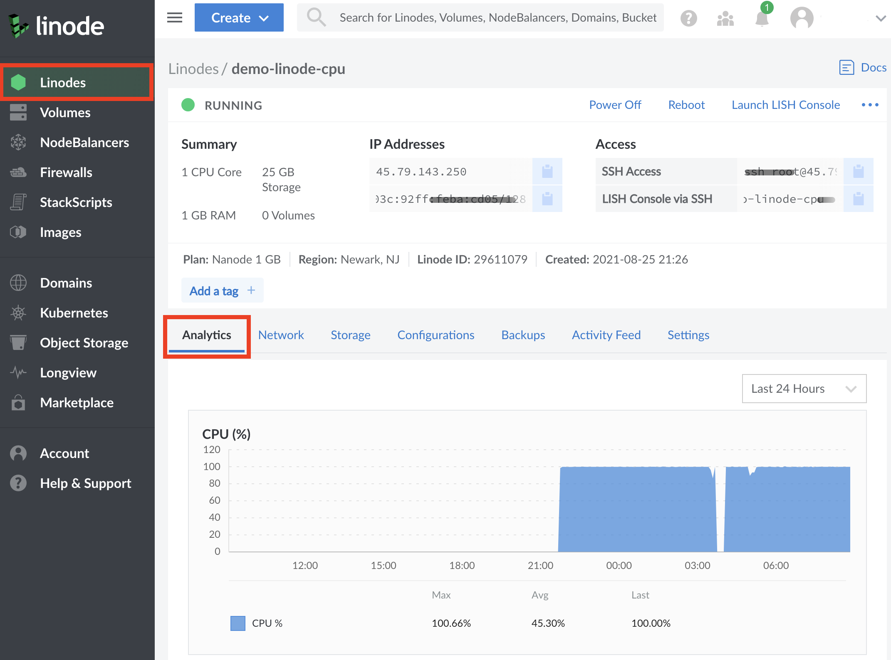

## In This Guide

In this guide, you learn how to evaluate your current Shared CPU workloads through manual diagnosis, Linode Cloud Manager analytics, and attributes of your use case, to determine if upgrading to a Dedicated CPU instance would be of benefit.

## Understanding Shared Hosting

To best understand the performance differences between Dedicated instances and Shared instances, it's important to understand what Shared Hosting really means as a term for general use and how it applies to performance.

Shared Hosting, as the name implies, describes a hosting service in which customers "share" access to a powerful physical CPU behind a **Hypervisor**, or a virtualization layer, which is responsible for separating physical resources and allocating them to virtual machines. The proliferation of this approach to server hosting set the foundation for the Cloud as we know it today. However in practice, this means that while Shared instances _do_ have access to the full number of cores that their plan has allocated to them, if neighboring instances have high CPU usage, then instances on the host may see degraded performance in the form of contention or  **CPU Steal**. CPU Steal is what occurs when the hypervisor instructs different virtual machines to access physical CPU resources faster than the hypervisor is able to cleanly manage. In terms of performance, this can appear as an instance being unable to access CPU cores that it has otherwise been allocated. While contention can occur for many reasons, it most commonly occurs in Cloud Hosting environments like Linode when a virtual machine process is being instructed to wait to access CPU resources due to high load.

With Shared instances, some level of contention can almost always be expected, as all customers on a host are entitled to the maximum amount of CPU resources their plan includes. While at Linode we do our best to keep contention down to an absolute minimum, the reality is that it is an inevitability when working in a shared hosting environment.

Shared hosting helps to make Cloud services more affordable, especially for use cases where the maximum number of CPU resources aren't needed with any urgency and some liberty can be taken with overall performance. Some of these use cases can include:

- Personal Blogs
- Personal Projects
- Forums
- Development Environments
- Simple Web Sites/Servers
- Small Low Traffic Databases

That being said, shared CPU isn't the recommended choice for many professional workloads which rely on steady service. While many users can still expect to see results if they require a more affordable solution for other use cases, most professional workloads will benefit from a dedicated CPU.

## Understanding Dedicated CPUs

In comparison to Shared instances, Dedicated CPU instances run on their own CPU cores as part of the Linode Cloud infrastructure. Hypervisor resources for Dedicated CPU instances are not shared with other instances in any capacity. This allows for a higher level of constant predictable performance for full-duty work, and opens up the ability to use your instance's CPU at its absolute maximum capacity (100% CPU all day, every day).

While Dedicated CPU is recommended for most professional use cases where peak performance at all times is key, there are some more notable cases which will see the highest level of benefit. Any time you notice a high and steady level of CPU usage for example, or otherwise are in a position which applies more strain on your CPU frequently, Dedicated CPUs may be less of a recommendation and more of a need. The following use cases specifically tend to see more dramatic performance benefits from a dedicated CPU.

- Production Websites for eCommerce, Businesses, and Apps
- CI/CD Toolchains and Build Servers
- Game Servers
- Audio and Video Transcoding
- Big Data and Data analysis
- Scientific Computing and Data Science
- Machine Learning and AI
- High Traffic Databases (Galera, PostgreSQL with Replication Manager, MongoDB using Replication Sets)
- Replicated or Distributed Filesystems (GlusterFS, DRBD)

For more information on these use cases and whether or not your use case may be a good fit for Dedicated CPU, see our guide on [Use Cases for Dedicated CPU](/docs/guides/dedicated-cpu-use-cases/).

Additionally, you may ask yourself some of the following questions:
- Is my server performance critical to the success of my business, app, or other use case?
- Will visitors to my server leave if performance degrades?
- Is my workload unable to accept the uncertainty of my neighbors on the host server?

If you answered yes to any of the above, you should start with, or move to, a Dedicated CPU instance.

## Diagnosing Shared CPU Performance

If you are using a Shared instance and suspect that contention may be impacting your workload, you may want to see how much steal your CPU is currently experiencing. Diagnosing contention requires internal access to your instance over SSH, then running and understanding diagnostic commands.

The first test that should be performed is to run the `iostat` command for a period of time to get a wide array of data. By using the `-c` flag, the `iostat` command can focus specifically on data for the CPU. In the following example, steal data is outputted every `1` second, for a total of `10` seconds.

    sudo iostat -c 1 10

When reviewing output, the main column to focus on is `%steal`, followed by `%user`. The `%steal` column shows how much of your CPU is currently being utilized due to contention, while the `%user` column shows how much of the CPU is being utilized at the user level. A instance that isn't experiencing any contention and has a small workload would see output resembling the following:


avg-cpu:  %user   %nice %system %iowait  %steal   %idle
           0.11    0.00    0.10    0.01    0.06   99.71

avg-cpu:  %user   %nice %system %iowait  %steal   %idle
           0.00    0.00    0.00    0.00    0.00  100.00

avg-cpu:  %user   %nice %system %iowait  %steal   %idle
           0.00    0.00    0.00    0.00    0.00  100.00


However, an instance that is experiencing contention will see CPU steal that can be as high as several percentage points. The following for example, reflects a instance that is encountering a low level of steal:


avg-cpu:  %user   %nice %system %iowait  %steal   %idle
           88.11    0.00    0.10    0.01    10.06   0.14

avg-cpu:  %user   %nice %system %iowait  %steal   %idle
           86.00    0.00    0.00    0.00    12.00  1.69

avg-cpu:  %user   %nice %system %iowait  %steal   %idle
           89.00    0.00    0.00    0.00    9.91  1.78


It's important to keep in mind that while some steal won't usually have a noticeable impact on smaller workloads, it can have a larger impact on a system that is already using a significant amount of it's available CPU. In the latter example, this user should absolutely consider an upgrade to a dedicated CPU to boost their performance. It's worth keeping in mind that this test only reflects steal occurring at the moment that this test is performed, and there is no guarantee that steal cannot or will not occur in the future. Generally, in shared hosting, some level of steal can be expected.

## Viewing CPU Usage Graphs

By default, the Cloud Manager will log a history of resource usage and plot CPU data to a graph. We recommend observing CPU usage in the Cloud Manager if you're unsure of upgrading to a Dedicated CPU, because it will have the most amount of data pertaining to the lifetime of your instance. By looking at your CPU graph, you'll be empowered to make a value based judgement on any possible upgrade you may need.

1. To investigate CPU usage on the Cloud Manager, log in and click on the Linodes sidebar menu.

1. Select the instance you'd like to inspect further.

1. By default, the `analytics` tab for the instance will be automatically selected, and directly underneath the CPU usage graph will be observable.

Generally, when observing the CPU graph, good candidates for an upgrade to a Dedicated CPU will have high and often relatively steady CPU usage. That being said, this does not necessarily need to be constant and may have high peaks that reflect a possibility for improvement with a Dedicated CPU.

## What If I Need More Specialized Resources Than a Dedicated CPU?

If you find that a Dedicated CPU alone is not enough for your workload and you may benefit from something more specialized, then you may be interested in service offerings that come with more or different resources than a Dedicated CPU alone can provide. [High Memory](/docs/products/compute/high-memory/) plans feature higher RAM allocations than a standard plan with relatively fewer vCPUs and less storage. This can help to keep your costs down and provide power to memory-intensive applications.

Additionally, [GPU instances](/docs/products/compute/gpu/) provide access to NVIDIA Quadro RTX 6000 GPU cards with Tensor, ray tracing (RT), and CUDA cores. GPUs are designed to process large blocks of data in parallel, meaning that they are an excellent choice for any workload requiring thousands of simultaneous threads. With significantly more logical cores than a standard CPU alone, GPUs can perform computations that process large amounts of data in parallel more efficiently.

As of June 16, 2020, all High Memory and GPU plans utilize dedicated CPU cores by default, as part of the package including the specialized resources they provide.

## How to Upgrade Your Shared Instance

For more information on how to upgrade or resize your shared instance, consult our [Resizing a Linode](/docs/guides/resizing-a-linode/) guide.