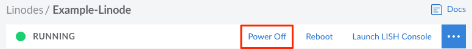
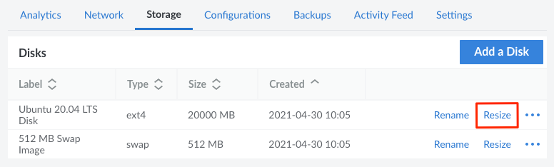

The size of a Linode Compute Instance's disk can be increased or decreased as needed. When resizing, it's important to keep the following restrictions in mind:

- The **maximum size** of a disk is equal to the current size of the disk and the remaining unallocated storage space on the Linode. The maximum size is displayed underneath the **Size** field when resizing the disk.
- The **minimum size** of a disk is equal to the current disk usage within the filesystem. This number is not displayed in the Cloud Manager. To determine how much space the files on the disk are using, run the command `df -h` within the Linode's command Line (through [SSH](/docs/guides/getting-started/#connect-to-your-linode-via-ssh) or [Lish](https://www.linode.com/docs/guides/using-the-linode-shell-lish/)).
- **Raw disks** can only be resized to a larger disk.
- Disks with **custom partitions** cannot be resized.

The following instructions cover how to resize a disk. For instructions regarding resizing a Linode Compute Instance's plan (including downgrading to a smaller plan), see the [Resizing a Linode](/docs/guides/resizing-a-linode/) guide.

1. Log in to the [Cloud Manager](https://cloud.linode.com/), click the **[Linodes](https://cloud.linode.com/linodes)** link in the sidebar, and select a Linode from the list.

1. Click the **Power Off** button in the upper right of the page or within the **ellipsis** menu. Before proceeding, wait until the Linode has been fully powered off.

    

1. On the Linode's dashboard page, navigate to the **Storage** tab.

1. Within the **Disks** table, locate the disk you wish to resize and click the corresponding **Resize** button, which may also appear within the **ellipsis** menu.

    

1.  The **Resize Disk** form is displayed. In the **Size** field, enter the new size for the disk in megabytes. The new size of the disk needs to be within the maximum and minimize disk size discussed above.

1.  Click **Resize**. The progress can be monitored from the corresponding entry for the disk within the **Disks** table on the Linode's **Storage** page.

1.  Once the disk has been successfully resized, click the **Power On** button to boot up the Linode.