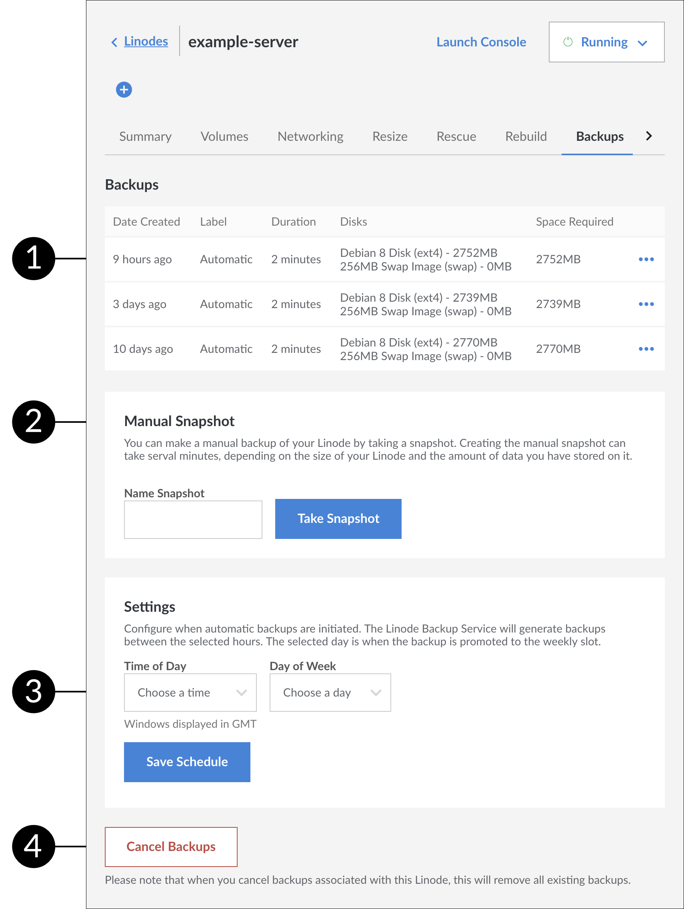

You'll manage your backups with a simple web interface in the Linode Cloud Manager. There's no software to install, and there are no commands to run. Just log in to the Linode Cloud Manager, navigate to the **Linodes** page by clicking on the link in the sidebar, select a Linode, and then click the **Backups** tab. The backups interface is shown below.

1. A list of available backups. Listed in this view are the date created, the label, how long the backup took to be created, the disks imaged, and the size of the resulting image.

1. Manually create a backup by taking a *manual snapshot*. For more information, see the [Take a Manual Snapshot](/docs/products/storage/backups/guides/take-a-snapshot/) section.

1. Configure backup schedule settings. For more information, see the [Schedule Backups](/docs/products/storage/backups/guides/schedule/) section.

1. Cancel backups. After cancelling your backups you will have to wait 24 hours before you can re-enable them again.
