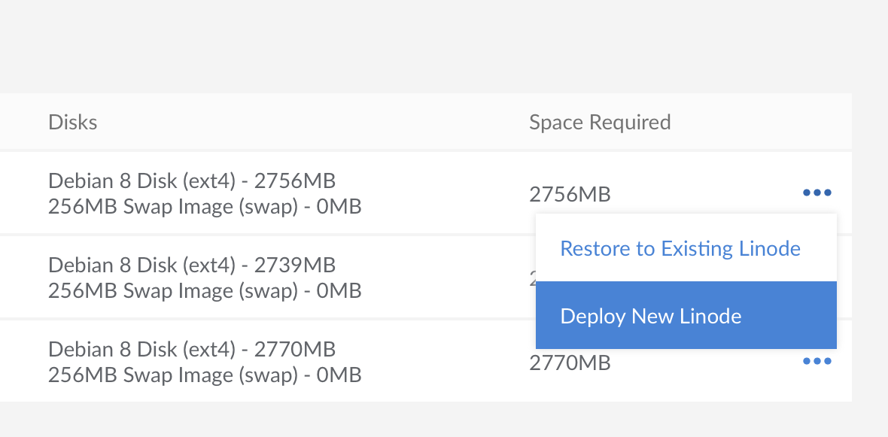

These steps cover how to restore a backup to a new Linode that does not already have any disks deployed to it. The new Linode will be located in the same data center.

To restore a backup to a different data center, first restore to a Linode in the same data center, creating a new one if necessary. Once the restore is complete, use the [Clone](/docs/migrate-to-linode/disk-images/clone-your-linode/) tab to copy the disk(s) to a Linode in a different data center.

Restoring a backup will create a new [configuration profile](/docs/platform/disk-images/disk-images-and-configuration-profiles/#configuration-profiles) and a new set of [disks](/docs/platform/disk-images/disk-images-and-configuration-profiles/#disks) on your Linode. The restore process does not restore single files or directories automatically. Restoring particular files can be done by completing a normal restore, copying the files off of the new disks, and then removing the disks afterward.


The size of the disk(s) created by the restore process will be equal to the amount of space allocated to the disk when the backup was created. In some cases, this means you may want to to reallocate disk space once the restore is complete. For more information regarding this process, see our [Disk Images and Configuration Profiles](/docs/platform/disk-images/disk-images-and-configuration-profiles/#resizing-a-disk) guide.


1.  From the **Linodes** page, select the Linode whose backups you intend to restore, and then click on the **Backups** tab. Select the **more options ellipsis** next to the backup you would like to restore, and click **Deploy New Linode**.

    

1.  You will be taken to the **Create New Linode** screen. The **Create from Backup** tab will already be selected for you, as will the fields corresponding to the Linode and backup that you are restoring from. Choose a Linode plan, enter a label for the new Linode, select any other options you prefer, and click **Create**. The new Linode will be created with the same password and SSH keys (if any) as the original.

    The backup disks and configuration profiles will be restored to the Linode you selected. Watch the notifications area for updates on the process. Restoring from a backup can take several minutes depending on the size of your Linode and the amount of data you have stored on it.