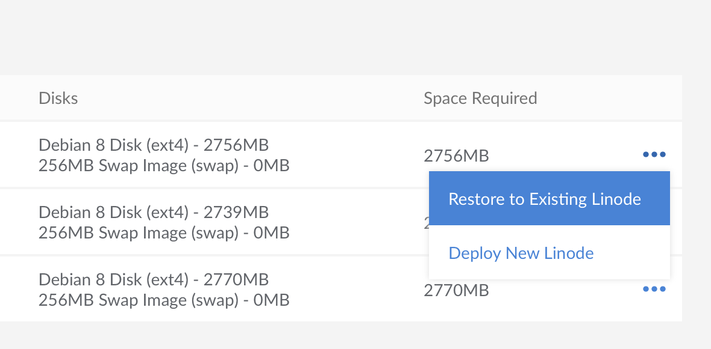
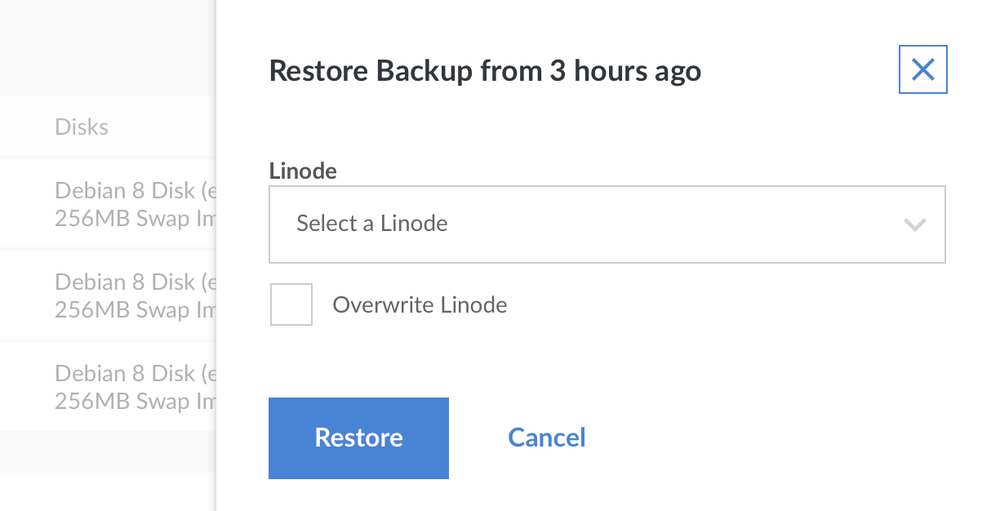

You can restore a backup to the Linode that the backup was created from. You can also restore to any other existing Linode in the same data center, even if the target does not have the Backup Service enabled. To restore a backup to an existing Linode, you will need to make sure that it has enough storage space that is not currently assigned to disk images.

To restore a backup to a different data center, first restore to a Linode in the same data center, creating a new one if necessary. Once the restore is complete, use the [Clone](/docs/migrate-to-linode/disk-images/clone-your-linode/) tab to copy the disk(s) to a Linode in a different data center.

Restoring a backup will create a new [configuration profile](/docs/platform/disk-images/disk-images-and-configuration-profiles/#configuration-profiles) and a new set of [disks](/docs/platform/disk-images/disk-images-and-configuration-profiles/#disks) on your Linode. The restore process does not restore single files or directories automatically. Restoring particular files can be done by completing a normal restore, copying the files off of the new disks, and then removing the disks afterward.


The size of the disk(s) created by the restore process will be equal to the amount of space allocated to the disk when the backup was created. In some cases, this means you may want to to reallocate disk space once the restore is complete. For more information regarding this process, see our [Disk Images and Configuration Profiles](/docs/platform/disk-images/disk-images-and-configuration-profiles/#resizing-a-disk) guide.


1.  From the **Linodes** page, select the Linode whose backups you intend to restore, and then click on the **Backups** tab. Observe the size of the backup you would like to restore, which is visible in the **Space Required** column. You will need at least this amount of unallocated disk space on the target Linode to complete the restore.

1.  Select the **more options ellipsis** next to the backup you would like to restore, and click **Restore to Existing Linode**.

    

1.  A menu will open with the Linodes that you can restore to. Select a Linode and click **Restore**.

    

    You will be notified if you do not have enough space on your Linode to restore your backup. Optionally, you can choose to overwrite the Linode you are restoring to.

1.  If the amount of unallocated space available is greater than the size of the backup, you can proceed with restoring. If the amount of unallocated space is less than the size of the backup, you can stop the restoration workflow, [resize your existing disks](/docs/platform/disk-images/disk-images-and-configuration-profiles/#resizing-a-disk) on the target Linode to make room for it, and then come back to the restore page after the disk resize operation has finished.

    
In some cases, you will not be able to shrink your disks enough to fit the restored backup. As an alternative, you can [change your Linode's plan](/docs/platform/disk-images/resizing-a-linode/) to a higher tier that offers more disk space.


1.  From the **Restore to Existing Linode** menu, click **Restore**.

    Your backup will begin restoring to your Linode, and you can monitor its progress in the notifications area. Note that the time it takes to restore your backup will vary depending upon the restore size, and the number of files being restored.

    
If you are attempting to restore a disk to the same Linode the backup was created from, the restoration process will not delete the original disk for you. Manually delete the original disk to make room for the backup, if desired.
