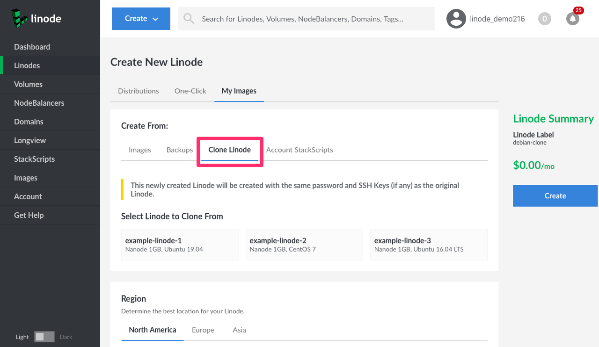
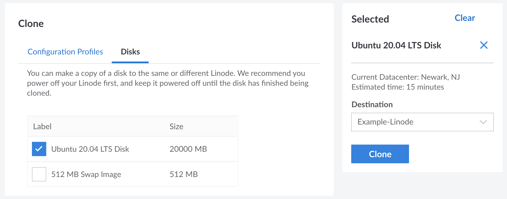

The cloning feature allows you to copy a Linode's disks (and configuration profiles) to a new or existing Linode on your account. This guide covers cloning to a new Linode.

## Cloning to a New Linode

This process copies all disks and configuration profiles to a newly created Linode on your account.


Before continuing, it's recommended to power off the Linode you would like to clone to prevent data corruption.


1. Log in to the [Cloud Manager](https://cloud.linode.com).

1. Click the **Create** dropdown menu on the top left and select **Linode**.

1. In the **Create New Linode** form, navigate to the **Clone Linode** tab.

    

1. Under **Select Linode to Clone From**, click on the Linode you wish to clone.

1. Complete the remainder of the form. Enter a label and select the region, the plan, and other options for the new Linode.

   
The plan's storage must be greater than the combined disk size of the original Linode. If you wish to select a plan with less storage, you may need to [resize your Linode's disks](/docs/guides/resize-a-linode-disk/) before cloning.


1. Click the **Create** button to start the cloning process. Cloning a Linode can be much longer than creating a new Linode based on a distribution or custom image. The length of time depends on the size of the Linode's disks, among other factors. To keep track of the cloning progress, a status bar is displayed above the original Linode with the percentage of completion.

1. Once the cloning process is complete, you need to power on the new Linode to begin using it.

  
The new Linode's IP address will be different than the original Linode. If desired, you can transfer the IP address from the original Linode to the new Linode. Swapping the IP address can prevent additional changes from being required, such as changing DNS records or the internal configuration of a Linode. See [Transferring IP Addresses](/docs/guides/remote-access/#transferring-ip-addresses).


## Cloning to an Existing Linode

This process allows you to select specific disks and configuration profiles and duplicate them to an existing Linode.

1. Log in to the [Cloud Manager](https://cloud.linode.com) and select the **Linodes** link in the left sidebar menu.

1. Locate the Linode you wish to clone and click the Linode's label, which will display the Linode's page.

1. To prevent data corruption, click the **Power off** link on the top right.

1. **To clone a disk:** Navigate to the **Storage** tab, locate the disk you wish to clone within the **Disks** table, click the **more options ellipsis** dropdown menu, and select **Clone**.

    **To clone a configuration profile:** Navigate to the **Configurations** tab, locate the profile you wish to clone within the **Config** table, click the **more options ellipsis** dropdown menu, and select **Clone**.

1. A **Clone** form appears with either the **Disks** or **Configuration Profiles** tab displayed, depending on the previous step. From here, select the exact disks and configuration profiles you wish to clone. When a configuration profile is selected, all disks assigned to it (through **Block Device Assignments**) are also selected.

    

1. In the **Destination** dropdown menu, select the destination Linode (the Linode you wish to clone to).

    
The destination Linode must have enough free storage to accommodate the disks that are to be cloned. If there's not enough free storage space, you'll need to either [resize the Linode's disks](/docs/guides/resize-a-linode-disk/) (either the original or destination Linode) or [upgrade the destination Linode to a larger plan](/docs/guides/resizing-a-linode/).


1. Click the **Clone** button to start the cloning process. The length of time this takes depends on the size of the Linode's disks (among other factors). To keep track of the cloning progress, a status bar is displayed above the original Linode with the percentage of completion.

1. Once the cloning process is complete, you may need to make changes to the destination Linode in order to begin using the disks. This involves either booting the Linode using the cloned configuration profile or adjusting the existing configuration profile to assign the cloned disks. See [Linode Configuration Profiles](/docs/guides/linode-configuration-profiles/)