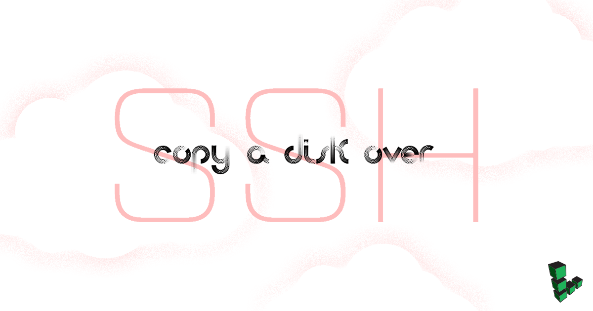
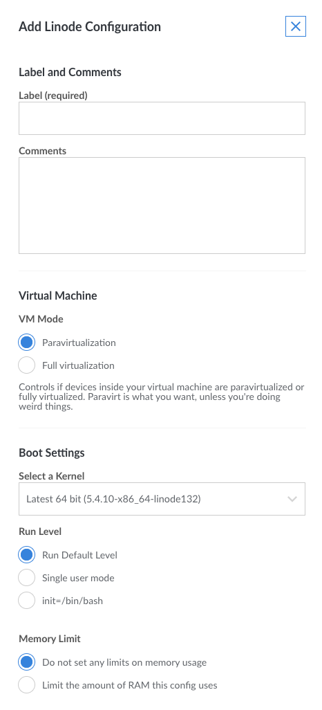

Piping SSH commands to utilities such as `dd`, `gzip`, or `rsync` is an easy way to copy a Linode's data into a single file for later extraction. This can effectively back up your Linode's disk or migrate your installed system among Linodes.

This guide demonstrates how to download a `.img` file to your computer over SSH containing a block-level copy of your Linode's disk device created with `dd`.


If the amount of data on your disk is much less than the size of the disk, then downloading a copy with `dd` can take longer than just downloading your files. If you're interested in downloading individual files or directories, review the options listed in our [Download Files from Your Linode](/docs/guides/download-files-from-your-linode/) and [Backing Up Your Data](/docs/guides/backing-up-your-data/) guides.


## Download a Disk over SSH

This guide shows you how to download a Linode's disk image over SSH to a separate receiving system, like a personal computer, by executing commands on both the **Origin Linode** as the origin of your disk image, and the **Receiving System** which will receive a copy of this image. The terms "origin Linode" and "receiving system" are used throughout this guide to describe these two separate environments.

While this guide has been written to accommodate computers running Linux as their operating system, if the receiving system is instead running Microsoft Windows, there are multiple SSH solutions available such as [Cygwin and PuTTY](/docs/guides/using-ssh-on-windows) which can alternatively be used to complete this process.

### Boot Linode into Rescue Mode

1.  Reboot Your origin Linode into [Rescue Mode](/docs/guides/rescue-and-rebuild/#boot-linode-into-rescue-mode) and connect to it using [Lish](/docs/guides/remote-access/#console-access).

1.  Set a root password for the rescue system and start the SSH server:

        passwd
        service ssh start

### Copy and Download the Disk

1.  Prepare the receiving system to download the disk image by verifying that SSH is installed. Most Linux/Unix-like systems include OpenSSH in their package base by default.

1.  Copy the disk over SSH from the origin Linode to the receiving system. Run the following command on the receiving system, replacing `192.0.2.9` with the origin Linode's IP address and `/home/archive/linode.img` with the path where you want to store the disk.

        ssh root@192.0.2.9 "dd if=/dev/sda " | dd of=/home/archive/linode.img

1.  The receiving system is now connected to the Linode, prompting you to verify that the SSH key fingerprints are valid. If valid, type `yes` and press **Enter** to continue:

        The authenticity of host '192.0.2.9 (192.0.2.9)' can't be established.
        RSA key fingerprint is 39:6b:eb:05:f1:28:95:f0:da:63:17:9e:6b:6b:11:4a.
        Are you sure you want to continue connecting (yes/no)? yes

1. The receiving system is prompted to enter the root password you [created for the origin Linode in rescue mode](#boot-linode-into-rescue-mode). Enter this password now:

        Warning: Permanently added '192.0.2.9' (RSA) to the list of known hosts.
        root@192.0.2.9's password:

    When the transfer completes, you see a summary output similar to the output below:

    
        4096000+0 records in
        4096000+0 records out
        2097152000 bytes (2.1 GB) copied, 371.632 seconds, 5.6 MB/s
    

    Copying your disk can take a while. If you have a slow internet connection, add the `-C` option to the SSH command to enable gzip compression of the disk image. If you receive a `Write failed: Broken pipe` error, repeat this process.

### Verify the Disk

Once the copy has completed, verify it by mounting the image on the receiving system with the following commands.

1.  Switch to the `root` user:

        su

1.  Make a directory to mount the disk:

        mkdir linode

1.  Mount the disk in the directory created in the previous step. Replace `linode.img` with the name of your Linode's disk.

        mount -o loop linode.img linode

1.  List the directories on the disk to indicate if everything has transferred. Your output of `ls` is similar to below:

        ls linode

    
        bin   dev  home  lost+found  mnt  proc  sbin     srv  tmp  var
        boot  etc  lib   media       opt  root  selinux  sys  usr


## Upload a Disk over SSH

In some cases, it is necessary to upload your disk image to a new server. For example, if you previously downloaded your Linode disk and deleted the Linode to halt billing on it, you can create a new Linode at a later date and upload the disk to resume your services. This section of the guide assumes that you are creating a new Linode with the default primary and swap disk as outlined in the Creating a Linode section of our [Getting Started](/docs/guides/getting-started/#create-a-linode) guide.

1.  Once you've finished [Creating a New Linode](/docs/guides/getting-started/#create-a-linode) with enough disk space available to accommodate your disk image, prepare the new Linode to receive this image. This is completed by first deleting the primary disk created by default, and keeping the swap disk. A swap disk typically starts at 256 MB or 512 MB in size, but can be larger or smaller depending upon your needs.

1.  Access your Linode through the Linode Cloud Manager. Click the **Disks/Configs** tab to navigate to the Disks/Configs section.

1. On the following page in the **Disks** menu, select the ellipsis next to any primary disks you are replacing and select **Delete**.

1. Next, select **Add a Disk**.

1.  The **Add Disk** panel appears. Select the **Create Empty Disk**, enter a **Label** that you can use as a personal identifier, select the file system that matches the format of the disk that was downloaded over SSH, and enter a Size that is larger enough to hold the contents of the disk you are uploading. Click **Save Changes**.

1. Reboot Your Linode into [Rescue Mode](#boot-linode-into-rescue-mode) and start the secure SSH server using the following commands:

        passwd
        service ssh start

1. Upload the disk image you have saved remotely over SSH to the new Linode. Replace `192.0.2.9` with the Linode's IP address and `/home/archive/linode.img` with the disk images's path.

        dd if=/home/archive/linode.img | ssh root@192.0.2.9 "dd of=/dev/sda"

    When the transfer completes, you see a summary output similar to below:

    
        49807360+0 records in
        49807360+0 records out
        25501368320 bytes (26 GB) copied, 9462.12 s, 2.7 MB/s


    Copying your disk can take a while. If you receive a `Write failed: Broken pipe` error, repeat this process.

### Expand the Filesystem

If the disk you created on the new server is larger than the source disk (for example you're transferring a disk from a smaller Linode to a larger Linode), you have to resize the file system to make use of the new space.

You can check if this is necessary by comparing the space of the file system to the space of the new disk:


    root@localhost:~# df -h
    Filesystem      Size  Used Avail Use% Mounted on
    /dev/sda         24G   19G  4.0G  83% /



    root@localhost:~# lsblk
    NAME  MAJ:MIN RM  SIZE RO TYPE MOUNTPOINT
    sda     8:0    0   30G  0 disk /


In the above example, the values in the **Size** column don't match. Although the disk is 30 GB, the file system can only see 24 GB.

To use all available space on the new disk, execute the following from Rescue Mode. Replace `/dev/sdx` with your system disk's device identifier (/dev/sda, /dev/sdb, etc.).

    e2fsck -f /dev/sdx
    resize2fs /dev/sdx

### Boot from the Disk

You now need to create a new configuration profile on the receiving Linode.

1.  Select your Linode, click the **Disks/Configs** tab, then select and select **Add a Configuration**.

1.  The **Add Linode Configuration** panel appears.

    

1.  Enter a name for the configuration profile in the **Label** field, and in the **Block Device Assignment** section set the `/dev/sda` to the new system disk you created earlier in this section of the guide. Set `/dev/sdb` to the swap image.

1.  The Linode is now ready to reboot using the new system disk.
