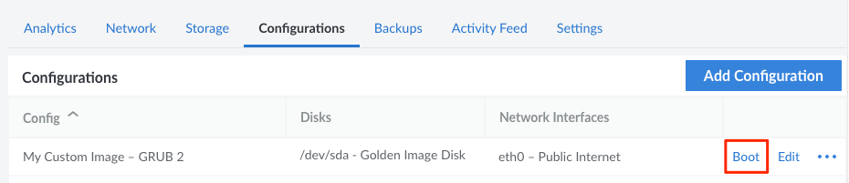

When a Linode is deployed, it is based on one of the main Distribution Images or a user-generated Custom Image. At some point, you might wish to change the Image on the Linode, perhaps to upgrade to a new major distribution release (or switch distributions altogether). This is commonly accomplished by rebuilding the Linode or creating a new Linode. However, both of these methods have important considerations: rebuilding a Linode will delete the existing data and creating a new Linode adds additional costs. Depending on your use case, these considerations may or may not be acceptable.

This guide will cover an alternative method of changing an Image: deploying an Image onto a new disk. Through this method, the Image is available on a new disk alongside the existing disks. This might be preferred by those looking to keep costs down and retain their existing data. It can also be useful for those wanting multiple bootable Images on the same Linode.

## Create a Disk

1. Log in to the [Cloud Manager](https://cloud.linode.com/), click the **[Linodes](https://cloud.linode.com/linodes)** link in the sidebar, and select a Linode from the list.

1. On the Linode's dashboard page, navigate to the **Storage** tab.

1. Confirm there is enough unallocated storage space to accommodate the new disk for the desired Image. If you aren't sure of the size of the Image, open the **[Images](https://cloud.linode.com/images)** page, find the Image within the list, and view the *Size* column.

    If there is not sufficient unallocated storage, [resize an existing disk](/docs/guides/resize-a-linode-disk/) or [resize the Linode](/docs/guides/resizing-a-linode/) to a larger plan.

1. Click the **Add a Disk** button to show the **Add Disk** form.

1. Select the **Create from Image** option, then complete the remaining fields in the form:

    | Field | Description |
    |-------|-------------|
    | Label | The name for the new disk. |
    | Image | The Distribution Image, [Custom Image](/docs/platform/disk-images/linode-images/), or Recovery Image you wish to deploy. |
    | Root Password | A strong, complex, and unique password for the root user on your new disk. |
    | SSH Keys | Any [SSH keys](/docs/security/authentication/use-public-key-authentication-with-ssh/) that you would like to assign to the root user. |
    | Size | The size of the disk that will be deployed. If you also want to create a new swap disk, make sure to enter a value that's less than the **Maximum Size** value displayed below this field (equal to the Linode's unallocated storage space). |

1. Once the form is complete, click the **Add** button to create the disk.

### Optional: Create a Swap Disk

Your new Linux distribution or image will often require a swap disk in order to boot. If you already have a swap disk on your Linode from a previous image deployment (visible under the **Disks** panel), you can reuse that same disk with your new image. Otherwise, you can create a new swap disk:

1. Navigate back to the Linode's **Storage** tab and click the **Add a Disk** button.

1. In the **Add Disk** form, select **Create Empty Disk** and choose the *swap* option from the **Filesystem** dropdown menu. Then enter a *Label* and *Size* (usually 128MB, 256MB, or 512MB). Click the **Add** button to create the disk.

## Create a Configuration Profile

To boot the Linode with the new disk, the disk needs to be properly assigned within a new or existing [configuration profile](/docs/guides/linode-configuration-profiles) and selected as the *Root Device*.

1. Navigate to the Linode's **Configuration** tab and click the **Add Configuration** button. It's also possible to adjust an existing configuration profile by clicking the *Edit* link next to that configuration.

1. Within the **Add (or Edit) Configuration** form that appears, assign the disk under **Block Device Assignment** and select that device as the **Root Device**. Here are the important fields within this form:

    | Field | Value |
    |-------|-------------|
    | Label | A name for the configuration profile. |
    | Comments | Enter any comments that may help you remember the purpose for your new configuration profile, or any other notes you'd like to record. |
    | Select a Kernel | In most cases, select *GRUB 2*. |
    | /dev/sda | Choose the disk for the new Image that was just deployed. |
    | /dev/sdb | Choose the swap disk, if one is available. |

    For all of Linode's standard distribution images, the other fields can retain their default values. For Custom Images, you may need to update other parts of the configuration profile. Review the [Managing Configuration Profiles on a Linode](/docs/guides/linode-configuration-profiles/#editing-a-configuration-profile) and [Install a Custom Distribution on a Linode](/docs/tools-reference/custom-kernels-distros/install-a-custom-distribution-on-a-linode/) guides for further guidance.

## Reboot the Linode

To reboot the Linode using the new Image, navigate to the Linode's **Configuration** tab. Find the new configuration profile in the list and click the corresponding **Boot** link. This link may be displayed with the **More Options** ellipsis dropdown menu.

For help with configuring the software on your new disk, review the [Getting Started](/docs/getting-started/) and [How to Secure Your Server](/docs/security/securing-your-server/) guides.
