
This guide has been split into two new guides:[Linode Disks and Storage](/docs/guides/disks-and-storage/) and [Linode Configuration Profiles](/docs/guides/linode-configuration-profiles/).


The Linode Cloud Manager allows you to create, edit, and use disks and configuration profiles with your Linodes. You can install different Linux distributions on the disks, set device assignments, and configure boot settings. This guide will show you how to put the pieces together to create a custom setup.

## Getting Started

Your Linode plan comes with persistent storage to hold your most important asset - data. This pool of storage can be broken up into individual containers called *disks*. It's easy to create, resize, and delete disks.

A *configuration profile* is a boot loader for your Linode. It controls general boot settings, including the disk your Linode will start up from, the disks that will be mounted, and the kernel that will be used. You can create multiple configuration profiles and store them in the Linode Cloud Manager.

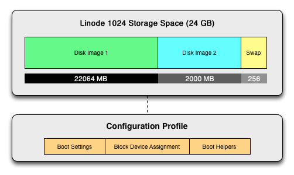

The Linode Cloud Manager automatically creates a disk and configuration profile when you create a Linode, but you can manually create as many as you want, provided you have the storage space available. The space for disks is allocated from your [Linode plan's](https://www.linode.com/pricing) storage size. You can allocate all available storage to one disk, or you can create multiple disks, as shown in the diagram above.

### Finding Your Way Around

All of a Linode's disks and configuration profiles are displayed on the Linode's detail page, under the **Disks/Configs**.

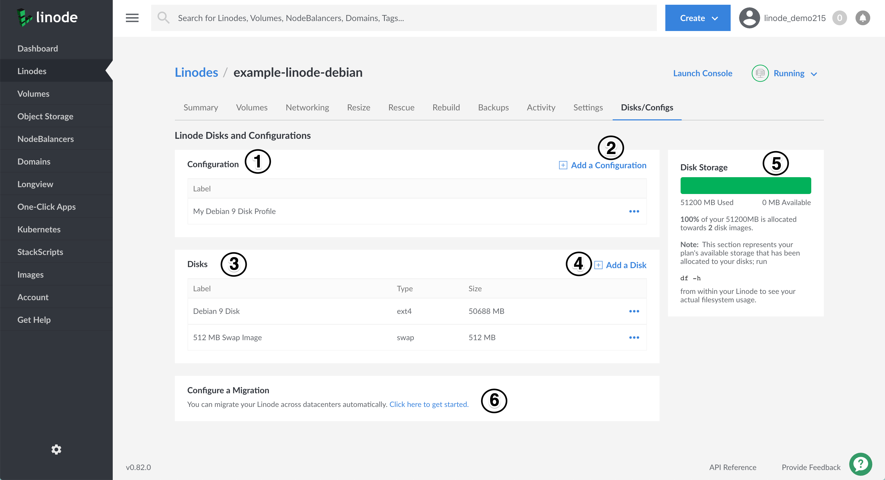

1.  Your configuration profiles are listed in the **Configuration** table. Click on the **more options ellipsis** corresponding to a profile and then select **Boot This Config** from the dropdown menu that appears to boot your Linode under that configuration profile.

1.  Click the **Add a Configuration** link to create a new configuration profile.

1.  Your disks are listed in the **Disks** table. Select the corresponding **more options ellipsis** to resize, rename, imagize, or delete a disk.

1.  Click the **Add a Disk** link to create a new blank disk, or a disk with a Linux distribution installed.

1.  This pane indicates how much of your plan's available storage has been allocated to your disks. This does not represent how much disk space is available on any given disk that you've created. To see how much space inside your disk is currently being used, connect to your Linode via SSH and execute the `df -h` command.

1. The **Configure a Migration** section gives you access to the Linode's migration page where you can initiate a [cross-data center migration](/docs/guides/how-to-initiate-a-cross-data-center-migration-for-your-linode/).

## Disks

Just like how your desktop computer has a physical hard drive that can be partitioned into smaller virtual drives, your Linode plan's storage space can be split into disks. Disks can be used to store anything, including files, applications, or other Linux distributions. The space allocated to disks draws from your plan's available storage space.

### Creating a Disk with a Linux Distribution Installed

The Linode Cloud Manager makes it easy to create a new disk with a fresh Linux distribution installed. This is a fast and easy way to try out other distributions. Here's how to create a disk with a Linux distribution installed:

1.  Log in to the [Linode Cloud Manager](https://cloud.linode.com).
1.  Click the **Linodes** link in the sidebar.
1.  Select a Linode. The Linode's detail page appears.
1.  Click on the **Disks/Configs** tab.
1.  Click on **Add a Disk**. The **Add Disk** form appears:

    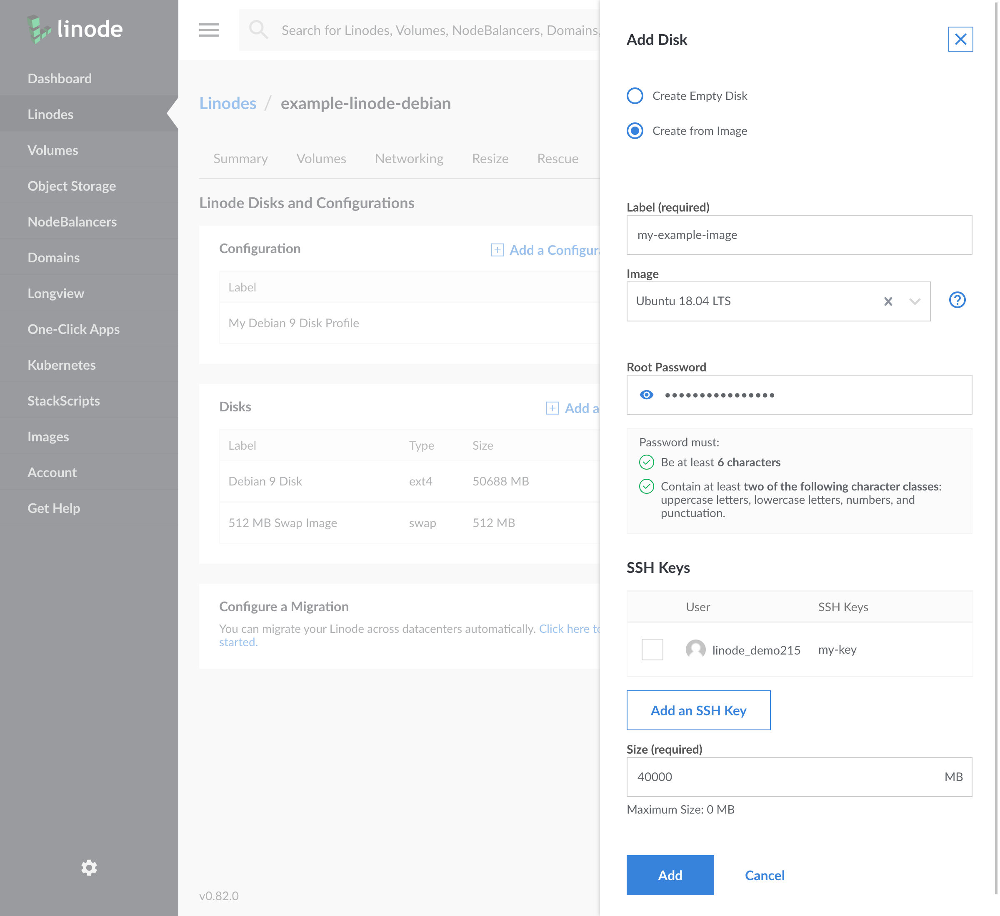

1.  Select **Create from Image**.
1.  Provide a label for your disk.
1.  Select a Linux distribution from the **Image** menu.
1.  Enter a password for the `root` user in the **Root Password** field.
1.  If desired, select an SSH key to add to the image.
1. Enter a size for the disk in the **Size** field. The size must be smaller than the amount of storage space remaining in your Linode plan.
1. Click **Add**.

The disk will be created. Monitor your bell notifications at the top of the Cloud Manager for progress updates on your new disk's creation. You'll need to create or modify a configuration profile to mount the new disk. For instructions, see [Configuration Profiles](#configuration-profiles).

### Creating a Blank Disk

Create a blank disk if you need detachable storage space or want to download and install your own Linux distribution. Here's how:

1.  Log in to the [Linode Cloud Manager](https://cloud.linode.com).
1.  Click the **Linodes** link in the sidebar.
1.  Select a Linode. The Linode's detail page appears.
2.  Click on the **Disks/Configs** tab.
3.  Click on **Add a Disk**. The **Add Disk** form appears:

    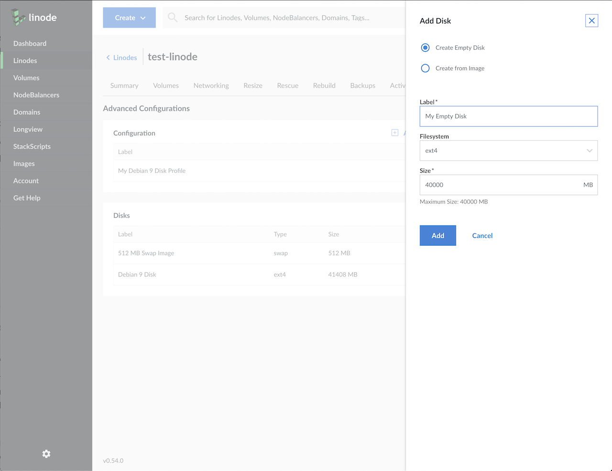

4.  Enter a name for the disk in the **Label** field.
5.  By default, **Filesystem** is set to `ext4`. We recommend that you stick with this setting.
6.  Enter a size for the disk in the **Size** field. The size must be smaller than the amount of storage space remaining in your Linode plan.
7.  Click **Add**.

The disk will be created. Monitor your bell notifications at the top of the Cloud Manager for progress updates on your new disk's creation. You'll need to create or modify a configuration profile to mount the new disk. For instructions, see [Configuration Profiles](#configuration-profiles).

### Resizing a Disk

Resizing allows you to allocate more storage to a disk so you can store more files on it, or shrink a disk so you have more allocatable space for the other disks.


Resizing a disk requires you to power your Linode off, if it is currently in use by your Linode.

When shrinking a disk that is using more space than you wish to allocate, you must first delete or compress files until it is within the reduced allocation size. Use the command `df -h` to determine how much space your disk is using.

Shrinking a disk takes longer than increasing its size.

If a disk is created using custom partitions, resizing is not possible. If using a raw disk, the disk can only be resized to a larger disk.


1.  Log in to the [Linode Cloud Manager](https://cloud.linode.com).
2.  Click the **Linodes** link in the sidebar.
3.  Select a Linode. The Linode's detail page appears.
4.  Select **Power Off** from the status dropdown menu to turn your Linode off. Monitor the progress bar at the top of the page for confirmation that your Linode has powered off.
5.  Click on the **Disks/Configs** tab.
6.  Click the **more options ellipsis** for the disk you would like to resize, and select **Resize**. The **Resize Disk** form appears.

    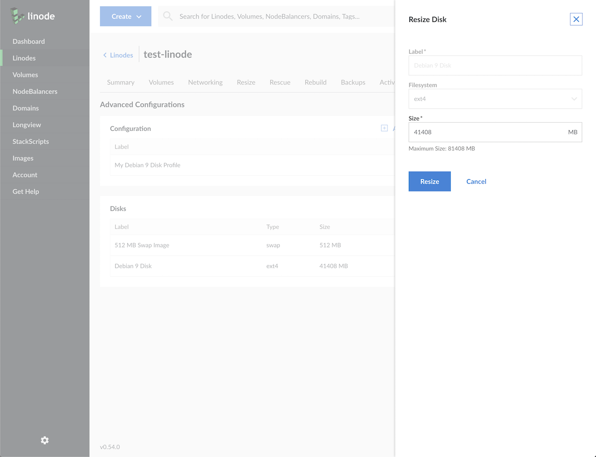

7.  In the **Size** field, enter a different size for the disk in megabytes. The maximum size available is shown beneath the field.
8.  Click **Resize**. A progress bar will appear at the top of the page.
9.  When resizing is complete, select **Power On** from the status menu to turn on the Linode. You have successfully resized the disk.

<!--### Duplicating a Disk


Duplicating a disk is not yet available in the Cloud Manager, but this feature is available in the Classic Manager. See [the Classic Manager version of this guide](/docs/platform/disk-images/disk-images-and-configuration-profiles-classic-manager/#duplicating-a-disk) for instructions on how to duplicate a disk.


You can create an exact copy of a disk by duplicating it. This is an effective way to back up your server or clone an existing Linode to a new Linode. (To clone a disk, see [Cloning disks and Configuration Profiles](#cloning-disks-and-configuration-profiles).) Here's how to duplicate a disk:

1.  Log in to the [Linode Manager](https://cloud.linode.com).
1.  Click the **Linodes** tab.
1.  Select a Linode. The Linode's dashboard appears.
1.  Click **Shut down** to turn your Linode off. Watch the *Host Job Queue* for confirmation that the Linode has shut down.
1.  Select the disk you want to duplicate. The *Edit disk* webpage appears.
1.  Click **Duplicate Disk**. The Linode's dashboard appears. Watch the *Host Job Queue* for confirmation that the disk has been duplicated.
1.  Click **Boot** to turn on the Linode.

The disk will be duplicated. Watch the *Host Job Queue* on the Dashboard to monitor the progress. When the process is complete, the disk will appear on the dashboard.
-->

### Removing a Disk

You can delete a disk to remove it from your Linode and reallocate its storage space to another disk. Here's how to delete a disk:


Removing a disk is permanent and cannot be undone.


1.  Log in to the [Linode Cloud Manager](https://cloud.linode.com).
2.  Click the **Linodes** link in the sidebar.
3.  Select a Linode. The Linode's detail page appears.
4.  Click **Power Off** from the status menu to turn your Linode off. Monitor the progress bar at the top of the page for confirmation that your Linode has powered off.
5.  Click on the **Disks/Configs** tab.
6.  Click on the **more options ellipsis** next to the disk you would like to delete and select **Delete**. Monitor your bell notifications for updates on the deletion of your disk.
7.  Click **Power On** from the status menu to turn on the Linode.

The disk will be deleted. The storage space the disk was using is now available to other disks.

## Configuration Profiles

A Linode's configuration profiles are similar to [GNU GRUB](http://en.wikipedia.org/wiki/GNU_GRUB), the Linux boot loader that allows you to select and boot from an operating system installed on your desktop computer. You can create different configuration profiles to build boot configurations with custom disks, kernels, and OS run level settings.

### Creating a Configuration Profile

Making a new configuration profile allows you to create a new and separate boot configuration for your system. You can specify boot settings and disks to mount. Here's how to create a new configuration profile:

1.  Log in to the [Linode Cloud Manager](https://cloud.linode.com).
1.  Click the **Linodes** link from the sidebar.
1.  Select a Linode. The Linode's detail page appears.
1.  Click on the **Disks/Configs** tab.
1.  Select the **Add a Configuration** link. The **Add Linode Configuration** form appears:

    

1.  Enter a descriptive name for the configuration profile in the **Label** field. This name appears on the Linode's detail page and will help you differentiate it from other configuration profiles.
1.  You can enter comments or notes about this configuration profile in the **Comments** field.
1.  Under **VM Mode**, select whether you would like paravirtualization or full-virtualization. This option describes how hardware commands are directed to the host operating system. Paravirtualization is recommended, and is necessary for features like [Block Storage](/docs/products/storage/block-storage/).
1.  Select a Linux kernel from the **Kernel** menu. We recommend selecting one of the current and latest kernels.
1. Select the **Run Level** for your configuration profile. If you aren't sure which level to choose, choose **Run Default Level**.
1. Select the **Memory Limit** setting for the configuration profile. If you select to **limit the amount of RAM this config uses**, enter in the memory limit allotment. The maximum amount of available memory is displayed below the text field.
1. In the **Block Device Assignment** section, select a bootable disk, a swap disk (optional), and any other disks that you would like to mount at start up.
1. Select a bootable disk from the **Root Device** menu.
1. Leave the settings in the **Filesystem/Boot Helpers** section alone, unless you have a specific reason to change them.
1. Click **Submit**.

The configuration profile will be created and will appear on the Linode's detail page.

### Editing a Configuration Profile

You can edit existing configuration profiles to change boot settings, set other disks to mount, and more. Here's how to edit a configuration profile:

1.  Log in to the [Linode Cloud Manager](https://cloud.linode.com).
2.  Click the **Linodes** link from the sidebar.
3.  Select a Linode. The Linode's detail page appears.
4.  Click on the **Disks/Configs** tab.
5.  Click the configuration profile's **more options ellipsis** and select **Edit**. The **Edit Linode Configuration** form appears.
6.  Edit the settings as necessary.
7.  When finished, click **Submit**.

The changes to the configuration profile have been saved. You may need to reboot your Linode to activate the changes.

### Selecting and Using a Configuration Profile

You can create and store many different configuration profiles in the Linode Manager, but you can only boot your Linode from one configuration profile at a time. Here's how to select a configuration profile and boot your Linode from it:

1.  Log in to the [Linode Cloud Manager](https://cloud.linode.com).
2.  Click the **Linodes** link from the sidebar.
3.  Select a Linode. The Linode's detail page appears.
4.  Click on the **Disks/Configs** tab.
5.  Click the more options ellipsis for the configuration profile you would like to boot from:

    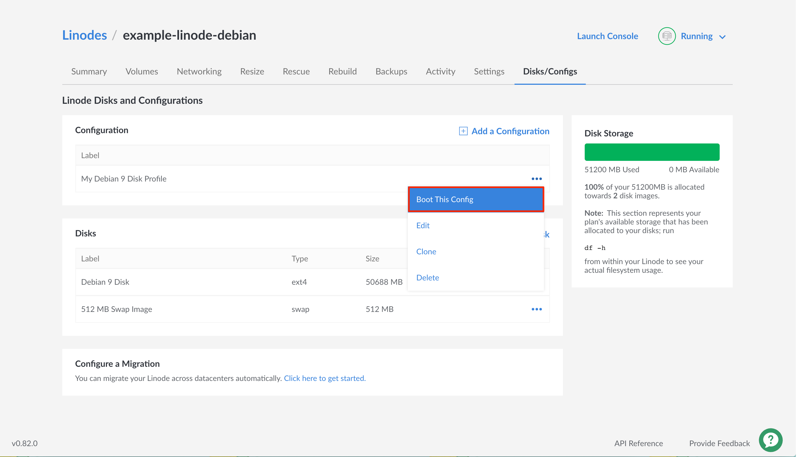

6.  Select **Boot This Config**. Monitor the progress bar at the top of the page as your Linode boots with your selected profile.

You have successfully selected and booted your Linode from a configuration profile.

### Removing a Configuration Profile

You can remove a configuration profile from the Linode Cloud Manager at any time. Here's how:

1.  Log in to the [Linode Cloud Manager](https://cloud.linode.com).
2.  Click the **Linodes** link from the sidebar.
3.  Select a Linode. The Linode's detail page appears.
4.  Click on the **Disks/Configs** tab.
5.  Click the **more options ellipsis** for the configuration profile you would like to remove.
6.  Select the **Delete** option from the dropdown menu that appears.

The configuration profile is removed from the Linode detail page.

## Cloning Disks and Configuration Profiles

You can *clone* disks and configuration profiles from one Linode to another, as long as both of the Linodes are on your account. This is an easy way to transfer your configuration between Linodes.

To clone an entire Linode, see our [Clone Your Linode guide](/docs/guides/clone-your-linode/). Cloning a Linode is a simple alternative to migrating your Linode to a different data center.


We recommend that you power off your Linode first, and keep it powered off until your disks have completed the cloning process.


1.  Log in to the [Linode Cloud Manager](https://cloud.linode.com).

1.  Click the **Linodes** link from the sidebar.

1.  Select a Linode. The Linode's detail page appears.

1.  Click on the **Disks/Configs** tab.

1.  Click the **more options ellipsis** for the Linode's configuration profile or disk that you wish to clone.

1.  Select the **Clone** option from the dropdown menu that appears.

    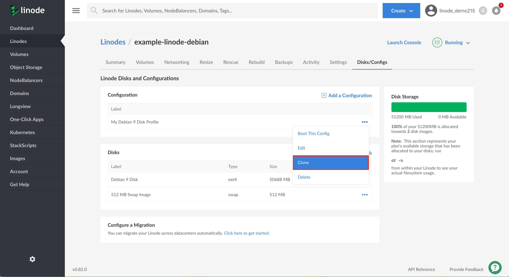

1.  On the Clone detail page, you can choose which disks and configuration profiles you wish to clone by checking their boxes.

    Click the **Configuration Profiles** tab to view and select your configuration profiles. As you make selections you will see them appear on **Selected** panel. If you select a configuration profile, all of the disks associated with that profile will automatically be selected.

    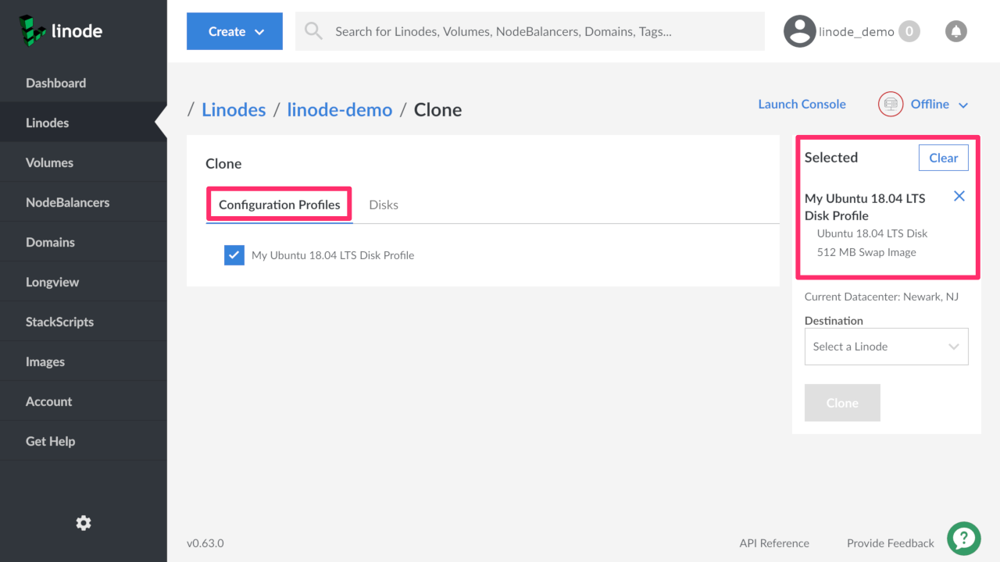

    Click the **Disks** tab to see and select your disks. As you make selections you will see them appear on the right panel below the word **Selected**.

    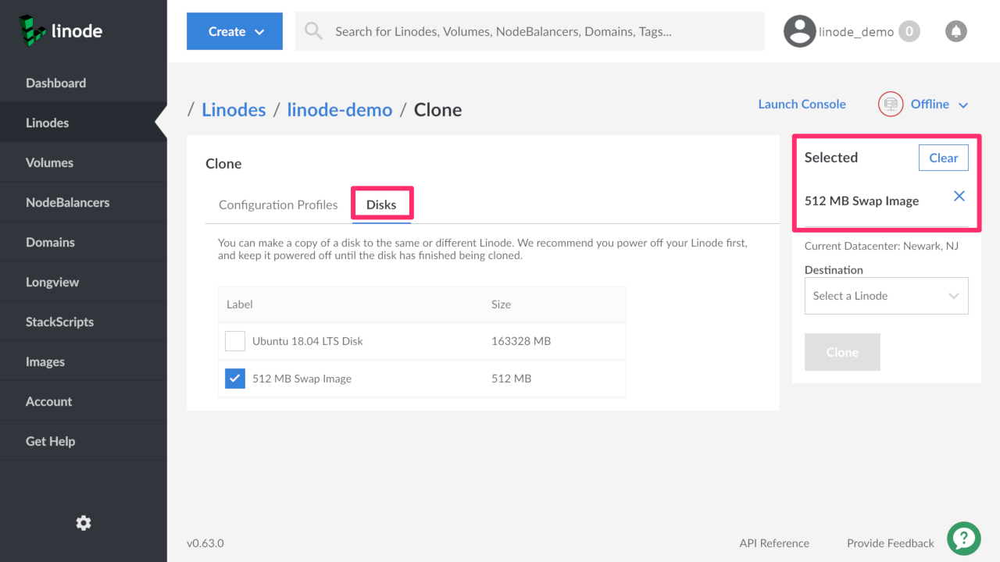

    If you already have a configuration profile selected, the disks associated with that profile will be pre-selected when viewing the Disks tab.

    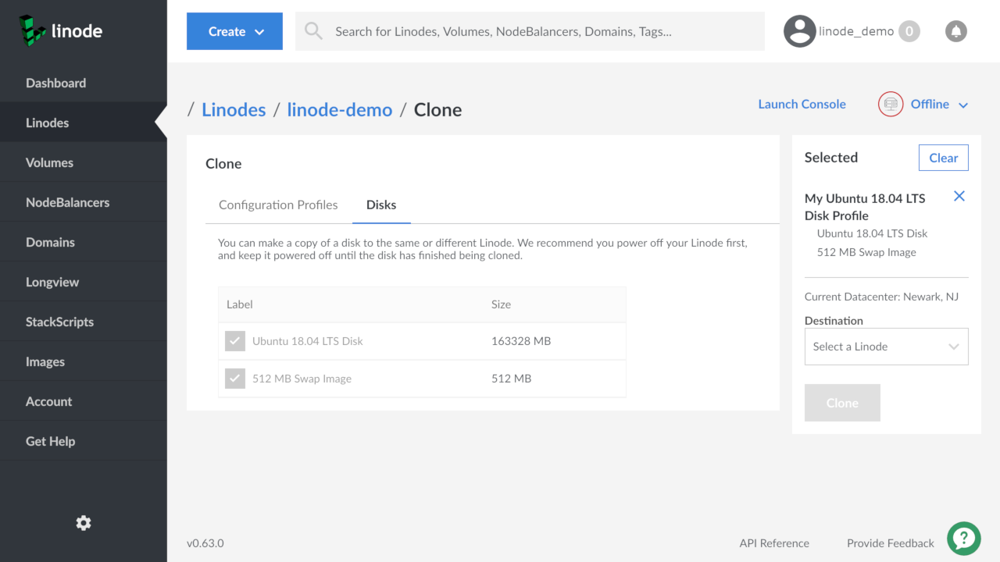

1.  Select the destination Linode for your clone using the **Destination** dropdown menu. If you're cloning any configuration profiles, you cannot select the current Linode as a destination, but any other Linode on your account will be available as an option. If you're cloning only a disk or disks, you can select both the current Linode or any other Linode on your account.

    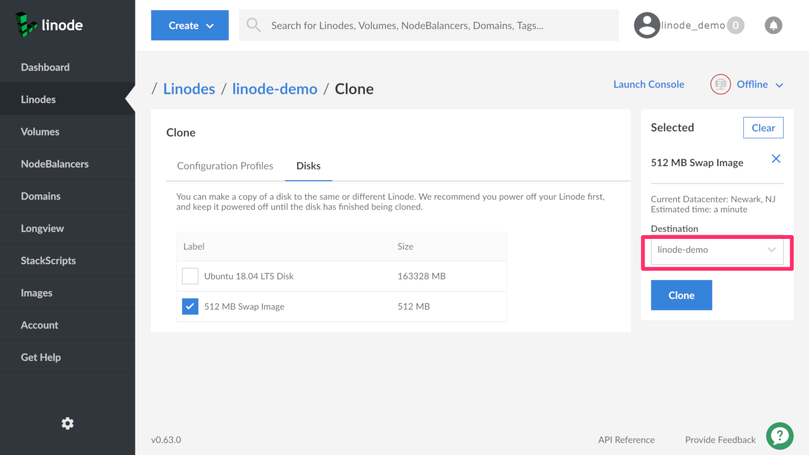

1.  Click the **Clone** button to begin the cloning process.
    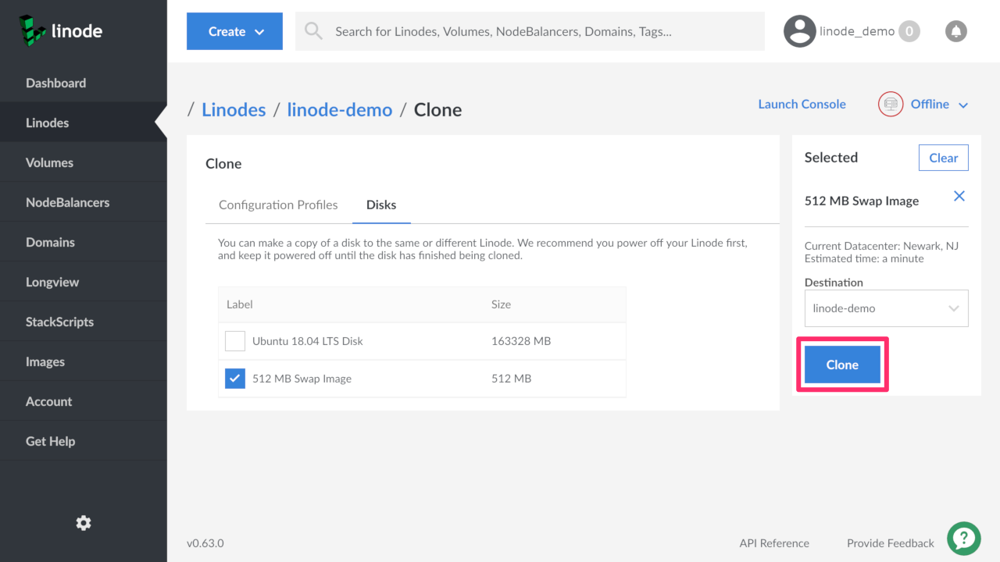

    If your **Destination** Linode is not large enough for your clone, you will see a warning and be unable to continue until the Linode has the required space available.
    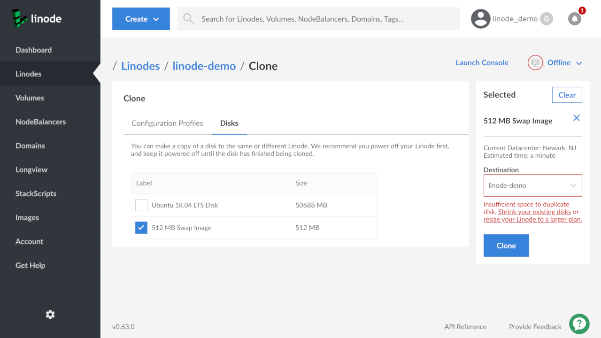

    
If you need to make room on your destination Linode you can [resize it to a larger plan](/docs/guides/resizing-a-linode/), [resize your disks](/docs/platform/disk-images/disk-images-and-configuration-profiles/#resizing-a-disk) to a smaller size, or [delete disks](/docs/platform/disk-images/disk-images-and-configuration-profiles/#removing-a-disk) to free up available space. If you decide to resize your Linode to a larger plan, be sure to uncheck the box that automatically resizes your disks or they will expand to fill up the extra space that you are trying to create.


1.  Once the cloning process begins, you are returned to the **Disks/Configs** tab and a progress bar appears at the top of the screen.
    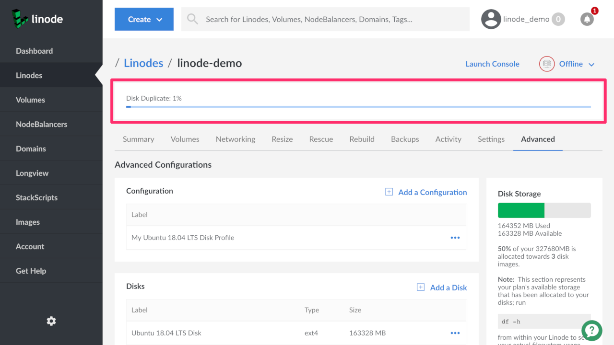

1.  When the cloning process is complete, your new disk or configuration appears in the Linode's **Disks/Configs** tab.

## Potential Uses

If you're wondering how you could use disks and configuration profiles, here are some ideas to get you started:

-   **Automate Server Builds:** If you run a large website that requires multiple servers, or if you just love automating things, you'll want to [automate your server builds](/docs/guides/automating-server-builds/). You can rapidly spin up multiple servers with exactly the same configuration by creating a *golden disk* that can be cloned to multiple Linodes.
-   **Experiment with Distributions:** New to Linux? Take different distributions out for a spin by creating a separate disk for each flavor of Linux. Once you find a distribution you like, you can delete all of the disks except the one with your favorite distribution.
-   **Create a Software Testing Environment:** If you're a developer, you can create different disks for testing purposes. Every disk can hold a different 32- or 64-bit distribution, and every configuration profile can be set to use a different kernel. Even if you're not a developer, this is ideal for testing open source or proprietary software on different distributions.
