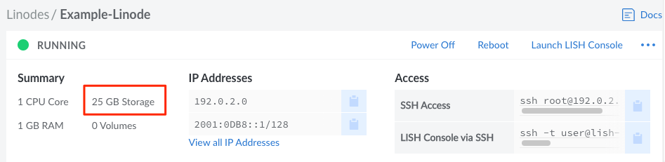
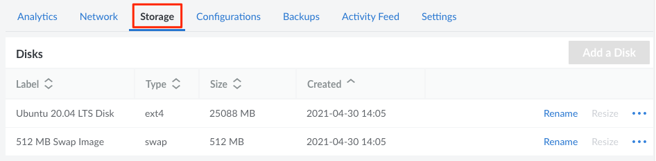
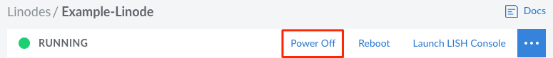

## Understanding Storage

Every Linode is equipped with persistent storage, the amount of which varies based on size and type of the Linode's plan. This local storage is built entirely on enterprise-grade SSDs (solid state disks) and is very performant.

### Disks

A Linode's storage space can be allocated to individual *disks*. Disks can be used to store any data, including the operating system, applications, and files. Most Linodes will come equipped with two disks. A large primary disk is used to store the Linux distribution, software, and data. There's also a much smaller swap disk, which is used in the event that your Linode runs out of memory.

While two disks may be the default, a Linode can be configured to have many more disks. These additional disks can serve a variety of purposes, including dedicated file storage or switching between entirely different Linux distributions. When multiple disks are added to a Linode, [configuration profiles](/docs/guides/linode-configuration-profiles) are used to determine the disks that are accessible when the Linode is powered on, as well as which of those disks serves as the primary root disk.

### Adding Additional Storage

The local storage capacity of a Linode can only be increased by upgrading to a larger Linode plan. This will allow you to increase the size of a Linode's disks or add additional disks. [Block Storage](/docs/products/storage/block-storage/) Volumes can also be used to add additional storage, though these Volumes are separate from a Linode's local disks and, for some use cases, may be less performant.

## Managing Disks on a Linode

A Linode's total storage space and disks can be viewed and managed from the [Cloud Manager](https://cloud.linode.com).

1. Log in to the [Cloud Manager](https://cloud.linode.com), click the **Linodes** link in the sidebar, and select a Linode from the list.
1. Look within the **Summary** section of the Linode's dashboard to view the total storage.

    

1. Navigate to the **Storage** tab to view the disks on a Linode.

    

From here, a [disk can be created](#creating-a-disk) using the **Add a Disk** button. To take action on an disk, locate the disk within the **Disks** table and select from the list of actions, some or all of which may appear within the **ellipsis** menu:

- **Rename:** Change the name of the disk.
- **Resize:** Increase or decrease the size of the disk. See [Resizing a Disk](#resizing-a-disk).
- **Imagize:** Create a Custom Image based on the disk. See [Capture an Image](/docs/products/tools/images/guides/capture-an-image/).
- **Clone:** Duplicate the disk, adding it to any Linode on your account. See [Cloning a Disk](#cloning-a-disk).
- **Delete:** Permanently delete's the disk and all of its data (cannot be undone). See [Deleting a Disk](#deleting-a-disk).

## Creating a Disk

Each Linode can have multiple disks. To create a new disk, follow the instructions below.


If you wish to deploy an Image to a new disk, see the [Deploy an Image to a Disk on an Existing Linode](/docs/guides/deploy-an-image-to-a-linode/) guide for complete instructions on creating the main disk, an optional swap disk, and a configuration profile.


1. Log in to the [Cloud Manager](https://cloud.linode.com/), click the **[Linodes](https://cloud.linode.com/linodes)** link in the sidebar, and select a Linode from the list.

1. On the Linode's dashboard page, navigate to the **Storage** tab.

1. Click the **Add a Disk** button to show the **Add Disk** form. If this button is disabled, all of the Linode's storage space has been allocated towards disks. Before continuing, [resize an existing disk](#resize-a-disk) or [upgrade the Linode](/docs/guides/resizing-a-linode/) to a larger plan. You'll want to confirm there is enough unallocated storage space to accommodate the desired size of the new disk.

1. Select from either the **Create Empty Disk** or **Create from Image** options.

    **Empty disks:** An empty disk can store additional data, be used as a swap disk, or it can be used to manually [install a custom distribution](/docs/guides/install-a-custom-distribution-on-a-linode/). When creating an empty disk, select the desired *Filesystem*. In most cases, it's recommended to use the *ext4* filesystem. This ensures compatibility with our Backups service. If needed, *ext3* and *raw* disks are also available. If creating a swap disk, select the *swap* option.

    **Images:** Selecting an Image allows you to deploy a [Distribution Image](https://www.linode.com/distributions/), a [Custom Image](/docs/products/tools/images/), or a Recovery Image to the new disk. When creating a disk based on an Image, select the *Image*, *Root Password*, and optionally add *SSH Keys*.

1. Once an option is chosen, complete the remaining fields in the form. Enter the *Label* and the *Size* for the new disk. The *maximum size* of the disk is pre-populated and based on the Linode's remaining storage allocation, though a smaller size can be entered if desired.

1. Click the **Add** button to create the disk. The progress can be monitored from the new entry appearing for the disk within the Linode's **Storage** page.

Once a disk has been created, you will need to modify the existing configuration profile or add a new configuration profile. Specifically, the disk will need to be assigned to a device and optionally marked as the root device if this new disk will function as the primary boot disk. See the [Deploy an Image to a Disk on an Existing Linode](/docs/guides/deploy-an-image-to-a-linode/) guide or the [Configuration Profiles](/docs/guides/linode-configuration-profiles) guide for additional details.

## Resizing a Disk



## Cloning a Disk

A disk can be duplicated onto the same Linode or any other Linode on the account. See [Cloning a Linode > Cloning to an Existing Linode](/docs/guides/clone-your-linode/#cloning-to-an-existing-linode) for instructions.

## Deleting a Disk

A disk can be deleted to remove it form the Linode and free up additional storage space that can be used for other disks.


Deleting a disk is permanent and cannot be undone. Make sure all required data is properly backed up before continuing.


1. Log in to the [Cloud Manager](https://cloud.linode.com/), click the **[Linodes](https://cloud.linode.com/linodes)** link in the sidebar, and select a Linode from the list.

1. Click the **Power Off** button in the upper right of the page or within the **ellipsis** menu. Before proceeding, wait until the Linode has been fully powered off.

    

1. On the Linode's dashboard page, navigate to the **Storage** tab.

1. Within the **Disks** table, locate the disk you wish to delete and click the corresponding **Delete** button, which may also appear within the **ellipsis** menu.

1. A confirmation dialog window will appear. Click the **Delete** button to confirm.

1. The disk will be deleted within a few seconds. Click the **Power On** button to boot up the Linode.