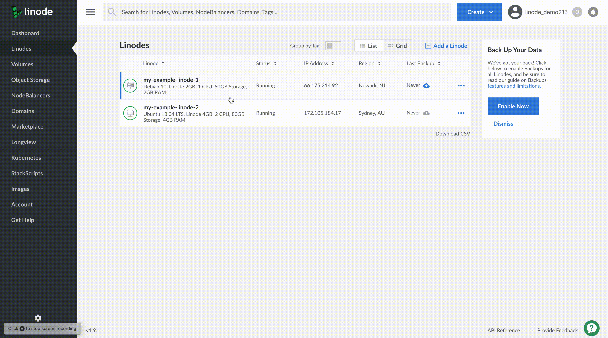
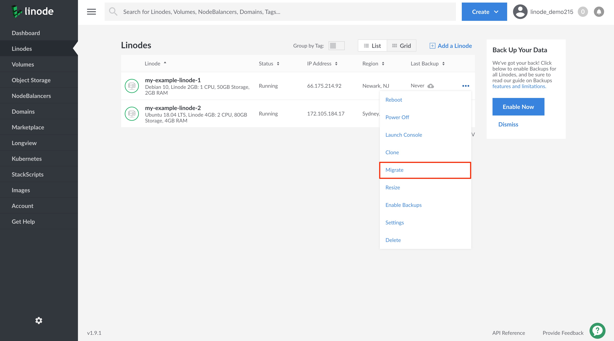
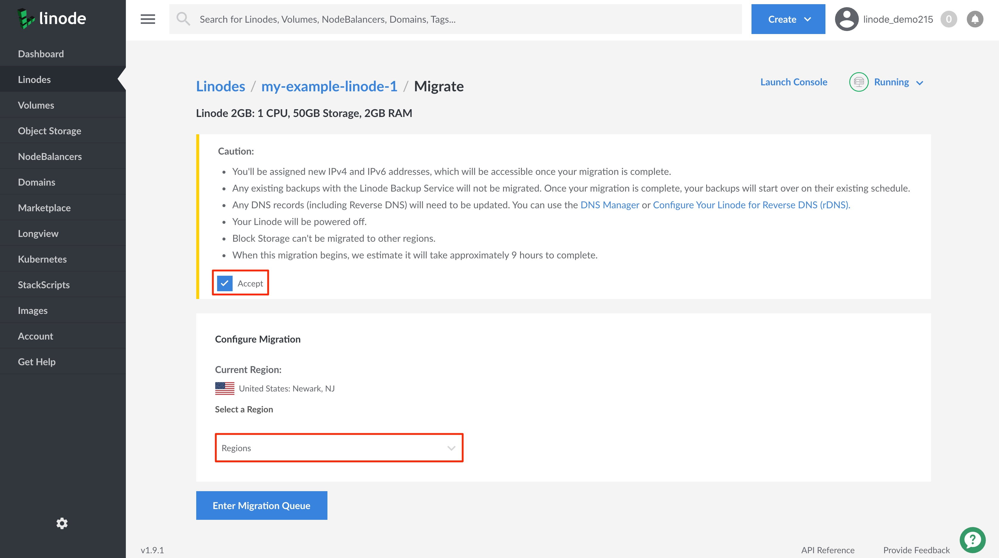

You can migrate your Linode across data centers using the Linode Cloud Manager. This is a self-service feature that does not require any action from Linode to initiate your migration.


We recommend using our [Choosing a Data Center](/docs/platform/how-to-choose-a-data-center/) guide to learn how to choose and speed test a data center.


## In this Guide:

This guide will cover the following topics:

- [Important details to know before initiating a cross data center migration](#things-to-know-before-migrating).
- [How to migrate your Linode to a different data center](#migrating-to-a-new-data-center).

## Things to Know Before Migrating

Migrating your Linode to a new data center will result in a number of changes that may impact your Linode's configuration and external devices connected to it. All of these changes can be seen in a caution message before proceeding with your migration within the Linode Manager. Changes to be aware of are as follows:

- IP addresses are not transferrable across data centers and they will not be migrated with your Linode. Your Linode will be issued a new IPv4 and IPv6 address, which will be accessible once the migration completes. When your Linode enters the migration queue, new IP address are reserved and can be viewed on your Linode's **Networking** detail page. See the [Find Your Linode's IP Address](/docs/quick-answers/linode-platform/find-your-linodes-ip-address/) guide to learn how to access Networking information in the Cloud Manager.

- You will need to update all your Linode's DNS records to use your new IP address or addresses. If you're hosting your DNS with us, this can be done through the [DNS Manager](/docs/platform/manager/dns-manager/), while [rDNS](/docs/networking/dns/configure-your-linode-for-reverse-dns/) can be configured directly on each Linode's Networking detail page.

- Any existing Backups created through our [Linode Backup Service](/docs/platform/disk-images/linode-backup-service/) will not be migrated. Once the Linode's migration has completed, your backup service will restart on its normal schedule.

- Block Storage volumes cannot be migrated to other regions. If you have a Block Storage volume attached to your Linode, it will be detached when the migration begins. See our [How to Use Block Storage with Your Linode](/docs/platform/block-storage/how-to-use-block-storage-with-your-linode/#how-to-transfer-block-storage-data-between-data-centers) guide, to learn how to transfer a Block Storage volume's data between data centers.

- Migrations will include a period of downtime while your data is transferred. This estimate varies depending on your total disk size and the speeds expected between each data center. A calculated estimate will be displayed within the "Caution" message displayed before moving forward with your migration.

## Migrating to a New Data Center
### From a Linode's Disks and Configurations Page

1. Log in to the [Cloud Manager](https://www.cloud.linode.com) and click on the **Linodes** link in the sidebar.

1. Select the Linode you'd like to migrate.

1. Viewing the Linode's *Summary* page, click on the **Disks/Configs** tab at the top of the page.

1. On the **Disks/Configs** page, scroll down to the **Configure a Migration** section and click on the **Click here to get started** link.

1. On the **Migrate** detail page, make sure you read and understand the "Caution" message before clicking on the **Accept** checkbox. Select the data center region you'd like the Linode to be migrated to.

1. Click on the **Enter Migration Queue** button. You will be automatically redirected to your Linode's summary page where you can monitor the progress of your migration. Your Linode will return to its previous state (powered on or off) once the migration has completed.

### From the Linodes Landing Page

1.  Log in to the [Cloud Manager](https://www.cloud.linode.com) and click on the **Linodes** link in the sidebar.

1.  Click on the **more options ellipsis** corresponding to the Linode that you'd like to migrate. Select **Migrate** from the dropdown menu.

    

1. On the **Migrate** detail page, make sure you read and understand the "Caution" message before clicking on the **Accept** checkbox. Select the data center region you'd like the Linode to be migrated to.

    

1. Click on the **Enter Migration Queue** button. You will be automatically redirected to your Linode's summary page where you can monitor the progress of your migration. Your Linode will return to its previous state (powered on or off) once the migration has completed.