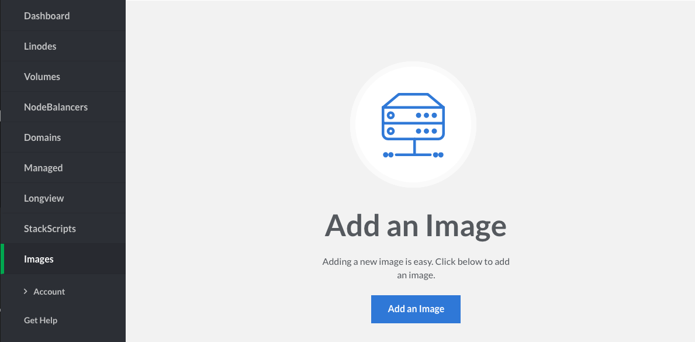
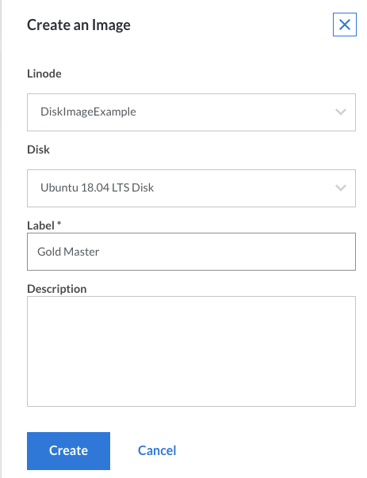
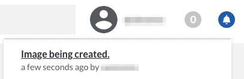

Linode Images captures an exact copy of your disk at the moment when the process is kicked off. This section shows you how to create an image from an existing Linode.


- If your Linode is running any active databases, we recommend shutting your Linode down prior to capturing your image. Capturing an image that includes a running database can cause corruption or data loss in the imaged copy of the database.

- Linode Images are limited to 6144MB of data per disk. Ensure that the data within your disk does not exceed this size limit.

- Linode Images cannot be created if you are using raw disks or disks that have been formatted using custom filesystems.

- When an image is created, it is the smallest possible size based on the data present on the disk rather than the full Disk Allocation.


1.  Navigate to your the Images page in the Linode Cloud Manager and select **Add an Image**.

    

1.  In the **Create an Image** menu select the Linode and disk you would like to freeze, and provide a label. You may also add an optional description of the image. Then, click **Create**.

    

    
CoreOS disk images are in RAW format. Images made from CoreOS disks can't be used to deploy new Linodes.


1.  Once you click the **Create** button, your image is frozen for later use. You can view the progress under the bell notifications at the top of the page.

    

    Once the job has completed, your Linode's disk is captured, stored, and can be used to [deploy new Linode instances from your saved image](/docs/products/tools/images/guides/deploy-from-a-saved-image/).
