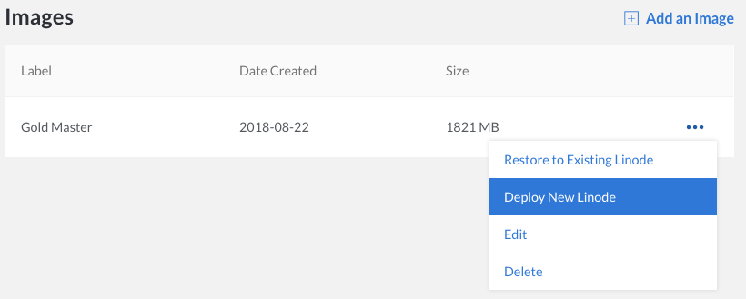
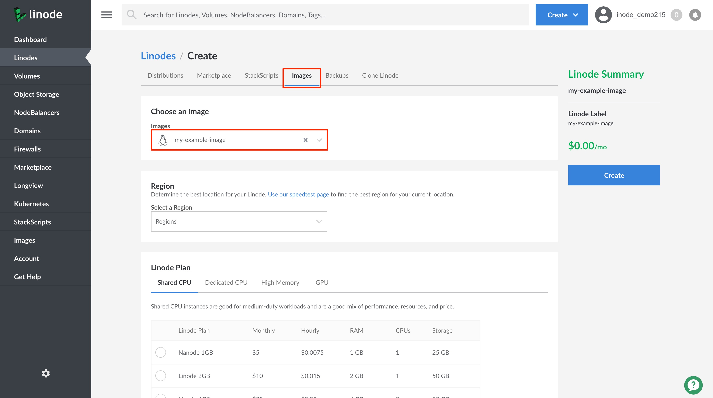

Deploying one of your saved images to any Linode under your account is a simple process.

1.  Navigate to the **Images** page, click on the **more options ellipsis** corresponding to the image you'd like to use, and select **Deploy New Linode**.

    

    You are brought to the **Lionde Create** page where your image is preselected.

    

    
You cannot deploy an image that was created from a RAW disk format. Attempting to do so will result in a failure.


1.  Provide the remaining configurations for your new Linode instancy by selecting your desired **Region**, **Linode Plan**, **Label**, and set your **Root Password**, then click **Create** to create a Linode from your saved image.

    You are brought to your new Linode's Details page where you can monitor its creation from your stored image.
