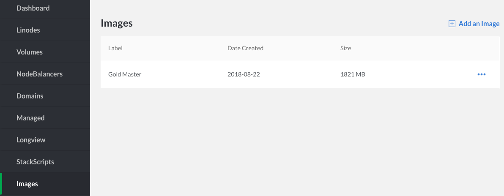
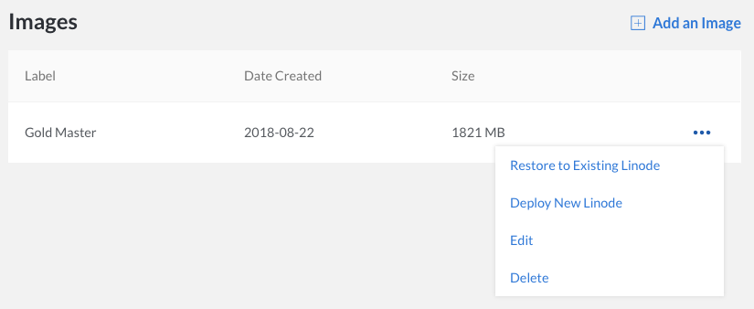

The images captured from your Linodes are stored for future usage. This section shows you how to access your Linode Images for editing or deleting.

1.  Click on the **Images** link in the sidebar.

    

1.  From this page, you can select any image's **more options ellipsis** menu for options to delete the image, edit its label and description, and [deploy a new Linode from the image](/docs/products/tools/images/guides/deploy-from-a-saved-image/).

    
