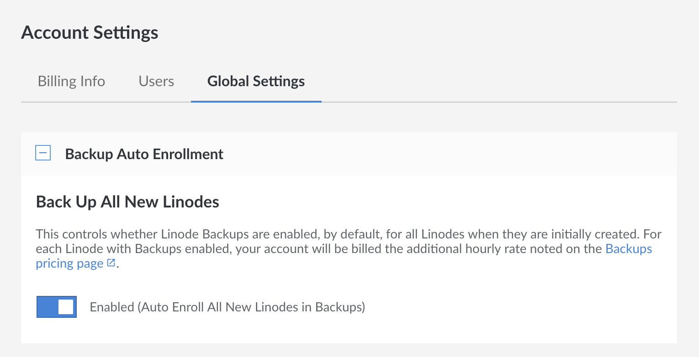

The *Linode Backup Service* is a subscription service add-on that automatically performs daily, weekly, and biweekly backups of your Linode. It's affordable, easy to use, and provides peace of mind. This guide explains how to enable and schedule your backups, make a manual backup snapshot, restore from a backup, and disable the Backup Service.

## Pricing

Pricing is per Linode and varies depending upon your Linode's plan. See the options on [the pricing page](https://www.linode.com/pricing/#row--storage) under Backups.

## Enable the Backup Service



### Auto Enroll New Linodes in the Backup Service

You can automatically enroll all new Linodes in the Backup Service. To do so, click the **Account** link in the sidebar, then select the **Global Settings** tab.

In the **Backup Auto Enrollment** panel, click on the switch to enable backups on all new Linodes.


Enabling this setting does not retroactively enroll any previously created Linodes in the Backup Service.


## Manage Backups



## How Linode Backups Work

Backups are stored on a separate system in the same data center as your Linode. The space required to store the backups is *not* subtracted from your storage space. You can store four backups of your Linode, three of which are automatically generated and rotated:

-   **Daily backup:** Automatically initiated daily within the backup window you select. Less than 24 hours old.
-   **Current week's backup:** Automatically initiated weekly within the backup window, on the day you select. Less than 7 days old.
-   **Last week's backup:** Automatically initiated weekly within the backup window, on the day you select. Between 8 and 14 days old.
-   **Manual Snapshot:** A user-initiated snapshot that stays the same until another snapshot is initiated.

The daily and weekly backups are automatically erased when a new backup is performed. The Linode Backup Service does not keep automated backups older than 14 days.

## Schedule Backups



## Take a Manual Snapshot



## Restore from a Backup

This section shows how to restore a backup to a [new](/docs/guides/linode-backup-service/#restore-to-a-new-linode) Linode, or to an [existing](/docs/guides/linode-backup-service/#restore-to-an-existing-linode) Linode.

### Restore to a New Linode



### Restore to an Existing Linode



## Boot from a Backup



## Cancel the Backup Service

You can cancel the Backup Service at any time. From your Linode's details page, choose the **Backups** tab and click the **Cancel Backups** link at the bottom of the page. Cancelling the service removes your saved backups from the Linode platform.


Cancelling your Backup Service irretrievably deletes all of your Linode's Backups, including its manual Snapshot.

To preserve this data, you need to back up your data independently from the Backup Service before cancelling it. You may consult the suggestions in [Backing Up Your Data](/docs/guides/backing-up-your-data/) for more information on how to do this.


## Backup Troubleshooting

### Linode Backup Disk Won't Boot

If you are restoring a single backup disk to your Linode, then the new disk will have a different UUID than the original. When this happens, configuration files on the Linode may still be referencing the old UUID of the original disk, instead of the new one, causing boot issues. If this is the case, you will likely see errors related to the UUID in your console when booting in [Rescue Mode](https://www.linode.com/docs/guides/rescue-and-rebuild/#booting-into-rescue-mode):


    ALERT!  UUID=xxxxx-xxxx-xxxx-xxxx-xxxxxxxxxxx does not exist.  Dropping to a shell!


To fix this error, you will need to boot into [Rescue Mode](https://www.linode.com/docs/guides/rescue-and-rebuild/#booting-into-rescue-mode) and edit your `/etc/fstab` file to account for the new UUID. This can be done in the following steps:

1. Follow the instructions for [Booting Into Rescue Mode](https://www.linode.com/docs/guides/rescue-and-rebuild/#booting-into-rescue-mode) using our Rescue and Rebuild guide. Once you have successfully completed step 4 in the section to [Change Root](https://www.linode.com/docs/guides/rescue-and-rebuild/#change-root), proceed to the next step.

1. Enter the following command to obtain the UUID of your current disk:

        blkid

    Output will resemble the following:

    
    /dev/sda: UUID="ecfd4955-9ce6-44ad-a8e4-275d5ac13ffc" TYPE="ext4"
  
    Copy _only_ the string surrounded by the quotation marks defining the `UUID` field in the output to use in the next step.

1. You should now have access to your disk's contents in the recovery environment. Check the contents of your `/etc/fstab` file for any entries pertaining to the UUID. This line may appear as follows:

    
    UUID=41c22818-fbad-4da6-8196-c816df0b7aa8  /disk2p2      ext3    defaults,errors=remount-ro 0       1
  

1. Replace the string defining the UUID in the `/etc/fstab` file with the the UUID of the disk you copied from the output of the `blkid` command.

1. After following all of the above steps, you should now be able to reboot your Linode normally.

## Limitations

There are some limitations to what the Linode Backup Service can back up. Here are some things you should be aware of:

-   The Backup Service must be able to mount your disks. If you've created partitions, configured full disk encryption, or made other changes that prevent us from mounting the disk as a file system, you likely can not use the Linode Backup Service. The backup system operates at the file level, not at the block level.
-    Because the Backup Service is file-based, the number of files stored on disk impacts both the time it takes for backups and restores to complete, and your ability to successfully take and restore backups. Customers who need to permanently store a large number of files may want to archive bundles of smaller files into a single file, or consider other backup services.


The percentage of customers who may run into this limitation is low. If you are not sure if this limitation applies to you, please [contact Linode Support](/docs/guides/support/#contacting-linode-support).


-   Backups taken of ext4 or ext3 filesystems are restored as ext4. Backups taken of other mountable file system types have their contents restored using ext4.
-   Restored backups will have a different UUID than the original disk.
-   Files that have been modified but have the same size and modify time are not be considered "changed" during a subsequent backup. ACLs and extended attributes are *not* tracked.
-   The Backup Service uses a snapshot of your disks to take consistent backups while your Linode is running. This method is very reliable, but can fail to properly back up the data files for database services like MySQL. If the snapshot occurs during a transaction, the database's files may be backed up in an unclean state. We recommend scheduling routine dumps of your database to a file on the filesystem. The resulting file is then be backed up, allowing you to restore the contents of the database if you need to restore from a backup.
