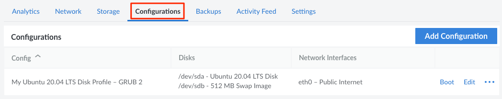
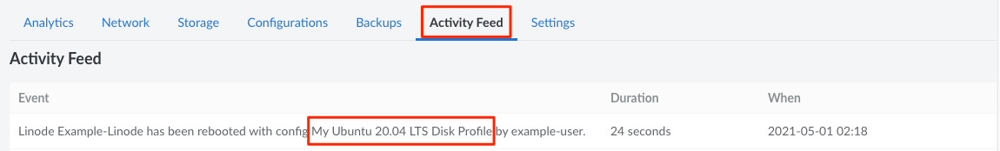

A **configuration profile** functions as a boot loader for a Linode. It controls general boot settings, including the disk the Linode will boot from, the disks that will be mounted, the kernel that will be used, and the network interfaces on the Linode. Multiple configuration profiles can be created, each one booting from different disks with different settings. This can allow you to try out new Linux distributions without paying for additional Linodes (see [Deploy an Image to a Disk on an Existing Linode](/docs/guides/deploy-an-image-to-a-linode/)) or to create custom software testing environments.

## Managing Configuration Profiles

The configuration profiles for a Linode can be viewed and managed from the [Cloud Manager](https://cloud.linode.com).

1. Log in to the [Cloud Manager](https://cloud.linode.com), click the **Linodes** link in the sidebar, and select a Linode from the list.

1. Navigate to the **Configurations** tab to view the configuration profiles on a Linode.

    

From here, a [configuration profile can be created](#creating-a-configuration-profile) using the **Add Configuration** button. To take action on an certain configuration, locate it within the **Configurations** table and select from the list of actions, some or all of which may appear within the **ellipsis** menu:

- **Boot:** Boots the Linode using the settings defined within the selected configuration profile. See [Booting from a Configuration Profile](#booting-from-a-configuration-profile).
- **Edit:** Modify the settings within a configuration profile. See [Editing a Configuration Profile](#editing-a-configuration-profile).
- **Clone:** Clones the configuration profile and the attached disks to any Linode on the same account. See [Cloning a Configuration Profile and the Attached Disks](#cloning-a-configuration-profile-and-the-attached-disks).
- **Delete:** Deletes the configuration profile. See [Deleting a Configuration Profile](#deleting-a-configuration-profile).

## Settings

When adding or editing a configuration profile on a Linode, the following settings are available:

- **Virtual Machine:** VM mode determines whether devices inside your virtual machine are *paravirtualized* or *fully virtualized*. Unless there is a specific need to run devices in full virtualization, select *paravirtualization*. This is required for features like Block Storage.

- **Boot Settings:**
    - **Kernel:** Select the version of the Linux kernel that will be used. The options include Grub 2 (for upstream or custom-compiled kernels), a specific Linode supplied kernel, or Direct Disk. For most distributions, its recommended to set this option to *Grub 2*. See [How to Change your Linode's Kernel](/docs/guides/how-to-change-your-linodes-kernel/).
    - **Run Level:** Adjust the [run level](https://en.wikipedia.org/wiki/Runlevel) of the OS to allow for advanced diagnostics. Recommended setting: *Run Default Level*.
    - **Memory Limit:** Limits the amount of memory that the Linode can use. Recommended setting: *Do not set any limits on memory usage*.

- **Block Device Assignment:** Assigns the Linode's disks to the disk devices in Linux, making them accessible once the Linode has booted up. Up to 8 disks can be assigned (`/dev/sda` through `/dev/sdg`), though it's common to only use the first two devices: `/dev/sda` as the main disk and `/dev/sdb` as the swap disk. The **Root Device** is used to select the primary disk device (commonly `/dev/sda`), though another predefined device or custom device path can be used.

- **Network Interfaces:**  Assigns either a VLAN or the Public Internet to a network interface in Linux. There are a total of 3 available network interfaces: `eth0`, `eth1`, and `eth2`. If no VLANs are in use, the recommended setting is _Public Internet_ for `eth0` and _None_ for all other interfaces. See [Getting Started with VLANs](/docs/guides/getting-started-with-vlans/).

- **Filesystem / Boot Helpers:** Various helper tasks that run when the Linode is booted up. Recommended setting for all helpers: _Enabled_.
    - **Enable distro helper:** Helps maintain correct inittab/upstart console device.
    - **Disable `updatedb`:** Disables `updatedb` cron job to avoid disk thrashing.
    - **Enable modules.dep helper:** Creates a module dependency file for the kernel you run.
    - **Auto-mount devtmpfs:** Controls if pv_ops kernels auto-mount devtmpfs at boot.
    - **Auto-configure networking:** Automatically configures static networking. See [Network Helper](/docs/guides/network-helper/).

## Creating a Configuration Profile

Making a new configuration profile allows you to create a new and separate boot configuration for your system. You can specify boot settings and disks to mount. Here's how to create a new configuration profile:

1. Log in to the [Cloud Manager](https://cloud.linode.com), click the **Linodes** link in the sidebar, and select a Linode from the list.

1. Navigate to the **Configurations** tab to view the configuration profiles on a Linode.

1. Select the **Add a Configuration** link. The **Add Linode Configuration** form appears:

1. Enter the *Label* for the new configuration, as well as an optional *Comment*.

1. Complete the remainder of the form, referencing the [Settings](#settings) section above for additional details and recommended values. For most basic configurations, it's recommended to adjust the following settings:
    - **Kernel:** Select *Grub 2*.
    - **Block Device Assignments:** Set `/dev/sda` to the disk you want to use as the primary disk (and boot disk) and set `/dev/sdb` to the swap disk.

1. Click **Add Configuration** to create the new configuration profile.

## Editing a Configuration Profile

You can edit existing configuration profiles to change boot settings, set other disks to mount, and more. Here's how to edit a configuration profile:

1. Log in to the [Cloud Manager](https://cloud.linode.com), click the **Linodes** link in the sidebar, and select a Linode from the list.

1. Navigate to the **Configurations** tab to view the configuration profiles on a Linode.

1. Within the **Configurations** table, locate the configuration profile you wish to modify and click the corresponding **Edit** button, which may also appear within the **ellipsis** menu. This displays the **Edit Configuration** form.

1. Adjust any settings as needed, referencing the [Settings](#settings) section above for additional details and recommended values.

1. Once finished, click **Save Changes**.

The changes to the configuration profile have been saved. You may need to reboot your Linode to activate the changes.

## Booting from a Configuration Profile

You can create and store many different configuration profiles in the Linode Manager, but you can only boot your Linode from one configuration profile at a time. Here's how to select a configuration profile and boot your Linode from it:

1. Log in to the [Cloud Manager](https://cloud.linode.com), click the **Linodes** link in the sidebar, and select a Linode from the list.

1. Navigate to the **Configurations** tab to view the configuration profiles on a Linode.

1. Within the **Configurations** table, locate the configuration profile you wish to modify and click the corresponding **Boot** button, which may also appear within the **ellipsis** menu.

1. A confirmation dialog window will appear. Click **Boot** to confirm.

1. The Linode will boot (or reboot) using the selected configuration profile. The progress of the boot can be viewed from the Linode's status.

You have successfully selected and booted your Linode from a configuration profile.

## Determining Which Configuration Profile Was Used

When a Linode is powered on or rebooted, it will use the settings stored within a configuration profile. You can determine which configuration profile was used by looking at the event history. Events are visible within the **Activity Feed** tab for a particular Linode or within the main [Events](https://cloud.linode.com/events) page for the account.

1. Log in to the [Cloud Manager](https://cloud.linode.com), click the **Linodes** link in the sidebar, and select a Linode from the list.

1. Navigate to the **Activity Feed** tab to view all events for the Linode.

1. Locate the particular boot or reboot event and review the text. The configuration profile used during that boot will be mentioned here.

## Cloning a Configuration Profile and the Attached Disks

A configuration profile, along with any attached disks, can be duplicated to any *other* Linode on the account. See [Cloning a Linode > Cloning to an Existing Linode](/docs/guides/clone-your-linode/#cloning-to-an-existing-linode) for instructions.

## Deleting a Configuration Profile

You can remove a configuration profile from the Linode Cloud Manager at any time. Here's how:

1. Log in to the [Cloud Manager](https://cloud.linode.com), click the **Linodes** link in the sidebar, and select a Linode from the list.

1. Navigate to the **Configurations** tab to view the configuration profiles on a Linode.

1. Within the **Configurations** table, locate the configuration profile you wish to modify and click the corresponding **Delete** button, which may also appear within the **ellipsis** menu.

1. A confirmation dialog window will appear. Click **Delete** to confirm.

1. The Linode will boot (or reboot) using the selected configuration profile. The progress of the boot can be viewed from the Linode's status.