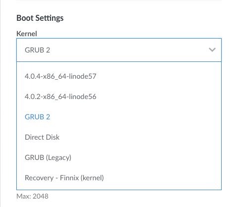

The primary component of every Linux system is the *Linux kernel*. The kernel interfaces with the system's hardware and it controls the operating system's core functionality. This guide covers the types of kernels that can be assigned to a Linode and how to view, update, or change the kernel.

## Types of Kernels

Your Linode is capable of running one of three kinds of kernels:

-   **Upstream kernel** (or *distribution-supplied kernel*): This kernel is maintained and provided by your Linux distribution. A major benefit of this kernel is that the distribution was designed with this kernel in mind and all updates are managed through the distributions package management system. It also may support features not present in the Linode kernel (for example, [SELinux](/docs/security/getting-started-with-selinux/)).

    To chose this kernel, select **GRUB2** within your Configuration Profile.

-   **Linode kernel:** Linode also maintains kernels that can be used on a Linode. If selected, these kernels are provided to your Linode at boot (not directly installed on your system). The [Current Kernels](https://www.linode.com/kernels) page displays a list of all the available Linode kernels.

    To chose this kernel, select **Latest 64-bit X.X.X-x86_64-linodeX** or a specific kernel version within your Configuration Profile.

-   **Custom-compiled kernel:** A kernel that you compile from source. Compiling a kernel can let you use features not available in the upstream or Linode kernels, but it takes longer to compile the kernel from source than to download it from your package manager.

    Like the upstream kernel, this kernel can also be selected by using **Grub2** in your Configuration Profile - though additional steps are needed to actually compile your kernel.

Most of the distribution images available on Linode use the upstream distribution-supplied kernel by default.

## Viewing and Modifying the Kernel

1.  Navigate to your Linode in the [Cloud Manager](https://cloud.linode.com) and click the **Configuration** tab.

1. Find your current *Configuration* and click the corresponding **Edit** link. This may be located within the **More Options Ellipses** dropdown menu.

1.  Scroll to the *Boot Settings* section.

1.  Review the **Kernel** dropdown menu selection. Depending on your distribution and when your Linode was created, this will likely be set to either `GRUB 2` or `Latest 64 bit (<kernel version>-x86_64-linode<linode kernel release number>)`.

    

1.  To use Linode's kernel, select `Latest 64 bit (<kernel version>-x86_64-linode)` from the Kernel menu. To change to the upstream kernel, or to use a kernel you've compiled from source, select `GRUB 2`. For more information on custom compiled kernels, review our guides for [Debian, Ubuntu,](/docs/tools-reference/custom-kernels-distros/custom-compiled-kernel-debian-ubuntu/) and [CentOS](/docs/tools-reference/custom-kernels-distros/custom-compiled-kernel-centos-7/).

1.  Click **Save Changes** and reboot your Linode for the new kernel to take affect

1.  Once booted, you can verify the kernel information with `uname`:

        uname -r

    
4.17.15-x86_64-linode115


    You can switch back to your previous kernel setting at any time by repeating the steps above for the kernel of your choice.

### Caveats when Booting under GRUB 2

#### SELinux

CentOS 7 and Fedora ship with [SELinux](/docs/security/getting-started-with-selinux/) running in enforcing mode by default. When switching from the Linode kernel to the upstream kernel, SELinux may need to relabel your filesystem at boot. When the relabeling completes, the Linode will shut down. If you have [Lassie](/docs/uptime/monitoring-and-maintaining-your-server/#configure-shutdown-watchdog) enabled, the Linode Manager will automatically boot your Linode again following the shut down. If you do not have Lassie enabled, you will need to manually reboot from the Linode Manager.

You can trigger the relabel process by creating an empty `/.autorelabel` file and then rebooting:

    touch /.autorelabel

#### No Upstream Kernel Installed

If your system does not boot and instead shows a GRUB command line prompt in Lish like shown below, then you need to install the kernel and configure GRUB. **This should only be necessary on Linodes which were created before February 2017.** If this is the case, switch back to the Linode kernel in your configuration profile, reboot your Linode, and then follow this guide's instructions for installing the kernel.

## Installing the Upstream Kernel


This guide is written for a non-root user. Some commands may require elevated privileges and should be prefixed with `sudo`. If you're not familiar with the `sudo` command, visit our [Users and Groups](/docs/tools-reference/linux-users-and-groups/) guide.

All configuration files should be edited with elevated privileges. Remember to include `sudo` before running your text editor.


1.  Update your package management system:

    **Arch Linux**

        pacman -Syu

    **CentOS**

        yum update

    **Debian/Ubuntu**

        apt update

    **Gentoo**

        emerge -avDuN world

1.  Install the Linux kernel and GRUB 2. Choose `/dev/sda` if you're asked which disk to install to during installation. Linode provides the GRUB bootloader, so your system only needs to provide a `grub.cfg` file.

    **Arch Linux**

        pacman -S linux grub

    **CentOS 6**

        yum install kernel grub

    **CentOS 7**

        yum install kernel grub2

    **Debian**

        apt-get install linux-image-amd64 grub2

    **Gentoo**

    There are two main ways to install Gentoo's kernel: Manual configuration and using the `genkernel` tool. Which you use and how you configure the kernel will depend on your preferences, so see the [Gentoo Handbook](https://wiki.gentoo.org/wiki/Handbook:AMD64/Installation/Kernel) for instructions.

    **Ubuntu**

        apt install linux-generic grub2

When the installation finishes, you'll see the kernel and other components in the `/boot` directory. For example:


[root@archlinux ~]# ls /boot
grub  initramfs-linux-fallback.img  initramfs-linux.img  vmlinuz-linux


### Configuring GRUB

After the kernel is installed, you'll need to configure the serial console and other GRUB settings so you can use [Lish](/docs/platform/manager/using-the-linode-shell-lish/) and [Glish](/docs/platform/manager/using-the-linode-graphical-shell-glish/).

1.  Open `/etc/default/grub` in a text editor and go to the line beginning with `GRUB_CMDLINE_LINUX`. Remove the word `quiet` if present, and add `console=ttyS0,19200n8 net.ifnames=0`. Leave the other entries in the line. For example, on CentOS 7 you should have something similar to:

        GRUB_CMDLINE_LINUX="crashkernel=auto rhgb console=ttyS0,19200n8 net.ifnames=0"

1.  Add or change the options in `/etc/default/grub` to match the following snippet. There will be other variables in this file, but the current changes are only focused on these lines.

    
GRUB_TERMINAL=serial
GRUB_DISABLE_OS_PROBER=true
GRUB_SERIAL_COMMAND="serial --speed=19200 --unit=0 --word=8 --parity=no --stop=1"
GRUB_DISABLE_LINUX_UUID=true
GRUB_GFXPAYLOAD_LINUX=text



1.  Prepare and update the bootloader:

    **Arch and Gentoo**

        grub-mkconfig -o /boot/grub/grub.cfg

    **CentOS**

    The `.autorelabel` file is necessary to queue the SELinux filesystem relabeling process when rebooting from the Linode kernel to the CentOS kernel.

        mkdir /boot/grub
        ln -s /boot/grub2/grub.cfg /boot/grub/grub.cfg
        grub2-mkconfig -o /boot/grub/grub.cfg
        touch /.autorelabel

    **Debian and Ubuntu**

        update-grub

## Updating the Kernel

The steps needed to update your kernel vary depending on the type of kernel you are running.

### Updating the Linode Kernel

1.  Navigate to your Linode in the [Cloud Manager](https://cloud.linode.com) and click the **Configuration** tab.

1. Find your current *Configuration* and click the corresponding **Edit** link. This may be located within the **More Options Ellipses** dropdown menu.

1.  Scroll to the *Boot Settings* section.

1.  Select **Latest 64 bit** from the *Select a Kernel* dropdown (if you need a 32-bit kernel, select **Latest 32 bit**) and click the **Submit** button to save the changes.

1.  Reboot the Linode to boot into the new kernel and verify the kernel version:

        uname -r

    
4.17.15-x86_64-linode115


### Updating the Upstream Kernel

If you boot your Linode using the GRUB2 or Direct Disk boot setting, your kernel is supplied by your distribution’s maintainers, not Linode. If you’ve compiled your own kernel, download a new set of kernel sources and recompile.

Update your kernel to the latest available version using the distribution’s package manager:

**CentOS**

    sudo yum update kernel

**Debian**

    sudo apt-get update
    sudo apt-get upgrade linux-base

**Ubuntu**

    sudo apt-get update
    sudo apt-get upgrade linux-generic

Reboot the Linode. When it comes back up, use the command `uname -r` to verify which version you are running. It's recommend that you compare your new kernel version against the patched version given in your distribution’s security bulletin: [CentOS](https://access.redhat.com/errata/#/?q=rhsa-2018&p=1&sort=portal_publication_date%20desc&rows=10); [Debian](https://security-tracker.debian.org/tracker/); [Ubuntu](https://people.canonical.com/~ubuntu-security/cve/).
