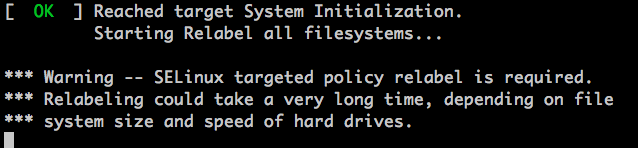

The primary component of every Linux system is the *Linux kernel*. The kernel interfaces with the system's hardware and it controls the operating system's core functionality. This guide covers the types of kernels that can be assigned to a Linode and how to view, update, or change the kernel.

## Types of Kernels

Your Linode is capable of running one of three kinds of kernels:

-   **Upstream kernel** (or *distribution-supplied kernel*): This kernel is maintained and provided by your Linux distribution. A major benefit of this kernel is that the distribution was designed with this kernel in mind and all updates are managed through the distributions package management system. It also may support features not present in the Linode kernel (for example, [SELinux](/docs/guides/a-beginners-guide-to-selinux-on-centos-7/)).

-   **Linode kernel:** Linode also maintains kernels that can be used on a Linode. If selected, these kernels are provided to your Linode at boot (not directly installed on your system). The [Current Kernels](https://www.linode.com/kernels) page displays a list of all the available Linode kernels.

-   **Custom-compiled kernel:** A kernel that you compile from source. Compiling a kernel can let you use features not available in the upstream or Linode kernels, but it takes longer to compile the kernel from source than to download it from your package manager. For more information on custom compiled kernels, review our guides for [Debian, Ubuntu,](/docs/guides/custom-compiled-kernel-debian-ubuntu/) and [CentOS](/docs/guides/custom-compiled-kernel-centos-7/).

Most of the distribution images available on Linode use the upstream distribution-supplied kernel by default.

## Determining Which Kernel Is Installed

There are may ways you can determine which kernel version is installed on your Linux system. The following instructions cover the most common methods:

1.  Log in to the Linode through either [SSH](/docs/guides/connect-to-server-over-ssh/) or [Lish](/docs/guides/using-the-lish-console/).

1.  Run one of the following commands to display the kernel version:

    - `uname -r`: Outputs a single line with just the kernel version.
    - `hostnamectl`: Outputs an organized list of system details, including the kernel version. Can only be used on distributions with [systemd](https://en.wikipedia.org/wiki/Systemd) (Debian, Ubuntu, CentOS, openSUSE, and more).
    - `cat /proc/version`: Outputs a string that contains the kernel version and release details.

The kernel version should be a string that's similar to `5.4.0-80-generic`. In this example, the kernel ends with `generic`, which is common in Ubuntu systems to designate that this is an upstream kernel. If the kernel ends with something similar to `linode123`, a Linode kernel is being used and the string matches the precise Linode kernel release.

## Viewing and Modifying the Kernel in the Cloud Manager

You can use the Cloud Manager to view the type of kernel you are using. If you are using a Linode kernel (not an upstream kernel), you can also view the kernel version.


These instructions may not accurately reflect the actual kernel version installed. This is especially true if the Linode hasn't been rebooted in a while or wasn't rebooted after a change to the Linode's Configuration. To determine the actual kernel version installed on your system, see [Determining Which Kernel Is Installed](#determining-which-kernel-is-installed).


1.  Navigate to your Linode in the [Cloud Manager](https://cloud.linode.com) and click the **Configuration** tab.

1. Find your current *Configuration* and click the corresponding **Edit** link. This may be located within the **More Options Ellipses** dropdown menu.

1.  Scroll to the *Boot Settings* section.

1.  Review the **Kernel** dropdown menu selection.

    - **Latest 64 bit** and **Latest 32 bit**: Uses one of the latest 64-bit or 32-bit Linode kernels at the time the Linode boots/reboots, depending on which option you selected. Since new kernel releases are rolled out over a short time period, the actual kernel used by your system may be one or two releases behind. This setting was the default for most distributions prior to August 2018.
    - **Direct Disk**: Instead of a Linux Kernel, this uses the MBE (Master Boot Record) of the primary disk*.
    - **GRUB 2**: Uses the upstream distribution-supplied kernel that's installed on the primary disk. If a custom kernel has been installed instead, that is used instead. **This is the most common option and has been the default for most new Linodes created after August 2018.**
    - **GRUB (Legacy)**: Uses the upstream distribution-supplied kernel that's installed on the primary disk*. This should only be used on older Linux distributions that have Grub (not Grub 2) installed, like CentOS 6.
    - **Specific Linode Kernel**: Allows you to specify the exact Linode kernel to use. Since this kernel is maintained regardless of reboots or system updates, it may be preferred in some use cases.

    *\*Primary disk: the disk assigned as the "Root Device" within the Linode's Configuration Profile.*

1.  Make any desired changes and click the **Save Changes** button. Otherwise, if no changes were made, click **Cancel**.

1.  If any changes were made, reboot your Linode for the new kernel to take affect.

## Updating the Kernel

Provided a newer kernel is available, you should be able to either manually (or automatically) update the kernel. The exact steps vary depending on the type of kernel and, for upstream kernels, the Linux distribution you are using.

### Updating the Linode Kernel

Follow these steps if the Linode is using a Linode kernel:

-   **Latest 64-bit or 32-bit kernel**: Rebooting the Linode automatically updates the kernel used within your system to one of the latest Linode kernel release. Since new kernel releases are rolled out over a short time period, the actual kernel used by your system may be one or two releases behind.
-   **Specific kernel version** (ex: `5.12.2-x86_64-linode144`): To update your kernel, follow the instructions within the [Viewing and Modifying the Kernel in the Cloud Manager](#viewing-and-modifying-the-kernel-in-the-cloud-manager) section. When selecting the kernel in the Linode's Configuration Profile, chose your desired kernel version (or select `Latest 64 bit`), save the changes, and reboot your Linode.

### Updating the Upstream Kernel

Follow these steps if the Linode is using an upstream kernel (the default for most new Linodes created after August 2018):

1.  Log in to the Linode through either [SSH](/docs/guides/connect-to-server-over-ssh/) or [Lish](/docs/guides/using-the-lish-console/).

1.  Upgrade any system packages related to the kernel:

    -   **Ubuntu**

            sudo apt-get update && sudo apt-get upgrade linux-generic

    -   **Debian**

            sudo apt-get update && sudo apt-get upgrade linux-base

    -   **CentOS Stream, CentOS 8, AlmaLinux 8, Rocky Linux 8, and Fedora**

            sudo dnf upgrade kernel

    -   **CentOS 7**

            sudo yum update kernel

    Alternatively, you can upgrade all packages on your system. For specific commands, review the Update/Upgrade sections in the guides for your [package manager](/docs/guides/linux-package-management-overview/). See [APT](/docs/guides/apt-package-manager/#upgrading-packages) (for Ubuntu and Debian), [DNF](/docs/guides/dnf-package-manager/#upgrade-packages) (for CentOS Stream, CentOS 8, AlmaLinux 8, Rocky Linux 8, and Fedora), and [YUM](/docs/guides/yum-package-manager/#upgrading-packages) (for CentOS 7).

1.  Reboot the Linode.

## Considerations When Switching From a Linode Kernel to GRUB2

While switching to GRUB2 is usually an easy seamless change, there are some fringe issues that can effect specific configurations.

### Asynchronous SCSI Scans

At the time of this writing, if you wish to switch from a Linode kernel to GRUB2, there is a known issue related to Asynchronous SCSI scans that can in some cases cause disks to be created with the wrong address. For example, a disk that may be created as a device to be addressed to `/dev/sda` may instead appear on `/dev/sdb`. This issue can most commonly be identified with an error message that is the same or similar to the following when the boot device is set to `/dev/sda`:

  `Failed to mount /dev/sda as root file system`

Users can generally resolve this issue by either using the latest upstream kernel instead, or by adding a kernel parameter to the grub configuration file, usually found in `/etc/default/grub` to disable the asynchronous scanning which causes the issue. To do this, the following line will need to be added to the end of the grub configuration file:


scsi_mod.scan=sync


Once the file has been edited, GRUB2 will need to be manually restarted. While this command will vary between Distros, using the following command will complete this task for **Debian** and **Ubuntu**:

    update-grub

Users that rely on **CentOS** or other **RHEL** based operating systems should instead enter the following:

    sudo grub2-mkconfig -o /boot/grub2/grub.cfg

Once completed, the disks should be read by GRUB2 correctly.

### SELinux

In older systems created prior to August 2018, CentOS 7 and Fedora ship with [SELinux](/docs/guides/a-beginners-guide-to-selinux-on-centos-7/) running in enforcing mode by default. When switching from the Linode kernel to the upstream kernel, SELinux may need to relabel your filesystem at boot. When the relabeling completes, the Linode will shut down. If you have [Lassie](/docs/uptime/monitoring-and-maintaining-your-server/#configure-shutdown-watchdog) enabled, the Linode will automatically boot back up following the shut down. If you do not have Lassie enabled, you will need to manually reboot from the Cloud Manager.

You can trigger the relabel process by creating an empty `/.autorelabel` file and then rebooting:

    touch /.autorelabel

### No Upstream Kernel Installed

If your system does not boot and instead shows a GRUB command line prompt in Lish like shown below, then you need to install the kernel and configure GRUB. **This should only be necessary on Linodes which were created before February 2017.** If this is the case, switch back to the Linode kernel in your configuration profile, reboot your Linode, and then follow this guide's instructions for installing the kernel.

## Installing the Upstream Kernel and Configuring GRUB

For new Linodes, an upstream kernel is already installed on your system and you **do not need to follow these steps**. In the case of older Linodes, this section outlines how to get both an upstream kernel (and GRUB) installed and configured on your system.

1.  Log in to the Linode through either [SSH](/docs/guides/connect-to-server-over-ssh/) or [Lish](/docs/guides/using-the-lish-console/).

1.  Update your package management system and install the Linux kernel and GRUB 2. Choose `/dev/sda` if you're asked which disk to install to during installation. Linode provides the GRUB bootloader, so your system only needs to provide a `grub.cfg` file.

    -   **Ubuntu**

            sudo apt update && sudo apt install linux-generic grub2

    -   **Debian**

            sudo apt update && sudo apt install linux-image-amd64 grub2

    -   **CentOS Stream, CentOS 8, AlmaLinux 8, Rocky Linux 8, Fedora**

            sudo dnf upgrade && sudo dnf install kernel grub2

    -   **CentOS 7**

            sudo yum update && sudo yum install kernel grub2

    -   **Arch Linux**

            sudo pacman -Syu && sudo pacman -S linux grub

    -   **Gentoo**

            emerge -avDuN world

        There are two main ways to install Gentoo's kernel: Manual configuration and using the `genkernel` tool. Which you use and how you configure the kernel will depend on your preferences, so see the [Gentoo Handbook](https://wiki.gentoo.org/wiki/Handbook:AMD64/Installation/Kernel) for instructions.

    When the installation finishes, the kernel and other components are located in the `/boot` directory. For example:

    
    [root@archlinux ~]# ls /boot
    grub  initramfs-linux-fallback.img  initramfs-linux.img  vmlinuz-linux
    

1. Next, configure the serial console and other GRUB settings so you can use [Lish](/docs/guides/using-the-lish-console/) and [Glish](/docs/guides/using-the-linode-graphical-shell-glish/). This is outlined in the following steps.

1.  Open `/etc/default/grub` in a text editor and go to the line beginning with `GRUB_CMDLINE_LINUX`. Remove the word `quiet` if present, and add `console=ttyS0,19200n8 net.ifnames=0`. Leave the other entries in the line. For example, on CentOS 7 you should have something similar to:

        GRUB_CMDLINE_LINUX="crashkernel=auto rhgb console=ttyS0,19200n8 net.ifnames=0"

1.  Add or change the options in `/etc/default/grub` to match the following snippet. There are other variables in this file, but the current changes are only focused on these lines.

    
GRUB_TERMINAL=serial
GRUB_DISABLE_OS_PROBER=true
GRUB_SERIAL_COMMAND="serial --speed=19200 --unit=0 --word=8 --parity=no --stop=1"
GRUB_DISABLE_LINUX_UUID=true
GRUB_GFXPAYLOAD_LINUX=text


1.  Prepare and update the bootloader:

    -   **Debian and Ubuntu**

            sudo update-grub

    -   **CentOS**

        The `.autorelabel` file is necessary to queue the SELinux file system relabeling process when rebooting from the Linode kernel to the CentOS kernel.

            mkdir /boot/grub
            ln -s /boot/grub2/grub.cfg /boot/grub/grub.cfg
            grub2-mkconfig -o /boot/grub/grub.cfg
            touch /.autorelabel

    -   **Arch and Gentoo**

            grub-mkconfig -o /boot/grub/grub.cfg
