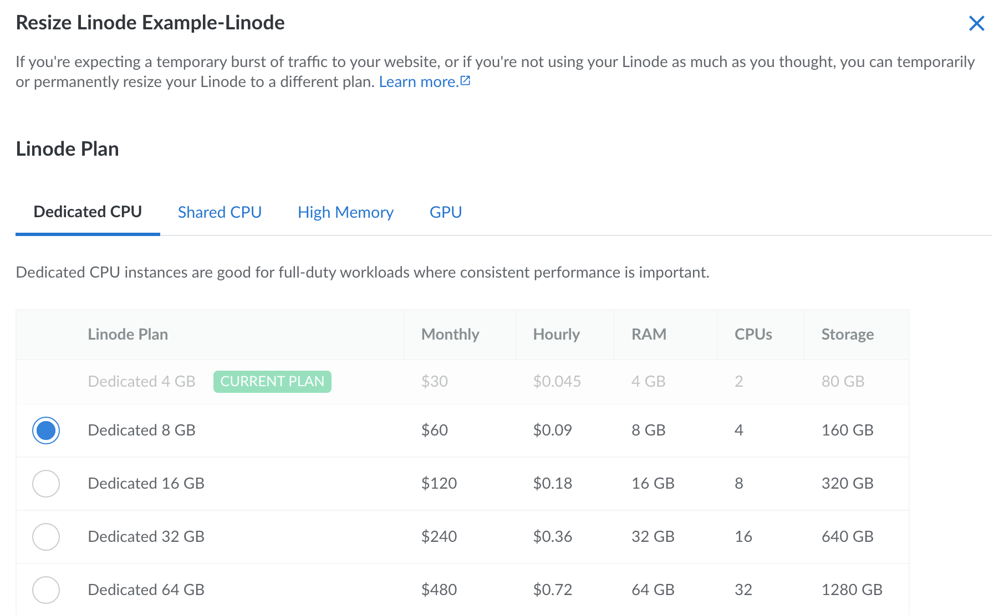
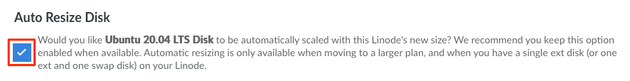

We make it easy to upgrade or downgrade your Linode by changing plans and adding additional resources. If you're expecting a temporary burst of traffic to your website, or if you're not using your Linode as much as you thought, you can temporarily or permanently resize your Linode to a different plan.

## What to Expect

- You can upgrade your Linode to a larger plan, downgrade to a smaller plan, or even change to a different plan type (such as switching from a Shared CPU plan to a Dedicated CPU plan).

- While resizing a Linode, it is powered off and migrated to a different physical host within the same data center. This new host may have slightly different hardware, though performance is consistent across our entire fleet.

-  The disks are transferred to the new hardware at a typical rate of ~150 MB/sec. While you can use this rate to approximate any downtime, the actual transfer speeds may vary and downtime may be shorter or longer than expected.

- The Linode remains powered off during the entire resize process. After the resize completes, the Linode returns to its previous power state.

- All of your existing data and configuration settings are preserved during the resize and your IP addresses remain the same.

## Resizing a Linode

Here's how to resize your Linode to a different plan:

1.  Log in to the [Cloud Manager](https://cloud.linode.com) and select the **Linodes** link within the left sidebar.

1.  Within the list of Linodes, locate the Linode you'd like to resize, click the corresponding **more options ellipsis** dropdown menu, and select **Resize**. This displays the **Resize Linode** panel.

    

1.  Select the desired plan for this Linode.

    -  **To select a larger plan**, review [Upgrading to a Larger Plan](#upgrading-to-a-larger-plan).

    -  **To select a smaller plan**, you first need to resize the Linode's disks. See [Downgrading to a Smaller Plan](#downgrading-to-a-smaller-plan).

    -  **To select a different plan type**, review [Switching to a Different Plan Type](#switching-to-a-different-plan-type).

1.  Check **Auto Resize Disk** if you'd like to automatically resize your Linode's primary disk. This can only be selected if the following conditions are met:

    - The new plan provides more storage space than the Linode's current plan.
    - There is only a single ext3 or ext4 disk (not a raw disk). A swap disk can also be present, but it will not be resized.

    

1.  Enter the Linode's label in the **Confirm** field and select the **Resize Linode** button to initiate the resize.

1.  If the Linode is powered on, it is powered off for the duration of the resize. After the resize completes, the Linode returns to it's original power state.

You are now able to utilize the resources of your new plan.

## Upgrading to a Larger Plan

Upgrading to a plan with additional resources and capacity enables you to scale vertically. Larger plans can accommodate increased traffic and provide your application with the additional computing power it needs. Since larger plans come equipped with more resources, you may want to make adjustments to take advantage of these resources.

- **Resize Disks:** When resizing a Linode to a larger plan, you can (in most cases) opt to automatically resize the Linode's disks. If your Linode does not meet the requirements for this functionality or if you decide not to do this automatically, you can manually resize the disks at any point. See [Resize a Linode's Disk](/docs/guides/resize-a-linode-disk/)

- **Optimize Applications:** Many applications can be configured to enhance performance when additional resources become available. This configuration may include increasing the memory limit, enabling multiple threads, and increasing the size maximum size of data, cache, logs, or other files. Review the documentation for your application and any software such as PHP, MySQL, Apache, or NGINX.

- **Enable Multi-Queue NICS:** When upgrading to a plan with two or more vCPU cores, make sure that the multi-queue NICs feature is enabled. In most cases, this feature is already enabled or will be enabled once the Linode reboots during the resize process. However, older distributions may require additional steps. See [Configuring Multi-Queue NICS](/docs/guides/multiqueue-nic/).

## Downgrading to a Smaller Plan

Downgrading to a plan with less resources may be helpful when looking to reduce computing costs or after making your application use system resources more efficiently. When moving to a smaller plan, the combined size of the Linode's disks must be equal to or less than the desired plan's storage allocation.

1.  Determine the storage space that's included in the new desired plan. This information is listed on the [Pricing Page](https://www.linode.com/pricing/) (under the *Storage* column).

1.  Determine the amount of disk space currently being used on your Linode. To do this, log in to your Linode via [SSH](/docs/guides/connect-to-server-over-ssh/) or [Lish](/docs/guides/using-the-lish-console/) and run the following command:

        df -h

    Specifically, review the *Used* column from the output of that command.

    - If you're using less space than your intended plan requires, you can move onto the next step without any further action.

    - If you're using more space than your intended plan allows, you need to remove some files to free up some space before moving onto the next step. See the options for doing this in the [Download Files from Your Linode](/docs/guides/download-files-from-your-linode/) guide.

1.  Resize the Linode's disks to fit within the storage space of the new plan. See [Resizing a Disk](/docs/guides/resize-a-linode-disk/).

## Switching to a Different Plan Type

There are quite a few types of Linode Compute Instances available to you, each with their own value propositions and use cases. When resizing your Linode, you aren't limited to the current plan type. You are able to switch to any Linode plan across any plan type, including:

- **Dedicated CPU:** Optimized for CPU-intenseive applications. This plan type is equipped with dedicated vCPU cores, suitable for almost any workload that requires consistently high CPU performance. Use cases include production (and high traffic) websites, e-commerce sites, machine learning, data processing, and much more. See [Dedicated CPU Compute Instances](https://www.linode.com/products/dedicated-cpu/).
- **Shared CPU:** Balancing performance with value. This plan type is a solid foundation for many common use cases, including development, low-traffic websites, or any workload that doesn't require consistent 100% CPU usage. See [Shared CPU Compute Instances](https://www.linode.com/products/shared/).
- **High Memory:** Optimized for memory-intensive applications. This plan type is also equipped with dedicated vCPU cores, though they contain more memory than other similarly priced plans. Use cases include large or high-traffic databases, caching servers, and more. See [High Memory Compute Instances](https://www.linode.com/products/high-memory/).
- **GPU:** The only plan type that is equipped with high performance NVIDIA GPU cards. GPU plans are capable of processing large amounts of data in parallel, performing complex calculations much more efficiently. See [GPU Compute Instances](https://www.linode.com/products/gpu/).

For help deciding on a plan type, review the [Choosing a Compute Instance Type and Plan](/docs/guides/choosing-a-compute-instance-plan/) guide for advice and a comparison of each plan.

To switch to a different plan type, follow the instructions outlined within [Resizing a Linode](#resizing-a-linode). When choosing the plan, select the tab that corresponds with your desired plan type.

