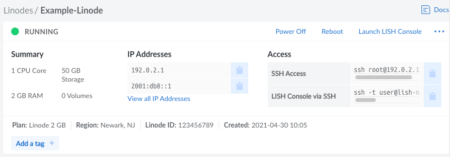

After you have successfully created a Compute Instance, there are a few initial configuration steps you should perform within your new Linux system. This ensures your instance is update to date and ready for whatever applications you wish to install. If you haven't yet created a Compute Instance, see [Creating a Compute Instance](/docs/guides/creating-a-compute-instance/).

1. [View your Instance in the Cloud Manager](#view-your-instance-in-the-cloud-manager)
1. [Connect to the Instance](#connect-to-the-instance)
1. [Install Software Updates](#install-software-updates)
1. [Set the Hostname](#set-the-hostname)
1. [Set the Timezone](#set-the-timezone)
1. [Next Steps](#next-steps)

## View your Instance in the Cloud Manager

Log in to the [Cloud Manager](https://cloud.linode.com/), click the **Linodes** link in the left menu, and select your Compute Instance from the list. This opens the details page for that instance, which allows you to view key information and further configure it to your meet your needs.

## Connect to the Instance

Once the Compute Instance has been created and is done initializing, you can start connecting to it over Weblish, Lish, or SSH. Communicating with your Linode is usually done using the SSH protocol, though you can use Weblish (through your browser) or Lish (through SSH) as an alternative means of connecting.

-   **Weblish (via the Cloud Manager):** Click the **Launch LISH Console** link at the top right corner of the Compute Instance's detail page. See [Using the Lish Console > Through a Browser](/docs/guides/using-the-lish-console/#through-the-cloud-manager-weblish).

-   **Lish (via SSH):** Copy the command from the *LISH Console via SSH* field under the **Access** section on the Compute Instance's detail page (see screenshot above) and paste it into your local computer's terminal. The command should look similar to the one below, only with your username, data center, and Linode label. Review [Using the Lish Console > Through SSH](/docs/guides/using-the-lish-console/#through-ssh-using-a-terminal) for more instructions.

        ssh -t user@lish-newark.linode.com Example-Linode

-   **SSH:** Copy the command from the *LISH Console via SSH* field under the **Access** section on the Compute Instance's detail page (see screenshot above) and paste it into your local computer's terminal. The command should look similar to the following, only with the IP address of your newly created instance.

        ssh root@192.0.2.1

    - **Windows:** Windows 10 and 11 users can connect to their Linode using the [Command Prompt (or PowerShell)](/docs/guides/connect-to-server-over-ssh-on-windows/#command-prompt-or-powershell---windows-10-or-11) application, provided their system is fully updated. For users of Windows 8 and earlier, [Secure Shell on Chrome](/docs/guides/connect-to-server-over-ssh-on-chrome/), [PuTTY](/docs/guides/connect-to-server-over-ssh-using-putty/), or many other third party tools can be used instead. See [Connecting to a Remote Server Over SSH on Windows](/docs/guides/connect-to-server-over-ssh-on-windows/).
    - **macOS:** The *Terminal* application is pre-installed on macOS. See [Connecting to a Remote Server Over SSH on a Mac](/docs/guides/connect-to-server-over-ssh-on-mac/).
    - **Linux:** You can use a terminal window, regardless of desktop environment or window manager. See [Connecting to a Remote Server Over SSH on Linux](/docs/guides/connect-to-server-over-ssh-on-linux/)

## Install Software Updates

The first thing you should do after connecting to your Linode is update the Linux distribution's packages. This applies the latest security patches and bug fixes to help protect your Linode against unauthorized access. Installing software updates should be performed regularly.

### CentOS/RHEL Stream and Fedora

*This includes CentOS Stream (and 8), other RHEL derivatives (including AlmaLinux 8, and Rocky Linux 8), and Fedora.*

    dnf upgrade

### Ubuntu and Debian

    apt update && apt upgrade


You may be prompted to make a menu selection when the Grub package is updated on Ubuntu. If prompted, select `keep the local version currently installed`.


### Other Distributions

#### Alpine

    apk update && apk upgrade

#### Arch Linux

    pacman -Syu

#### CentOS 7

    yum update

#### Gentoo

    emaint sync -a

After running a sync, it may end with a message that you should upgrade Portage using a `--oneshot` emerge command. If so, run the Portage update. Then update the rest of the system:

    emerge -uDU --keep-going --with-bdeps=y @world

#### OpenSUSE

    zypper update

#### Slackware

    slackpkg update
    slackpkg upgrade-all

## Set the Hostname

A hostname is used to identify your Linode using an easy-to-remember name. Your Linode's hostname doesn't necessarily associate with websites or email services hosted on the system, but see our guide on using the [hosts file](/docs/networking/dns/using-your-systems-hosts-file/) if you want to assign your Linode a fully qualified domain name.

 Your hostname should be something unique, and should not be *www* or anything too generic. Some people name their servers after planets, philosophers, or animals. After you've made the change below, you may need to log out and log back in again to see the terminal prompt change from `localhost` to your new hostname. The command `hostname` should also show it correctly.

### Most Distributions

*This includes Ubuntu 16.04 (and newer), CentOS 7 (and newer), other RHEL derivatives (including AlmaLinux 8 and Rocky Linux 8), Debian 8 (and newer), Fedora, OpenSuse, and Arch.*

Replace `example-hostname` with one of your choice.

    hostnamectl set-hostname example-hostname

### Other Distributions

#### Alpine

See [Update Your Systems hosts File](#update-your-systems-hosts-file).

#### Gentoo

    echo "HOSTNAME=\"example-hostname\"" > /etc/conf.d/hostname
    /etc/init.d/hostname restart

#### Slackware

    echo "example-hostname" > /etc/HOSTNAME
    hostname -F /etc/HOSTNAME

### Update Your System's `hosts` File

The `hosts` file creates static associations between IP addresses and hostnames or domains which the system prioritizes before DNS for name resolution. Open this file in a text editor and add a line for your Linode's public IP address. You can associate this address with your Linode's **Fully Qualified Domain Name** (FQDN) if you have one, and with the local hostname you set in the steps above. In the example below, `203.0.113.10` is the public IP address, `example-hostname` is the local hostname, and `example-hostname.example.com` is the FQDN.


127.0.0.1 localhost.localdomain localhost
203.0.113.10 example-hostname.example.com example-hostname


Add an entry for your Linode's IPv6 address. Applications requiring IPv6 will not work without this entry:


127.0.0.1 localhost.localdomain localhost
203.0.113.10 example-hostname.example.com example-hostname
2600:3c01::a123:b456:c789:d012 example-hostname.example.com example-hostname


The value you assign as your system's FQDN should have an "A" record in DNS pointing to your Linode's IPv4 address. For IPv6, you should also set up a DNS "AAAA" record pointing to your Linode's IPv6 address.

See our guide to [Adding DNS Records](/docs/guides/dns-manager/) for more information on configuring DNS. For more information about the `hosts` file, see [Using your System's hosts File](/docs/networking/dns/using-your-systems-hosts-file/)

## Set the Timezone

All new Linodes are set to UTC time by default. However, you may prefer your Linode use the time zone which you live in so log file timestamps are relative to your local time.

### Most Distributions

*This includes CentOS 7 (and newer), other RHEL derivatives (including AlmaLinux 8, and Rocky Linux 8), Fedora, and Arch. These instructions also work for most Ubuntu, Debian, and OpenSuse distributions, though other methods may be preferred in those cases.*

1.  Use `timedatectl` to output a list of available timezones.

        timedatectl list-timezones

1.  Use the arrow keys, `Page Up`, and `Page Down` to navigate. Copy the time zone you want as a mouse selection. Then press **q** to exit the list.

1.  Set the time zone (for example, `America/New_York`).

        timedatectl set-timezone 'America/New_York'

### Ubuntu and Debian

The instructions under the [Most Distributions](#most-distributions-1) section above (which outlines the `timedatectl` command) are valid. That said, both Ubuntu and Debian come with a more friendly tool called `tzdata`, outlined below.

1.  Open the `tzdata` tool.

        dpkg-reconfigure tzdata

1.  Select the continent of your choice using the arrow keys and press **Enter**.
1.  Select your region using the arrow keys and press **Enter**.

### Other Distributions

#### Alpine

1.  Use the [setup-timezone](https://wiki.alpinelinux.org/wiki/Alpine_setup_scripts#setup-timezone) command to initiate the timezone selection process:

        setup-timezone

1.  Enter the timezone you are located within. If you aren't sure of the timezone string to use, enter `?` to display a list of available timezones

1.  If you selected a region with sub-timezones, enter `?` again to see a list of available sub-timezones and then enter the sub-timezone you are located within.

#### Gentoo

1.  View a list of available time zones.

        ls /usr/share/zoneinfo

1.  Write the selected time zone to `/etc/timezone` (for example, EST for Eastern Standard Time).

        echo "EST" > /etc/timezone

1.  Configure the `sys-libs/timezone-data` package, which sets `/etc/localtime`.

        emerge --config sys-libs/timezone-data

#### OpenSUSE

The instructions under the [Most Distributions](#most-distributions-1) section above (which outlines the `timedatectl` command) are valid. OpenSuse also has a more friendly way to select a timezone, discussed below.

1. Open the YaST2 timezone selector tool.

        yast2 timezone

1.  Use the arrow keys to select your region within the *Region* pane.

1.  Press **tab** to switch to the *Time Zone* pane and then use the arrow keys to select your time zone or sub-region.

1. Press **F10** to save the changes. Alternatively, press **tab** until the `[OK]` text button is highlighted. Then press **enter**.

#### Slackware

1.  Run the `timeconfig` tool.

        timeconfig

1.  Select `NO Hardware clock is set to local time`.
1.  Select a timezone.

### Check the Time

Use the `date` command to view the current date and time according to your server.


root@localhost:~# date
Thu Feb 16 12:17:52 EST 2018


## Next Steps

Now that you've learned the basics of using the Cloud Manager and working with your Linode, secure it and your Linode account from unauthorized access. See the following guides to begin:

* [Securing Your Server](/docs/security/securing-your-server/)
* [Linode Manager Security Controls](/docs/security/linode-manager-security-controls-new-manager/)