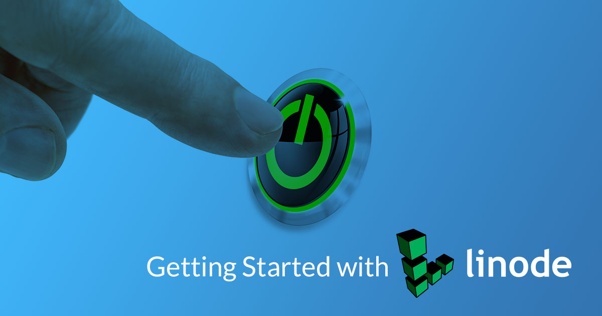
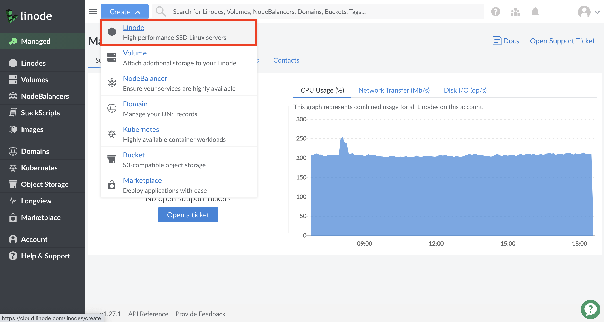
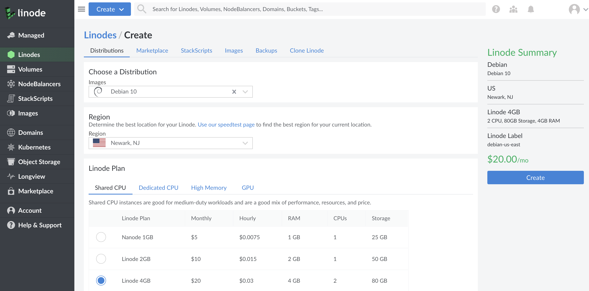
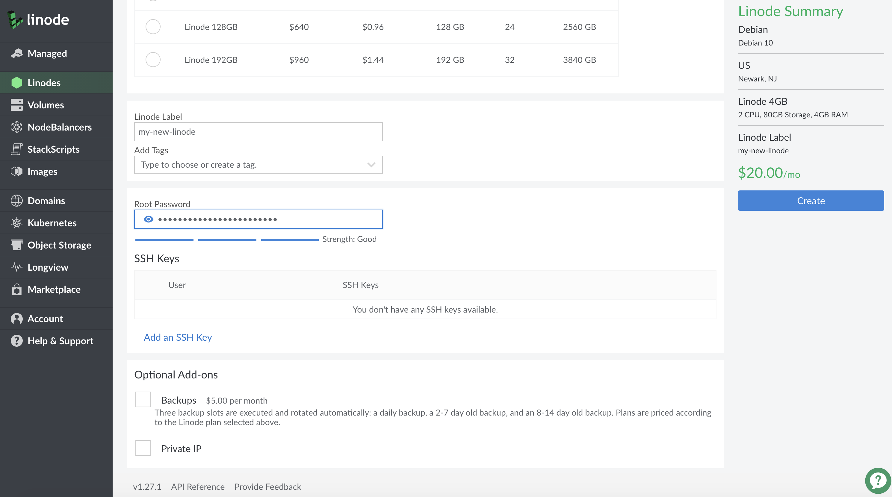
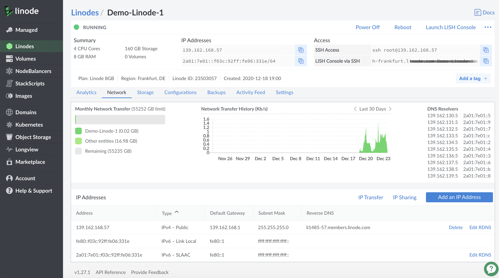
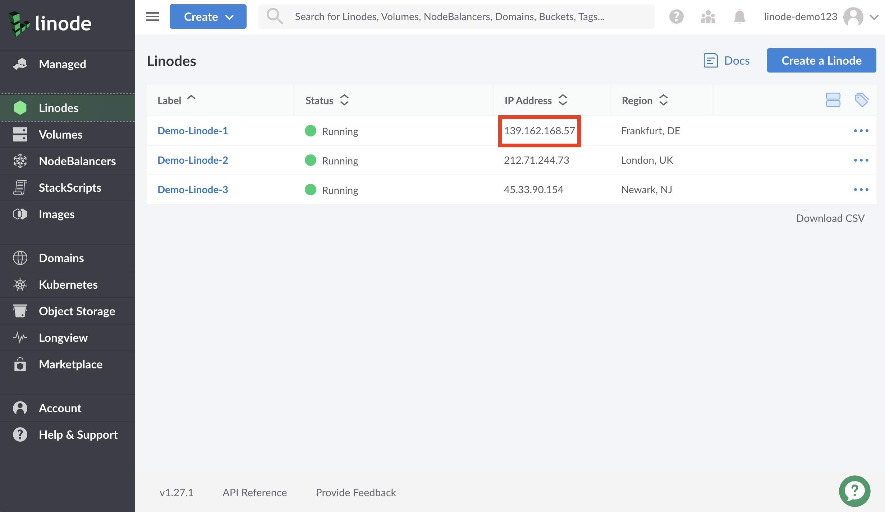

## Welcome to Linode!

Thank you for choosing Linode as your cloud hosting provider! This guide will help you sign up for an account and access Linode's [Cloud Manager](https://cloud.linode.com), a browser-based control panel which allows you to manage your Linode virtual servers and services.

From there you'll set up a Linux distribution, boot your Linode, and perform some basic system administration tasks. If you've already created an account and booted your Linode, skip ahead to [connecting to your Linode](#connect-to-your-linode-via-ssh) using SSH.

## Sign Up

First, you need to create a Linode account to start using our services. If you already have a Linode account, you can skip to the next section.

1.  Create a new Linode account. 

    
Newly created Linode accounts have restrictions on ports `25`, `465`, and `587`. If you'd like to send email from a Linode, review the [Running a Mail Server](/docs/email/running-a-mail-server/#sending-email-on-linode) guide, then [open a ticket](https://cloud.linode.com/support/tickets?type=closed&drawerOpen=true) with our Support team.
    

1.  Sign in and enter your billing and account information. Most accounts are activated instantly, but some require manual review prior to activation. If your account is not immediately activated, you will receive an email with additional instructions.

## Create a Linode

1.  Log in to the [Cloud Manager](https://cloud.linode.com) with the username and password you created when signing up.

1.  At the top of the page, click **Create** and select **Linode**.

    

1.  Select the [Distribution](/docs/quick-answers/linux/choosing-a-distribution/), [Marketplace App](/docs/platform/marketplace/how-to-use-marketplace-apps-at-linode/), or [Image](/docs/platform/disk-images/linode-images/) you would like to use.

    
Use a [StackScript](http://www.linode.com/stackscripts) to quickly deploy software platforms and system configuration options to your Linux distribution. Some of the most popular StackScripts do things like install a LAMP stack, VPN, or WordPress. You can read more about Stackscripts and how they work in our [Automating Deployments with Stackscripts Guide.](/docs/platform/stackscripts/)


1.  Choose the region where you would like your Linode to reside. If you're not sure which to select, see our [How to Choose a Data Center](/docs/platform/how-to-choose-a-data-center) guide. You can also generate [MTR reports](/docs/networking/diagnostics/diagnosing-network-issues-with-mtr/) for a deeper look at the route path between you and a data center in each specific region.

1. Select a Linode plan.

    

1.  Give your Linode a label. This is a name to help you easily identify it within the Cloud Manager's Dashboard. If desired, assign a tag to the Linode in the **Add Tags** field.

1. Create a root password for your Linode in the **Root Password** field. This password must be provided when you log in to your Linode via SSH. The password must meet the complexity strength validation requirements for a strong password. Your root password can be used to perform any action on your server, so make it long, complex, and unique.

    

1.  Click **Create**. You will be directed back to the *Linodes* page which will report the status of your Linode as it boots up. You can now use the Cloud Manager to:

    * Boot and shut down your Linode
    * Access monitoring statistics
    * Update your [billing](/docs/platform/billing-and-support/manage-billing-in-cloud-manager/) and [account](/docs/platform/manager/accounts-and-passwords-new-manager/) information
    * Add additional Linode services, like [Block Storage](/docs/platform/block-storage/how-to-use-block-storage-with-your-linode-new-manager/)
    * Open a [support](/docs/platform/billing-and-support/support-new-manager/) ticket and perform other administrative tasks

1.  Be sure to bookmark the [Linode Status page](https://status.linode.com/) or [subscribe](/docs/platform/linode-status-page/) to our system status updates by email.

## Network Helper

[Network Helper](/docs/platform/network-helper/) is a host-side service which automatically sets a static IPv4 address and gateway for your Linode. It is enabled by default. However, it can be [enabled and disabled globally](/docs/platform/network-helper/#global), and [per-Linode](/docs/platform/network-helper/#single-per-linode).

- If you **disable** Network Helper globally on your account, and you want it enabled for a single Linode, you will need to enable it for that Linode.
- If you **enable** Network Helper globally, every new Linode you create will have it enabled upon creation; you can disable it for single Linodes if desired.


If Network Helper is unable to determine the operating system during boot, or if you boot an unsupported operating system, Network Helper will not attempt to write any new configuration files. See the [Network Helper](/docs/platform/network-helper/) guide to learn which distributions it supports. Be aware that Network Helper configures only IPv4 addressing; your Linode’s IPv6 address is assigned by SLAAC.


## Connect to Your Linode via SSH

Communicating with your Linode is usually done using the secure shell (SSH) protocol. SSH encrypts all of the data transferred between the client application on your computer and the Linode, including passwords and other sensitive information. There are SSH clients available for every desktop operating system.

* **Windows:** Windows 10 users can connect to their Linode using the [PowerShell](/docs/guides/connect-to-server-over-ssh-on-windows/#powershell---windows-10) application, provided their system is fully updated. For users of Windows 8 and earlier, [Secure Shell on Chrome](/docs/guides/connect-to-server-over-ssh-on-chrome/), [PuTTY](/docs/guides/connect-to-server-over-ssh-using-putty/), or many other third party tools can be used instead. See [Connecting to a Remote Server Over SSH on Windows](/docs/guides/connect-to-server-over-ssh-on-windows/).
* **macOS:** The *Terminal* application is pre-installed on macOS. See [Connecting to a Remote Server Over SSH on a Mac](/docs/guides/connect-to-server-over-ssh-on-mac/).
* **Linux:** You can use a terminal window, regardless of desktop environment or window manager. See [Connecting to a Remote Server Over SSH on Linux](https://www.linode.com/docs/guides/connect-to-server-over-ssh-on-linux/)

### Find your Linode's IP Address

Your Linode has a unique IP address that identifies it to other devices and users on the internet.

1.  Click the **Linodes** menu item in the [Cloud Manager's](https://cloud.linode.com/) left hand navigation.

1.  Find your Linode, click on it's name and navigate to *Network*.

1.  Your IPv4 and IPv6 addresses appear under the *IPv4* and *IPv6* sections.

    

    You can also quickly reference your Linode's IP addresses from the **Linodes** page:

    

### Log in Using SSH

Once you have the IP address and an SSH client, you can log in via SSH. The following instructions are written for Linux and macOS. If you're using PuTTY on Windows, follow [these instructions](/docs/networking/ssh/ssh-connections-using-putty-on-windows/).

1.  Enter the following into your terminal window or application. Replace the example IP address with your Linode's IP address:

        ssh root@198.51.100.4

1.  If this is the first time connecting to your Linode, you'll see the authenticity warning below. This is because your SSH client has never encountered the server's key fingerprint before. Type `yes` and press **Enter** to continue connecting.

    
The authenticity of host '198.51.100.4 (198.51.100.4)' can't be established.
RSA key fingerprint is 11:eb:57:f3:a5:c3:e0:77:47:c4:15:3a:3c:df:6c:d2.
Are you sure you want to continue connecting (yes/no)?


    After you enter `yes`, the client confirms the addition:

    
Warning: Permanently added '198.51.100.4' (RSA) to the list of known hosts.


1.  The login prompt appears for you to enter the password you created for the `root` user above.

    
root@198.51.100.4's password:


1.  The SSH client initiates the connection and then the following prompt appears:

    
root@li123-456:~#


    
If you recently rebuilt an existing Linode, you might receive an error message when you try to
reconnect via SSH. SSH clients try to match the remote host with the known keys on your desktop computer, so when you rebuild your Linode, the remote host key changes.

To reconnect via SSH, revoke the key for that IP address.

For Linux and macOS:

    ssh-keygen -R 198.51.100.4

For Windows, PuTTY users must remove the old host IP addresses manually. PuTTY's known hosts are in the registry entry:

    HKEY_CURRENT_USER\Software\SimonTatham\PuTTY\SshHostKeys


## Install Software Updates

The first thing you should do after connecting to your Linode is update the Linux distribution's packages. This applies the latest security patches and bug fixes to help protect your Linode against unauthorized access. Installing software updates should be performed regularly.

### CentOS/RHEL Stream and Fedora

*This includes CentOS Stream (and 8), other RHEL derivatives (including AlmaLinux 8, and Rocky Linux 8), and Fedora.*

    dnf upgrade

### Ubuntu and Debian

    apt update && apt upgrade


You may be prompted to make a menu selection when the Grub package is updated on Ubuntu. If prompted, select `keep the local version currently installed`.


### Other Distributions

#### Alpine

    apk update && apk upgrade

#### Arch Linux

    pacman -Syu

#### CentOS 7

    yum update

#### Gentoo

    emaint sync -a

After running a sync, it may end with a message that you should upgrade Portage using a `--oneshot` emerge command. If so, run the Portage update. Then update the rest of the system:

    emerge -uDU --keep-going --with-bdeps=y @world

#### OpenSUSE

    zypper update

#### Slackware

    slackpkg update
    slackpkg upgrade-all

## Set the Hostname

A hostname is used to identify your Linode using an easy-to-remember name. Your Linode's hostname doesn't necessarily associate with websites or email services hosted on the system, but see our guide on using the [hosts file](/docs/networking/dns/using-your-systems-hosts-file/) if you want to assign your Linode a fully qualified domain name.

 Your hostname should be something unique, and should not be *www* or anything too generic. Some people name their servers after planets, philosophers, or animals. After you've made the change below, you may need to log out and log back in again to see the terminal prompt change from `localhost` to your new hostname. The command `hostname` should also show it correctly.

### Most Distributions

*This includes Ubuntu 16.04 (and newer), CentOS 7 (and newer), other RHEL derivatives (including AlmaLinux 8 and Rocky Linux 8), Debian 8 (and newer), Fedora, OpenSuse, and Arch.*

Replace `example-hostname` with one of your choice.

    hostnamectl set-hostname example-hostname

### Other Distributions

#### Alpine

See [Update Your Systems hosts File](#update-your-systems-hosts-file).

#### Gentoo

    echo "HOSTNAME=\"example-hostname\"" > /etc/conf.d/hostname
    /etc/init.d/hostname restart

#### Slackware

    echo "example-hostname" > /etc/HOSTNAME
    hostname -F /etc/HOSTNAME

### Update Your System's `hosts` File

The `hosts` file creates static associations between IP addresses and hostnames or domains which the system prioritizes before DNS for name resolution. Open this file in a text editor and add a line for your Linode's public IP address. You can associate this address with your Linode's **Fully Qualified Domain Name** (FQDN) if you have one, and with the local hostname you set in the steps above. In the example below, `203.0.113.10` is the public IP address, `example-hostname` is the local hostname, and `example-hostname.example.com` is the FQDN.


127.0.0.1 localhost.localdomain localhost
203.0.113.10 example-hostname.example.com example-hostname


Add an entry for your Linode's IPv6 address. Applications requiring IPv6 will not work without this entry:


127.0.0.1 localhost.localdomain localhost
203.0.113.10 example-hostname.example.com example-hostname
2600:3c01::a123:b456:c789:d012 example-hostname.example.com example-hostname


The value you assign as your system's FQDN should have an "A" record in DNS pointing to your Linode's IPv4 address. For IPv6, you should also set up a DNS "AAAA" record pointing to your Linode's IPv6 address.

See our guide to [Adding DNS Records](/docs/guides/dns-manager/) for more information on configuring DNS. For more information about the `hosts` file, see [Using your System's hosts File](/docs/networking/dns/using-your-systems-hosts-file/)

## Set the Timezone

All new Linodes are set to UTC time by default. However, you may prefer your Linode use the time zone which you live in so log file timestamps are relative to your local time.

### Most Distributions

*This includes CentOS 7 (and newer), other RHEL derivatives (including AlmaLinux 8, and Rocky Linux 8), Fedora, and Arch. These instructions also work for most Ubuntu, Debian, and OpenSuse distributions, though other methods may be preferred in those cases.*

1.  Use `timedatectl` to output a list of available timezones.

        timedatectl list-timezones

1.  Use the arrow keys, `Page Up`, and `Page Down` to navigate. Copy the time zone you want as a mouse selection. Then press **q** to exit the list.

1.  Set the time zone (for example, `America/New_York`).

        timedatectl set-timezone 'America/New_York'

### Ubuntu and Debian

The instructions under the [Most Distributions](#most-distributions-1) section above (which outlines the `timedatectl` command) are valid. That said, both Ubuntu and Debian come with a more friendly tool called `tzdata`, outlined below.

1.  Open the `tzdata` tool.

        dpkg-reconfigure tzdata

1.  Select the continent of your choice using the arrow keys and press **Enter**.
1.  Select your region using the arrow keys and press **Enter**.

### Other Distributions

#### Alpine

1.  Use the [setup-timezone](https://wiki.alpinelinux.org/wiki/Alpine_setup_scripts#setup-timezone) command to initiate the timezone selection process:

        setup-timezone

1.  Enter the timezone you are located within. If you aren't sure of the timezone string to use, enter `?` to display a list of available timezones

1.  If you selected a region with sub-timezones, enter `?` again to see a list of available sub-timezones and then enter the sub-timezone you are located within.

#### Gentoo

1.  View a list of available time zones.

        ls /usr/share/zoneinfo

1.  Write the selected time zone to `/etc/timezone` (for example, EST for Eastern Standard Time).

        echo "EST" > /etc/timezone

1.  Configure the `sys-libs/timezone-data` package, which sets `/etc/localtime`.

        emerge --config sys-libs/timezone-data

#### OpenSUSE

The instructions under the [Most Distributions](#most-distributions-1) section above (which outlines the `timedatectl` command) are valid. OpenSuse also has a more friendly way to select a timezone, discussed below.

1. Open the YaST2 timezone selector tool.

        yast2 timezone

1.  Use the arrow keys to select your region within the *Region* pane.

1.  Press **tab** to switch to the *Time Zone* pane and then use the arrow keys to select your time zone or sub-region.

1. Press **F10** to save the changes. Alternatively, press **tab** until the `[OK]` text button is highlighted. Then press **enter**.

#### Slackware

1.  Run the `timeconfig` tool.

        timeconfig

1.  Select `NO Hardware clock is set to local time`.
1.  Select a timezone.

### Check the Time

Use the `date` command to view the current date and time according to your server.


root@localhost:~# date
Thu Feb 16 12:17:52 EST 2018


## Next Steps

Now that you've learned the basics of using the Cloud Manager and working with your Linode, secure it and your Linode account from unauthorized access. See the following guides to begin:

* [Securing Your Server](/docs/security/securing-your-server/)
* [Linode Manager Security Controls](/docs/security/linode-manager-security-controls-new-manager/)
