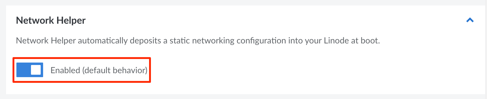
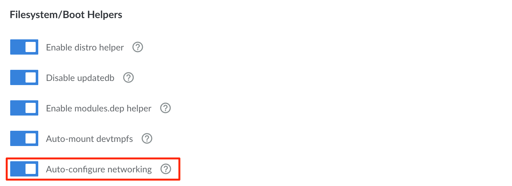

## Overview

Network Helper is an optional tool that makes network configuration easier on Linode Compute Instances. It automatically adjusts the appropriate internal network configuration files for your distribution during each system boot. This enables you to start using (and connecting to) your instance right away, without needing to manually configure these files yourself.

Network Helper automatically configures the following network settings:

- Statically configures all assigned IPv4 addresses (public and private)
- Statically configures the IPv4 gateway
- Adds settings to enable IPv6 assignment through SLAAC
- Adds Linode's DNS resolvers

## Use Cases

For most common use cases, it is recommended to enable Network Helper. Here are some scenarios in which Network Helper automatically configures networking:

 - Deploying a Compute Instance
 - Adding a public or private IPv4 address
 - Restoring from a backup
 - Migrating to a different data center
 - Cloning from another instance

However, there are some advanced use cases that require Network Helper to be disabled so that you can manually configure networking yourself:

- Installing a custom distribution on a Compute Instance
- Configuring failover
- Configuring addresses from an IPv6 routed range
- Using other DNS resolvers (not Linode's)
- Other advanced use cases where custom network configuration is required


If you choose to manually edit your network configuration files, Network Helper must be disabled. If enabled, any configuration changes will be overwritten on the next system boot.


## Enable or Disable Network Helper

Network Helper can be enabled or disabled for each Compute Instance. There is also a global setting that applies to all *new* Compute Instances.

### Global (Account-Wide) Setting

The global Network Helper setting enables or disables Network Helper on *new* Compute Instances. Existing Compute Instances are not affected by any changes to this global setting. When Network Helper is enabled globally, all *new* Compute Instances are created with Network Helper enabled by default.

1. Log in to the [Cloud Manager](https://cloud.linode.com) and click the **Account** link on the left sidebar.

1. Navigate to the **Settings** tab and scroll down to the *Network Helper* section.

1. Set the **Enabled** switch to the desired setting. Your selection is automatically saved.

    

### Individual Compute Instance Setting

Network Helper can also be enabled or disabled on a specific Compute Instance, regardless of the global setting.

1. Follow the [Editing a Configuration Profile](/docs/guides/linode-configuration-profiles/#editing-a-configuration-profile) instructions.

1. Within the **Edit Configuration** form, scroll down to the **Filesystem/Boot Helpers** section.

1. Set the **Auto-configure networking** switch to the desired setting. This toggles Network Helper on or off.

    

1. Once the setting has been adjusted, click the **Save Changes** button. If you are enabling Network Helper, reboot the Compute Instance so that Network Helper can run and adjust your system's network configuration files.

## Files Maintained by Network Helper

Network Helper automatically edits the appropriate network configuration files for the distribution you have installed. Here is a list of the network configuration files that are maintained by Network Helper for each supported distribution.

-   **Alpine:**

        /etc/network/interfaces
        /etc/resolv.conf

-   **Arch:**

        /etc/systemd/network/05-eth0.network

-   **CentOS, CentOS Stream, AlmaLinux, and Rocky Linux:**

        /etc/sysconfig/network-scripts/ifcfg-eth0

-   **Debian:**

        /etc/network/interfaces
        /etc/resolv.conf

-   **Fedora:**

        /etc/sysconfig/network-scripts/ifcfg-eth0

-   **Gentoo:**

        /etc/conf.d/net
        /etc/resolv.conf

-   **OpenSuse Leap:**

        /etc/sysconfig/network/ifcfg-eth0
        /etc/sysconfig/network/routes
        /etc/resolv.conf

-   **Slackware:**

        /etc/rc.d/rc.inet1.conf
        /etc/resolv.conf

-   **Ubuntu 16.04 LTS (and earlier)**

        /etc/network/interfaces
        /etc/resolv.conf

-   **Ubuntu 18.04 LTS (and later)**

        /etc/systemd/network/05-eth0.network

## Restore Previous Network Configuration Files

Network Helper creates backups of the original distribution-supplied configuration file, as well as a backup each time it edits the networking configuration.

- A copy of the interface and resolver file as the distribution provided it: `.interfaces.linode-orig` and `/etc/.resolv.conf.linode-orig`. Note that Network Helper does not modify `/etc/resolv.conf` on all of our distributions.

- A copy of the interface and resolver files from the previous boot: `.interfaces.linode-last` and `/etc/.resolv.conf.linode-last`. If you manually changed either of these file before the previous boot, you'll find them saved there.

Use the following command to restore manual changes made before the previous reboot. Be sure to replace `/etc/network/interfaces` with the network interface file for your distribution from above.

    mv /etc/network/.interfaces.linode-last /etc/network/interfaces