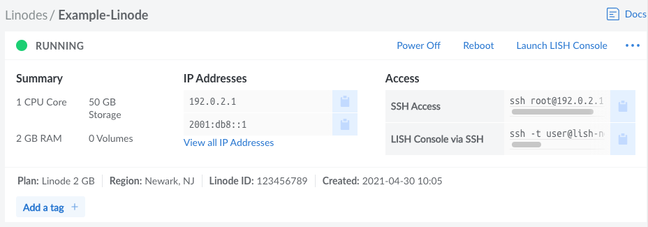

After you have successfully created a Compute Instance, there are a few initial configuration steps you should perform within your new Linux system. This includes updating your system, setting the timezone, configuring a custom hostname, adding a limited user, hardening SSH to prevent unauthorized access, and configuring a firewall. These steps ensure your instance is update to date, secure, and ready for use.


While this guide is optional, it walks you through best practices and covers important steps to secure your server. It is recommended that you follow these instructions when deploying a new Compute Instance. Some guides within our library assume that you have performed these steps, such as setting your hostname and updating your software.


1. [View your Instance in the Cloud Manager](#view-your-instance-in-the-cloud-manager)
1. [Connect to the Instance](#connect-to-the-instance)
1. [Perform System Updates](#perform-system-updates)
1. [Set the Timezone](#set-the-timezone)
1. [Configure a Custom Hostname](#configure-a-custom-hostname)
1. [Add a Limited User Account](#add-a-limited-user-account)
1. [Harden SSH Access](#harden-ssh-access)
1. [Configure a Firewall](#configure-a-firewall)
1. [Common Lockout Recovery Steps](#common-lockout-recovery-steps)

## Before You Begin

If you haven't done so already, review the following guides to learn more about using Linode and Compute Instances.

- [Getting Started with Linode](/docs/guides/getting-started/)
- [Creating a Compute Instance](/docs/guides/creating-a-compute-instance/)
- [Linode Beginner's Guide](/docs/guides/linode-beginners-guide/)

## View your Instance in the Cloud Manager

Log in to the [Cloud Manager](https://cloud.linode.com/), click the **Linodes** link in the left menu, and select your Compute Instance from the list. This opens the details page for that instance, which allows you to view key information and further configure it to your meet your needs.

## Connect to the Instance

Once the Compute Instance has been created and has finished booting up, you can connect to it. Connecting to your instance is usually done through the SSH (Secure Shell) protocol, though you can use the [Lish Console](/docs/guides/using-the-lish-console/) to bypass SSH and connect directly to your instance. The Lish Console can be accessed through a web browser (Weblish) or via SSH on the command line.

-   **Weblish (via the Cloud Manager):** Click the **Launch LISH Console** link at the top right corner of the Compute Instance's detail page. See [Using the Lish Console > Through a Browser](/docs/guides/using-the-lish-console/#through-the-cloud-manager-weblish).

-   **SSH:** Copy the command from the *SSH Access* field under the **Access** section on the Compute Instance's detail page (see screenshot above) and paste it into your local computer's terminal. The command should look similar to the following, only with the IP address of your newly created instance.

        ssh root@192.0.2.1

    - **Windows:** Windows 10 and 11 users can connect to their Linode using the [Command Prompt (or PowerShell)](/docs/guides/connect-to-server-over-ssh-on-windows/#command-prompt-or-powershell---windows-10-or-11) application, provided their system is fully updated. For users of Windows 8 and earlier, [Secure Shell on Chrome](/docs/guides/connect-to-server-over-ssh-on-chrome/), [PuTTY](/docs/guides/connect-to-server-over-ssh-using-putty/), or many other third party tools can be used instead. See [Connecting to a Remote Server Over SSH on Windows](/docs/guides/connect-to-server-over-ssh-on-windows/).
    - **macOS:** The *Terminal* application is pre-installed on macOS. See [Connecting to a Remote Server Over SSH on a Mac](/docs/guides/connect-to-server-over-ssh-on-mac/).
    - **Linux:** You can use a terminal window, regardless of desktop environment or window manager. See [Connecting to a Remote Server Over SSH on Linux](/docs/guides/connect-to-server-over-ssh-on-linux/)

-   **Lish (via SSH):** Copy the command from the *LISH Console via SSH* field under the **Access** section on the Compute Instance's detail page (see screenshot above) and paste it into your local computer's terminal. The command should look similar to the one below, only with your username, data center, and Linode label. Review [Using the Lish Console > Through SSH](/docs/guides/using-the-lish-console/#through-ssh-using-a-terminal) for more instructions.

        ssh -t user@lish-newark.linode.com Example-Linode

## Perform System Updates

Updating your system frequently is the single biggest security precaution you can take for any operating system. Software updates range from critical vulnerability patches to minor bug fixes and many software vulnerabilities are actually patched by the time they become public. Updating also provides you with the latest software versions available for your distribution.

### Ubuntu, Debian, and Kali Linux

    apt update && apt upgrade


When updating some packages, you may be prompted to use updated configuration files. If prompted, it is typically safer to keep the locally installed version".



Linode's Kali Linux distribution image is a [minimum installation](https://www.kali.org/docs/troubleshooting/common-minimum-setup/). You will likely want to install individual [tools](https://www.kali.org/tools/) or [metapackages](https://www.kali.org/tools/kali-meta/), such as the [kali-linux-headless](https://www.kali.org/tools/kali-meta/#kali-linux-headless) metapackage.


### CentOS/RHEL Stream and Fedora

*This includes CentOS Stream 8 (and above), CentOS 8, other RHEL derivatives (including AlmaLinux 8 and Rocky Linux 8), and Fedora.*

    dnf upgrade

### Other Distributions

#### Alpine

    apk update && apk upgrade

#### Arch Linux

    pacman -Syu

#### CentOS 7

    yum update

#### Gentoo

    emaint sync -a

After running a sync, it may end with a message that you should upgrade Portage using a `--oneshot` emerge command. If so, run the Portage update. Then update the rest of the system:

    emerge -uDU --keep-going --with-bdeps=y @world

#### OpenSUSE

    zypper update

#### Slackware

    slackpkg update
    slackpkg upgrade-all

## Set the Timezone

All new Linodes are set to UTC time by default. However, you may prefer your Linode use the time zone which you live in so log file timestamps are relative to your local time.

### Most Distributions

*This includes CentOS Stream 8 (and newer), CentOS 7 (and newer), other RHEL derivatives (including AlmaLinux 8 and Rocky Linux 8), Fedora, and Arch. These instructions also work for most Ubuntu, Debian, and OpenSuse distributions, though other methods may be preferred in those cases.*

1.  Use `timedatectl` to output a list of available timezones.

        timedatectl list-timezones

1.  Use the arrow keys, `Page Up`, and `Page Down` to navigate through the list. Copy or make note of your desired time zone and press **q** to exit the list.

1.  Set the time zone using the command below, replacing *America/New_York* with your preferred time zone.

        timedatectl set-timezone 'America/New_York'

### Ubuntu, Debian, and Kali Linux

The instructions under the [Most Distributions](#most-distributions-1) section above (which outlines the `timedatectl` command) are valid. That said, both Ubuntu and Debian come with a more friendly tool called `tzdata`, outlined below.

1.  Open the `tzdata` tool.

        dpkg-reconfigure tzdata

1.  Select the continent of your choice using the arrow keys and press **Enter**.
1.  Select your region using the arrow keys and press **Enter**.

### Other Distributions

#### Alpine

1.  Use the [setup-timezone](https://wiki.alpinelinux.org/wiki/Alpine_setup_scripts#setup-timezone) command to initiate the timezone selection process:

        setup-timezone

1.  Enter the timezone you are located within. If you aren't sure of the timezone string to use, enter `?` to display a list of available timezones

1.  If you selected a region with sub-timezones, enter `?` again to see a list of available sub-timezones and then enter the sub-timezone you are located within.

#### Gentoo

1.  View a list of available time zones.

        ls /usr/share/zoneinfo

1.  Write the selected time zone to `/etc/timezone` (for example, EST for Eastern Standard Time).

        echo "EST" > /etc/timezone

1.  Configure the `sys-libs/timezone-data` package, which sets `/etc/localtime`.

        emerge --config sys-libs/timezone-data

#### OpenSUSE

The instructions under the [Most Distributions](#most-distributions-1) section above (which outlines the `timedatectl` command) are valid. OpenSuse also has a more friendly way to select a timezone, discussed below.

1.  Open the YaST2 timezone selector tool.

        yast2 timezone

1.  Use the arrow keys to select your region within the *Region* pane.

1.  Press **tab** to switch to the *Time Zone* pane and then use the arrow keys to select your time zone or sub-region.

1. Press **F10** to save the changes. Alternatively, press **tab** until the `[OK]` text button is highlighted. Then press **enter**.

#### Slackware

1.  Run the `timeconfig` tool.

        timeconfig

1.  Select `NO Hardware clock is set to local time`.
1.  Select a timezone.

### Check the Time

Use the `date` command to view the current date and time according to your server.


root@localhost:~# date
Thu Feb 16 12:17:52 EST 2018


## Configure a Custom Hostname

A hostname is used to identify your Compute Instance using an easy-to-remember name. It can be descriptive and structured (detailing what the system is used for) or a generic word or phrase. Here are some examples of hostnames:

- **Descriptive and/or Structured:** `web`, `staging`, `blog`, or something more structured like `[purpose]-[number]-[environment]` (ex: `web-01-prod`).

- **Generic/Series:** Such as the name of a fruit (`apple`, `watermelon`), a planet (`mercury`, `venus`), or animal (`leopard`, `sloth`).

This hostname can be used as part of a FQDN (fully qualified domain name) for the system (ex: `web-01-prod.example.com`).

After you've made the change below, you may need to log out and log back in again to see the terminal prompt change from `localhost` to your new hostname. The command `hostname` should also show it correctly. See our guide on using the [hosts file](/docs/guides/using-your-systems-hosts-file/) if you want to configure a fully qualified domain name.

### Most Distributions

*This includes Ubuntu 16.04 (and newer), CentOS Stream 8 (and newer), CentOS 7 (and newer), other RHEL derivatives (including AlmaLinux 8 and Rocky Linux 8), Debian 8 (and newer), Fedora, OpenSuse, Kali Linux, and Arch.*

Replace `example-hostname` with one of your choice.

    hostnamectl set-hostname example-hostname

### Other Distributions

#### Alpine

See [Update Your Systems hosts File](#update-your-systems-hosts-file).

#### Gentoo

    echo "HOSTNAME=\"example-hostname\"" > /etc/conf.d/hostname
    /etc/init.d/hostname restart

#### Slackware

    echo "example-hostname" > /etc/HOSTNAME
    hostname -F /etc/HOSTNAME

### Update Your System's `hosts` File

The `hosts` file creates static associations between IP addresses and hostnames or domains which the system prioritizes before DNS for name resolution.

1.  Open the `hosts` file in a text editor, such as [Nano](/docs/guides/use-nano-to-edit-files-in-linux/).

        nano /etc/hosts

1.  Add a line for your Linode's public IP address. You can associate this address with your Linode's **Fully Qualified Domain Name** (FQDN) if you have one, and with the local hostname you set in the steps above. In the example below, `203.0.113.10` is the public IP address, `example-hostname` is the local hostname, and `example-hostname.example.com` is the FQDN.

    
127.0.0.1 localhost.localdomain localhost
203.0.113.10 example-hostname.example.com example-hostname


1.  Add a line for your Linode's IPv6 address. Applications requiring IPv6 will not work without this entry:

    
127.0.0.1 localhost.localdomain localhost
203.0.113.10 example-hostname.example.com example-hostname
2600:3c01::a123:b456:c789:d012 example-hostname.example.com example-hostname


The value you assign as your system's FQDN should have an "A" record in DNS pointing to your Linode's IPv4 address. For IPv6, you should also set up a DNS "AAAA" record pointing to your Linode's IPv6 address.

See our guide to [Adding DNS Records](/docs/guides/dns-manager/) for more information on configuring DNS. For more information about the `hosts` file, see [Using your System's hosts File](/docs/guides/using-your-systems-hosts-file/)

## Add a Limited User Account

Up to this point, you have accessed your Compute Instance as the `root` user, which has unlimited privileges and can execute *any* command--even one that could accidentally disrupt your server. We recommend creating a limited user account and using that at all times. Administrative tasks will be done using `sudo` to temporarily elevate your limited user's privileges so you can administer your server.


Not all Linux distributions include `sudo` on the system by default, but all the images provided by Linode have sudo in their package repositories. If you get the output `sudo: command not found`, install sudo before continuing.


### Ubuntu and Debian

1.  Create the user, replacing `example_user` with your desired username. You'll then be asked to assign the user a password:

        adduser example_user

1.  Add the user to the `sudo` group so you'll have administrative privileges:

        adduser example_user sudo

### CentOS/RHEL Stream and Fedora

1.  Create the user, replacing `example_user` with your desired username, and assign a password:

        useradd example_user && passwd example_user

1.  Add the user to the `wheel` group for sudo privileges:

        usermod -aG wheel example_user

### Log in as the New User

1.  After creating your limited user, disconnect from your Compute Instance:

        exit

1.  Log back in as your new user. Replace `example_user` with your username, and the example IP address with your instance's IP address:

        ssh example_user@192.0.2.1

Now you can administer your Compute Instance from your new user account instead of `root`. Nearly all superuser commands can be executed with `sudo` (example: `sudo iptables -L -nv`) and those commands will be logged to `/var/log/auth.log`.

## Harden SSH Access

By default, password authentication is used to connect to your Compute Instance via SSH. A cryptographic key-pair is more secure because a private key takes the place of a password, which is generally much more difficult to decrypt by brute-force. In this section we'll create a key-pair and configure your system to not accept passwords for SSH logins.

### Create an Authentication Key-pair


As of Autumn 2018, [OpenSSH](https://www.openssh.com/) has been added to Windows 10, simplifying the process for securing SSH. **Windows 10** in this guide assumes OpenSSH has been installed as part of this update, while **Earlier Windows Versions** would apply to earlier versions.


1.  This is done on your local computer, **not** your Compute Instance, and will create a 4096-bit RSA key-pair. During creation, you will be given the option to encrypt the private key with a passphrase. This means that it cannot be used without entering the passphrase, unless you save it to your local desktop's keychain manager. We suggest you use the key-pair with a passphrase, but you can leave this field blank if you don't want to use one.

    -   **Linux / macOS / Windows 10 or 11**

        
If you've already created an RSA key-pair, this command will overwrite it, potentially locking you out of other systems. If you've already created a key-pair, skip this step. To check for existing keys, run `ls ~/.ssh/id_rsa*`.


            ssh-keygen -b 4096

        Press **Enter** to use the default names `id_rsa` and `id_rsa.pub` before entering your passphrase. On Linux and OS X, these files will be saved in the `/home/your_username/.ssh` directory. On Windows, they will be saved in `C:\Users\MyUserName\.ssh`

    -   **Earlier Windows Versions**

        This can be done using PuTTY as outlined in our guide: [Use Public Key Authentication with SSH](/docs/guides/use-public-key-authentication-with-ssh/#public-key-authentication-on-windows).

1.  Upload the public key to your Compute Instance. Replace `example_user` with the name of the user you plan to administer the server as, and `192.0.2.1` with your instance's IP address.

    -   **Linux**

        From your local computer:

            ssh-copy-id example_user@192.0.2.1

    -   **macOS**

        On your Compute Instance (while signed in as your limited user):

            mkdir -p ~/.ssh && sudo chmod -R 700 ~/.ssh/

        From your local computer:

            scp ~/.ssh/id_rsa.pub example_user@203.0.113.10:~/.ssh/authorized_keys

        
`ssh-copy-id` is available in [Homebrew](http://brew.sh/) if you prefer it over SCP. Install with `brew install ssh-copy-id`.


    -  **Windows 10 or 11**

        On your Compute Instance (while signed in as your limited user):

            mkdir -p ~/.ssh && sudo chmod -R 700 ~/.ssh/

        From your local computer:

            scp C:\Users\MyUserName\.ssh/id_rsa.pub example_user@192.0.2.1:~/.ssh/authorized_keys

    -  **Earlier Windows Versions**

        - **Option 1:** This can be done using [WinSCP](http://winscp.net/). In the login window, enter your Linode's public IP address as the hostname, and your non-root username and password. Click *Login* to connect.

            Once WinSCP has connected, you'll see two main sections. The section on the left shows files on your local computer and the section on the right shows files on your Linode. Using the file explorer on the left, navigate to the file where you've saved your public key, select the public key file, and click *Upload* in the toolbar above.

            You'll be prompted to enter a path where you'd like to place the file on your Linode. Upload the file to `/home/example_user/.ssh/authorized_keys`, replacing `example_user` with your username.

        -   **Option 2:** Copy the public key directly from the PuTTY key generator into the terminal emulator connected to your Linode (as a non-root user):

                mkdir ~/.ssh; nano ~/.ssh/authorized_keys

            The above command will open a blank file called `authorized_keys` in a text editor. Copy the public key into the text file, making sure it is copied as a single line exactly as it was generated by PuTTY. Press **CTRL+X**, then **Y**, then **Enter** to save the file.

1.  Finally, you'll want to set permissions for the public key directory and the key file itself:

        sudo chmod -R 700 ~/.ssh && chmod 600 ~/.ssh/authorized_keys

    These commands provide an extra layer of security by preventing other users from accessing the public key directory as well as the file itself. For more information on how this works, see our guide on [how to modify file permissions](/docs/guides/modify-file-permissions-with-chmod/).

1.  Now exit and log back into your Compute Instance. If you specified a passphrase for your private key, you'll need to enter it.

### SSH Daemon Options

1.  Open the SSH configuration file on your Compute Instance using a Linux text editor, such as nano or vim:

        sudo nano /etc/ssh/sshd_config

1.  **Disallow root logins over SSH.** This requires all SSH connections be by non-root users. Once a limited user account is connected, administrative privileges are accessible either by using `sudo` or changing to a root shell using `su -`.

    
# Authentication:
...
PermitRootLogin no


1.  **Disable SSH password authentication.** This requires all users connecting via SSH to use key authentication. Depending on the Linux distribution, the line `PasswordAuthentication` may need to be added, or uncommented by removing the leading `#`.

    
# Change to no to disable tunnelled clear text passwords
PasswordAuthentication no


    
You may want to leave password authentication enabled if you connect to your Linode from many different computers. This will allow you to authenticate with a password instead of generating and uploading a key-pair for every device.


1.  **Listen on only one internet protocol.** The SSH daemon listens for incoming connections over both IPv4 and IPv6 by default. Unless you need to SSH into your Linode using both protocols, disable whichever you do not need. *This does not disable the protocol system-wide, it is only for the SSH daemon.* Depending on the Linux distribution, the line `AddressFamily` may need to be added, or uncommented by removing the leading `#`

    Use the option:

    *   `AddressFamily inet` to listen only on IPv4.
    *   `AddressFamily inet6` to listen only on IPv6.

    
# Port 22
AddressFamily inet


1.  Restart the SSH service to load the new configuration.

    -   If you’re using a Linux distribution which uses systemd (CentOS 7, Debian 8, Fedora, Ubuntu 15.10+)

            sudo systemctl restart sshd

    -   If your init system is SystemV or Upstart (CentOS 6, Debian 7, Ubuntu 14.04):

            sudo service sshd restart

### Use Fail2Ban for SSH Login Protection

[*Fail2Ban*](http://www.fail2ban.org/wiki/index.php/Main_Page) is an application that bans IP addresses from logging into your server after too many failed login attempts. Since legitimate logins usually take no more than three tries to succeed (and with SSH keys, no more than one), a server being spammed with unsuccessful logins indicates attempted malicious access.

Fail2Ban can monitor a variety of protocols including SSH, HTTP, and SMTP. By default, Fail2Ban monitors SSH only, and is a helpful security deterrent for any server since the SSH daemon is usually configured to run constantly and listen for connections from any remote IP address.

For complete instructions on installing and configuring Fail2Ban, see our guide: [A Tutorial for Using Fail2ban to Secure Your Server](/docs/guides/using-fail2ban-to-secure-your-server-a-tutorial/).

## Configure a Firewall



Using a *firewall* to block unwanted inbound traffic to your Linode provides a highly effective security layer. By being very specific about the traffic you allow in, you can prevent intrusions and network mapping. A best practice is to allow only the traffic you need, and deny everything else. See our documentation on some of the most common firewall applications:

- [nftables](/docs/guides/how-to-use-nftables/) or its predecessor, [iptables](/docs/guides/control-network-traffic-with-iptables/), is the controller for netfilter, the Linux kernel's packet filtering framework. One of these utilities is included in most Linux distributions by default.

- [firewalld](/docs/guides/introduction-to-firewalld-on-centos/) is a firewall management tool that serves as a frontend to nftables or iptables. It is preinstalled on the RHEL family of distributions (and others), including CentOS, AlmaLinux, Rocky Linux, Fedora, and OpenSUSE Leap.

- [UFW](/docs/guides/configure-firewall-with-ufw/) is another firewall management tool that operates as a frontend to nftables or iptables. It is used by default on Ubuntu and is also available on other Debian-based distributions.

## Common Lockout Recovery Steps

If for whatever reason you find yourself locked out of your Linode after putting your security controls into place, there are still a number of ways that you can regain access to your Linode.

- Access your Linode through our out-of-band [Lish console](/docs/guides/using-the-lish-console/) to regain access to the internals of your Linode without relying on SSH.

-   If you need to re-enable password authentication and/or root login over ssh to your Linode, you can do this by reversing the following sections of this file to reflect these changes

    
# Authentication:
...
PermitRootLogin yes
...
PasswordAuthentication yes


    From there, you just need to restart SSH.

    If you’re using a Linux distribution which uses systemd (CentOS 7, Debian 8, Fedora, Ubuntu 15.10+)

        sudo systemctl restart sshd

    If your init system is SystemV or Upstart (CentOS 6, Debian 7, Ubuntu 14.04):

        sudo service sshd restart

-   If you need to remove your public key from your Linode, you can enter the following command:

        rm ~/.ssh/authorized_keys

    You can then replace your key by re-following the [Create an Authentication Key-pair](#create-an-authentication-key-pair) section of this guide.

## Next Steps

These are the most basic steps to harden any Linux server, but further security layers will depend on its intended use. Additional techniques can include application configurations, using [intrusion detection](/docs/guides/ossec-ids-debian-7/), installing a form of [access control](https://en.wikipedia.org/wiki/Access_control#Access_Control), [fine tuning sudo access](/docs/guides/linux-users-and-groups/#understanding-the-sudo-linux-group-and-user), [removing exposed services](/docs/guides/remove-unused-network-facing-services), and [more](/docs/security/).

Now you can begin setting up your Linode for any purpose you choose. We have a library of documentation to assist you with a variety of topics ranging from [migration from shared hosting](/docs/guides/migrate-from-shared-hosting-to-linode/) to [enabling two-factor authentication](/docs/guides/user-security-controls/) to [hosting a website](/docs/guides/hosting-a-website-ubuntu-18-04/).
