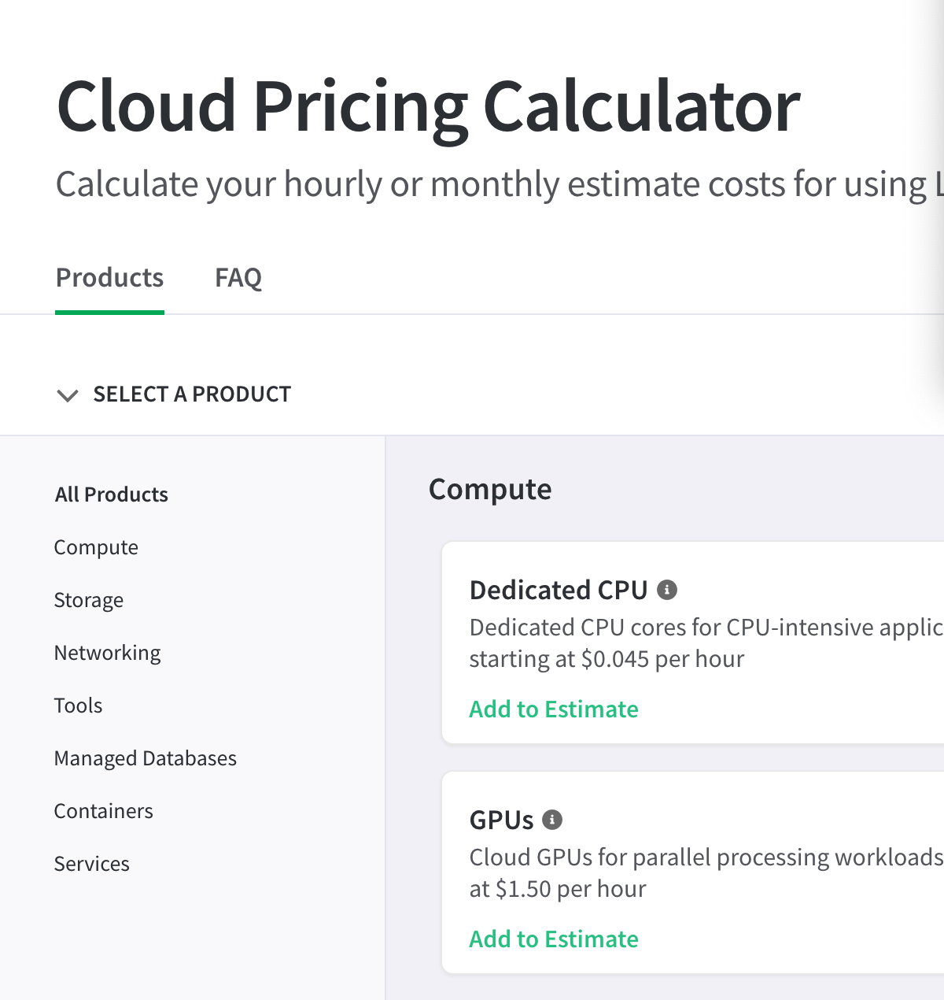
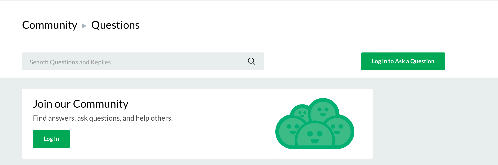
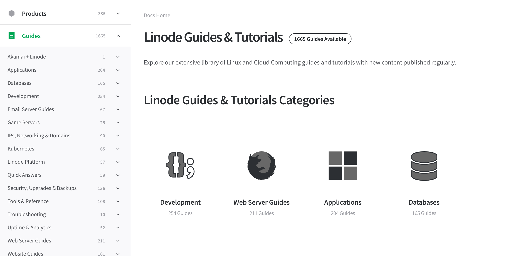
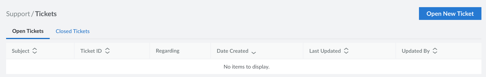

Linode provides live technical support services 24 hours a day, 7 days a week. Linode Support ensures network availability, verifies that you can access your Linode, resolves performance issues with hosts, and works to fix any service-related issues you may be experiencing.

Linode also offers a number of resources you can refer to when troubleshooting application and server configuration issues. These issues are generally outside the scope of Linode Support, and the other resources Linode provides can help you find solutions for your questions.

Linode provides a variety of support options so that you get the answers you need, in the timeframe you need them, and in the way that works best for you -- all at no cost.

## Account, Billing, and Linode Platform Questions

### Use our billing tools to help calculate, compare, and understand costs

With the [Cloud Estimator](https://www.linode.com/estimator/), you can compare both cost per month, as well as save with our predictable and transparent pricing. Explore bundled compute, storage, and transfer packages against AWS, GCP, and Azure.

The [Cloud Pricing Calculator](https://www.linode.com/cloud-pricing-calculator/) is perfect for anyone moving a workload from on-prem to the cloud, switching from one cloud provider to another, or setting up a hybrid or multi-cloud architecture. With this tool, you can receive a full cost breakdown and technical recommendations for your workload.

To better understand how our billing works, what payment methods we accept, tax information, and more see the [Billing guides](/docs/products/platform/billing/) section for help.

### Need help with large deployments?

[Contact our Sales Team](https://www.linode.com/company/contact/) to help you with migration planning, large volume pricing, partner recommendations, and more.

## Resources for Application Help & Server Configuration Issues

The Customer Support Team does not provide support regarding the installation or configuration of third-party applications, such as mail and web server software, nor does it provide support regarding the Linux configuration on your Linode. For help with these types of issues, we recommend the following resources:

### Lean on the Linode Community

The [Linode Community Site](https://www.linode.com/community/questions/) is a popular space for Linux hobbyists, Linode customers, and Linode staff to ask questions and get technical help. There are thousands of posts that can provide you with in-depth information, but if you can't find what you need, post your own question and let the community help.

We also have a very supportive [IRC channel](https://webchat.oftc.net/?channels=linode) with Linode/Linux enthusiasts who are always willing to assist fellow users. Choose your favorite IRC client and jump in.

### Check out the Linode Docs and Developer Tools

The [Linode Docs](/docs/) library hosts a cataloged and searchable list of comprehensive guides on a large number of topics. These guides are written for users at all stages from beginner to advanced, and are currently available in both English and Spanish.

Here are a few guides that focus on troubleshooting and quick help:

- The [Troubleshooting](/docs/troubleshooting/troubleshooting/) quick start guide provides answers for common server connectivity and management issues.
- The [Linode Beginner’s Guide](/docs/platform/billing-and-support/linode-beginners-guide/) displays a curated list of the most frequently asked questions from Linode customers.
- The [Quick Answers](/docs/quick-answers/) section offers short guides with fast answers.

Our [Developer Tools](https://www.linode.com/developers/) space has reference documentation for the Linode API, changelogs with latest updates from the Linode team, and integrations and DevOps tools for the Linode API.

### Need a hand with your application or configuration?

Our Professional Services Team can help! We have experienced consultants who can provide guidance for your architecture, migrations, and software deployments. To get started, [contact us](https://www.linode.com/products/pro-services/#speakwithus) or [request a free quote](https://proservices.typeform.com/to/xJiIEy).

## Legal and Compliance Documentation

Security, privacy, and compliance are important to us. To help you find answers on these pertinent topics, we've created the [Legal & Compliance Center](https://www.linode.com/legal/). Here, you will find all documentation regarding our policies relating to infrastructure use and privacy, available certifications for each data center, and our own security and vulnerability management posture.

### Infrastructure Status

For all emergent issues, as well as, planned maintenance within our infrastructure, our team will post to (and regularly update) our [Linode status page](https://status.linode.com/) until the issue has been resolved or maintenance completed. If you are experiencing a connectivity issue, or having troubles accessing one of our services, check this page for any system-wide outages. You can also subscribe to receive updates via email/SMS by clicking Subscribe To Updates in the top right corner of the page.

## Contact the Customer Support Team

### Our scope of support

Our Customer Support Team is available 24x7 to provide support related to the physical operation of your Linode virtual servers, such as: ensuring that your network traffic is properly routed to and from your Linodes’ IP addresses; helping with base system performance issues that may be related to our virtualization systems; and resolving potential hardware issues within our infrastructure.

We are the subject matter experts for all of our products such as [Linode Kubernetes Engine](https://www.linode.com/products/kubernetes/), [Object Storage](https://www.linode.com/products/object-storage/), and [NodeBalancers](https://www.linode.com/products/nodebalancers/). We can also assist you with any Linode software such as the [Linode Cloud Manager](https://cloud.linode.com/), and can help you with understanding and paying your bill.

As declared in our [Master Services Agreement](https://www.linode.com/legal-msa/), our Customer Support Team does not offer or provide support for application-specific issues such as application configuration, CGI programming, web server, mail server, database configuration, or any other such issue. For these issues, please consult the various other [resources](#resources-for-application-help--server-configuration-issues) we have available or contact your system administrator and/or developer. Additionally, if you are providing a service to your customers, we do not offer technical support for those customers.

### How to contact us

The primary method for contacting our Customer Support Team is to open a support ticket through the [Linode Cloud Manager](https://cloud.linode.com/) using the Get Help option in the sidebar. When opening a ticket, you will be required to include the following information:

- Notation of what product or service is affected by the issue
- Summary of the issue you are experiencing
- Details about the issue in the description

Additionally, you can attach up to 5 files with your initial ticket update. Accepted file extensions include: .gif, .jpg, .jpeg, .pjpg, .pjpeg, .tif, .tiff, .png, .pdf, or .txt.

If you are having difficulty logging in to your account, you can email our team at support@linode.com. You can also call us 24 hours a day for urgent issues:

- +1 (609) 380-7100 (International)
- +1 (855) 454-6633 (North America toll-free)
- +91 000-800-919-0534 (India toll-free)

If your call is diverted to voicemail, please leave a detailed message explaining your problem. Your call will be returned as quickly as possible.

### What to include in your support inquiry

We want to help you solve your problem efficiently and effectively. To help us get you a resolution in a timely manner, please consider the following when you open a ticket.

Be specific and detailed. We need to know what is happening. Providing error logs and outputs from commands will go a long way to getting you a faster and more accurate answer.
Be clear. Giving us context and sharing any troubleshooting steps you have already taken or resources you have looked at will help clarify what is going on and what additional steps we need to take on our end.
Use Markdown. Making sure you have the correct formatting will help make sure we can read what the error outputs you have provided are. For Markdown help, use this [cheat sheet](http://demo.showdownjs.com/).

## Report Abuse

Use our [Abuse Portal](https://www.linode.com/legal-abuse/) to report network abuse, unauthorized access attempts, or spam originating from the Linode platform. Please forward spam with the full headers intact, and include logs documenting unauthorized access.