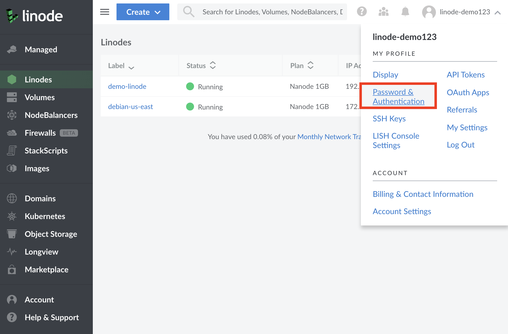
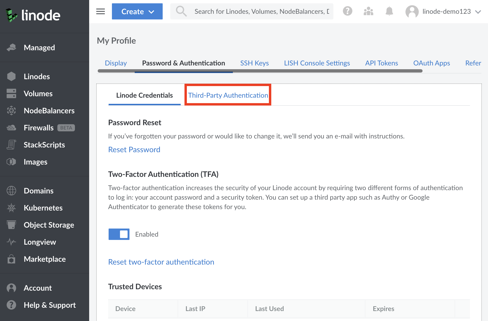
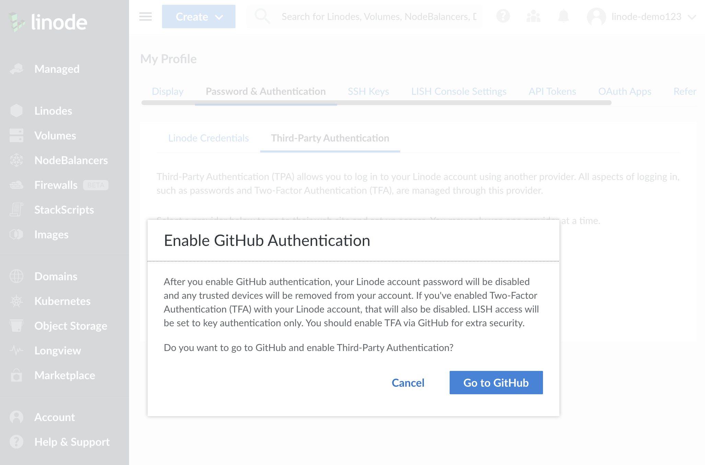
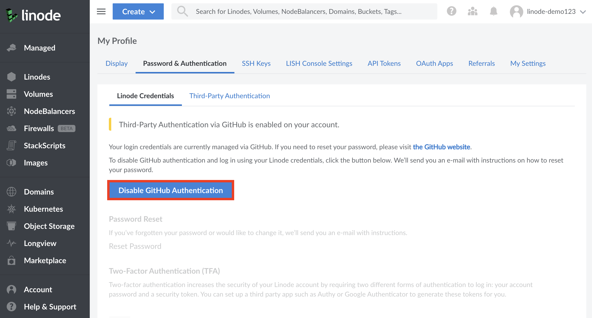
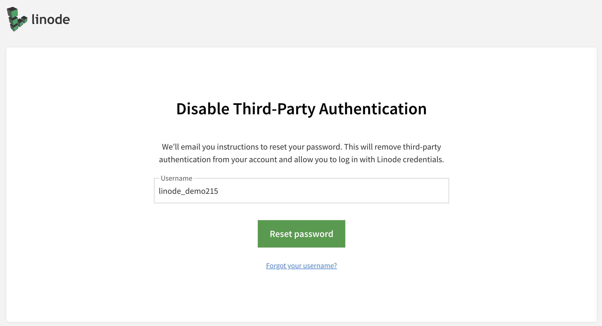

 
Linode Cloud Manager supports Third-Party Authentication (TPA). This allows you to log in to the Linode Cloud Manager with another provider's login credentials.


Enabling TPA disables Two Factor Authentication (TFA) on your Linode account. You should enable TFA with the TPA provider with which you choose to authenticate to Linode.

Additionally, enabling TPA disables password authentication in the Lish console. You can still authenticate to Lish with an SSH key. For more information on SSH key authentication with Lish, visit our [Using the Linode Shell (Lish) guide](/docs/platform/manager/using-the-linode-shell-lish/#add-your-public-key)


## Enabling Third Party Authentication

1.  To get started with TPA, log in to the [Linode Cloud Manager](https://cloud.linode.com) using your existing username and password.

1.  Navigate to your profile by clicking on your username in the top right of the screen.

    

1.  Click on the **Password & Authentication** tab, then click on the **Third Party Authentication** sub-tab.

    

1.  Select the Third Party Authentication provider you would like to enable on your account. You may only have one TPA provider active at a time. You will be asked to confirm that you'd like to enable TPA with this provider.

    
Enabling Third Party Authentication disables your current Linode password and Two-Factor Authentication on your Linode account. Any Two-Factor Authentication you require will be handled by the TPA provider you choose.


    

1.  You will be taken to the TPA provider's website, where you will be prompted to give account access to Linode. You will see a list of permissions that will be granted to Linode. Confirm that you would like to grant Linode the required permissions.

1.  After granting permissions, you will see a confirmation screen. You can now log in to your Cloud Manager account using the TPA provider.

## Disabling Third Party Authentication

1.  Log in to [Linode Cloud Manager](https://cloud.linode.com) using Third Party Authentication.

1.  Navigate to your profile by clicking your username in the top right of the screen.

    

1.  Click on the **Password & Authentication** tab.

1.  Click on the **Disable** button for your TPA provider. In the example below, the button is labeled **Disable GitHub Authentication**.

    

1.  A prompt will appear confirming that you've disabled the TPA provider on your Linode account. At this point, your session will be invalidated and you'll be logged out of Cloud Manager. You will need to click on the **Reset Password** button to send a password reset link to your email. This will be delivered to the email address associated with the Linode account, and not the email associated with the TPA provider. You will need to follow the link in that email to reset your Linode Cloud Manager password.

    

1.  Once reset, you can use your new password to log in to Linode Cloud Manager.
