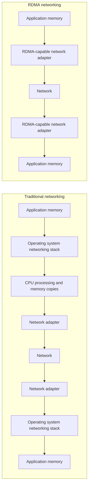

Remote Direct Memory Access (RDMA) is a networking technology that allows one computer to access memory on another computer without routing data through the normal operating system networking stack. With RDMA, supported network hardware can move data directly between memory regions on different systems.

RDMA is commonly associated with performance-sensitive infrastructure, including high-performance computing (HPC), distributed storage, databases, and AI clusters. It is not a single network type or vendor-specific product. Instead, RDMA is a capability supported by technologies such as InfiniBand, RDMA over Converged Ethernet (RoCE), and iWARP.

## What does RDMA mean?

RDMA stands for **Remote Direct Memory Access**:

- **Remote**: The memory being accessed is on another system.
- **Direct**: The transfer avoids much of the normal CPU and operating system involvement used by traditional networking.
- **Memory access**: Data moves to or from memory regions that have been made available for RDMA operations.

Applications still need the right software libraries, drivers, and permissions to use RDMA safely. RDMA describes the direct memory access model; technologies such as InfiniBand, RoCE, and iWARP provide ways to use that model across a network.

## How traditional networking moves data

In a traditional network connection, application data usually passes through several layers before it reaches the network adapter. An application writes data to a socket, the operating system processes that data through its networking stack, and the CPU helps copy data between application memory, kernel buffers, and network device buffers. The receiving system performs a similar process in reverse.

This model is flexible and broadly compatible, which is why TCP/IP networking is used for most applications. However, each step adds work. The CPU may need to manage interrupts, copy data between buffers, process protocol state, and move data between user space and kernel space. RDMA reduces some of this overhead by giving supported hardware a more direct path between application memory on different machines.

This diagram shows the main difference between the two paths: traditional networking routes data through more software layers, while RDMA allows supported hardware to handle more of the data movement directly.

## How RDMA works

RDMA uses supported network hardware to transfer data between registered memory regions on different systems. In many RDMA systems, this hardware is an RDMA-capable network interface card (NIC), host channel adapter (HCA), SmartNIC, or data processing unit (DPU). The exact term depends on the technology and vendor, but the role is similar: the device handles data movement that would otherwise require more CPU and operating system involvement.

Before memory can be used for RDMA, an application or system component typically registers that memory with the RDMA stack. Memory registration tells the RDMA device which memory regions it is allowed to access and how those regions can be used.

After the connection and memory setup are complete, RDMA-capable systems can communicate using several types of operations:

- **Send/receive**: One system sends a message and the other system receives it, similar to message-based networking.
- **RDMA write**: One system writes data directly into a registered memory region on another system.
- **RDMA read**: One system reads data directly from a registered memory region on another system.
- **Atomic operations**: One system performs a small, coordinated memory operation on another system, such as compare-and-swap or fetch-and-add.

Most users do not manage these operations manually. They usually encounter RDMA through software that supports it, such as MPI libraries, distributed storage systems, NVMe over Fabrics implementations, or AI communication libraries.

## Why RDMA matters

RDMA matters when network communication becomes a bottleneck. By reducing CPU involvement and avoiding unnecessary memory copies, RDMA can lower latency, improve throughput, and leave more CPU resources available for the application.

RDMA can also improve performance consistency by reducing the number of software layers involved in the data path. It does not remove every source of latency, but it can make communication overhead lower and more predictable for workloads that are designed to use it.

## RDMA technologies

RDMA can be provided by several network technologies. The most common terms are **InfiniBand**, **RoCE**, and **iWARP**.

### InfiniBand

InfiniBand is a high-performance interconnect designed for low-latency, high-throughput communication. RDMA is a native capability of InfiniBand, which is why the two terms are often discussed together. InfiniBand is common in supercomputing, scientific computing, AI clusters, MPI workloads, and high-performance storage fabrics.

### RoCE

RDMA over Converged Ethernet (RoCE) brings RDMA communication to Ethernet networks. There are two major versions:

- **RoCE v1** operates at Layer 2 and is limited to the local Ethernet broadcast domain.
- **RoCE v2** uses UDP/IP encapsulation, which allows RDMA traffic to be routed across Layer 3 networks.

RoCE can be useful in Ethernet-based data centers, but it may require careful configuration for congestion control, traffic prioritization, and packet loss handling.

### iWARP

iWARP is an RDMA technology that runs over TCP/IP. Because it uses TCP as its transport, iWARP can work across standard IP networks without requiring the same lossless Ethernet behavior often associated with RoCE. It is less commonly highlighted than InfiniBand and RoCE in many current HPC and AI discussions, but it remains one of the major RDMA implementations.

## RDMA and GPUs

RDMA is important in GPU-heavy systems because the bottleneck is often data movement rather than raw GPU compute performance. In a traditional path, data moving between the network and a GPU may need to pass through host system memory first.

GPUDirect RDMA allows supported network adapters to move data directly to or from GPU memory without staging that data through the CPU's system memory. This can help distributed AI training, multi-node inference, and high-performance storage systems keep GPUs supplied with data.

GPUDirect RDMA still requires support from the applications, libraries, drivers, hardware, and network fabric involved.

## Common RDMA use cases

RDMA is most useful when systems need to move data quickly between servers with minimal CPU overhead.

- **High-performance computing**: HPC workloads often divide a large problem across many compute nodes. RDMA is commonly used with Message Passing Interface (MPI) libraries and tightly coupled parallel workloads.
- **AI and machine learning**: Distributed training and multi-node inference can use RDMA to reduce communication delays between GPUs or servers.
- **Storage systems**: Technologies such as NVMe over Fabrics, distributed file systems, block storage platforms, and databases may use RDMA to reduce latency during reads, writes, replication, or synchronization.
- **Cloud and data center networking**: RDMA may be used for high-volume server-to-server traffic, specialized HPC or AI clusters, low-latency storage networks, and infrastructure that uses SmartNICs or DPUs.

## RDMA requirements and tradeoffs

RDMA can provide strong performance benefits, but it depends on the surrounding hardware and software stack. It is not just a setting that can be enabled on any network.

RDMA deployments may require:

- RDMA-capable network adapters.
- Compatible switches, cables, transceivers, and network fabric configuration.
- Operating system support, drivers, firmware, and RDMA libraries.
- Application, storage protocol, or framework support.
- Careful configuration for congestion control, traffic prioritization, and packet loss handling, especially with RoCE.
- Proper handling of memory registration, permissions, isolation, and cleanup.

This makes RDMA harder to configure and troubleshoot than standard TCP/IP networking. It is best suited for workloads where the performance gains justify the added complexity.

## RDMA vs TCP/IP

RDMA and TCP/IP are not direct replacements for each other. TCP/IP is the general-purpose networking model used by most applications and internet services. RDMA is a specialized data movement capability used when communication overhead becomes a limiting factor.

| Feature | TCP/IP | RDMA |
| --- | --- | --- |
| Primary role | General-purpose networking | High-performance data movement |
| Compatibility | Works across most networks and systems | Requires RDMA-capable hardware and software |
| Data path | Uses the operating system networking stack | Can bypass much of the operating system data path |
| CPU involvement | Higher | Lower |
| Operational complexity | Lower | Higher |
| Common uses | Web apps, APIs, SSH, general network traffic | HPC, AI clusters, low-latency storage, specialized data center workloads |

For most workloads, TCP/IP is the right default. RDMA is used when the performance benefits outweigh the additional hardware, software, and operational complexity.

## RDMA in cloud environments

In cloud environments, RDMA is usually associated with specialized infrastructure rather than general-purpose virtual machines. A standard compute instance should not be assumed to support RDMA unless the provider specifically documents that capability.

When evaluating RDMA support in a cloud environment, check the following requirements:

- **Instance type**: Confirm that the selected instance type supports RDMA or a provider-specific high-performance interconnect.
- **Network adapter capabilities**: Verify whether the instance exposes an RDMA-capable NIC, virtual function, or other specialized network device.
- **Operating system support**: Make sure the operating system image supports the required RDMA drivers and libraries.
- **Network fabric**: Check whether the environment uses InfiniBand, RoCE, or another RDMA-capable transport.
- **Application support**: Confirm that the workload, framework, storage protocol, or communication library can use RDMA.
- **Provider limitations**: Review any restrictions around regions, instance placement, clustering, virtualization, or supported topologies.

## Common misconceptions about RDMA

- **RDMA is the same thing as InfiniBand**: InfiniBand supports RDMA natively, but RDMA can also be provided through technologies such as RoCE and iWARP.
- **RDMA is only for supercomputers**: RDMA is common in HPC environments, but it is also used in AI clusters, storage systems, databases, and data center infrastructure.
- **RDMA automatically makes every workload faster**: RDMA helps when communication overhead is a bottleneck and the workload is designed to use it.
- **RoCE is just normal Ethernet**: RoCE uses Ethernet, but large or performance-sensitive RoCE deployments may require careful configuration.
- **Hardware support is enough**: RDMA also requires support from applications, libraries, storage protocols, drivers, or platforms.

In general, RDMA is most valuable when the workload, hardware, network, and software stack are all designed to take advantage of direct memory access across systems.