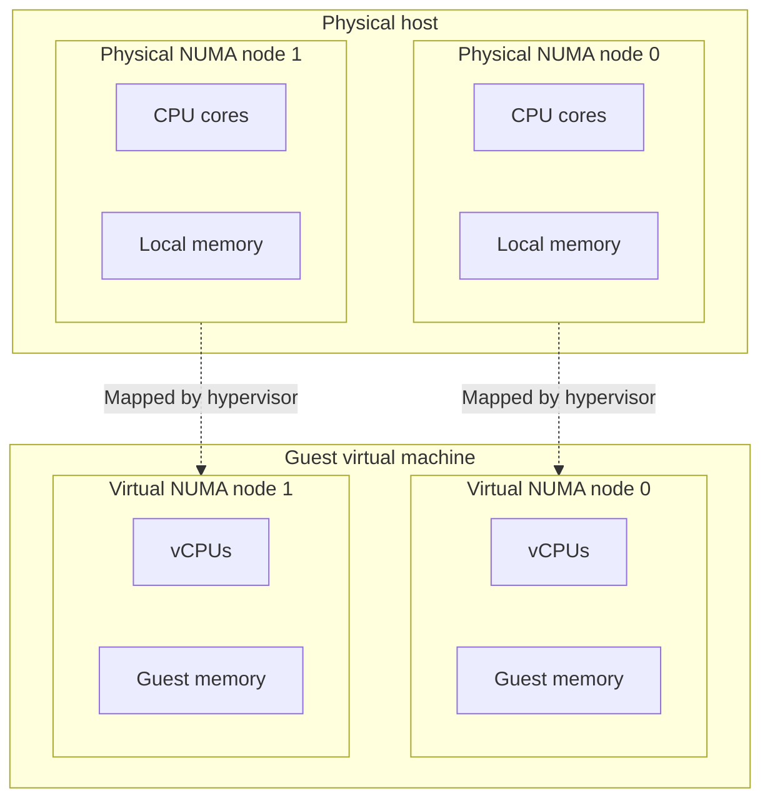

Virtual Non-Uniform Memory Access (vNUMA) is the NUMA topology that a hypervisor presents to a guest virtual machine (VM). It helps the guest operating system understand the relationship between virtual CPUs (vCPUs) and memory.

vNUMA is most relevant for large, memory-intensive, or latency-sensitive VMs, including VMs that support artificial intelligence (AI) inference, model fine-tuning, data preprocessing, vector search, and other memory-heavy application workloads. Smaller workloads may never need to account for vNUMA directly, but the concept is useful when evaluating VM sizing, CPU topology, and application performance.

This guide explains what vNUMA is, how it relates to physical NUMA, when it can affect performance, and what to consider when evaluating vNUMA-aware workloads.

## What is NUMA?

Non-Uniform Memory Access (NUMA) is a hardware architecture where memory access time varies depending on the relationship between a CPU and the memory being accessed.

In simpler memory architectures, processors access shared memory with relatively uniform latency. Each CPU has similar access to the same pool of system memory. This design is easier to reason about, but it becomes harder to scale as systems add more processors, cores, and memory.

NUMA systems divide CPUs and memory into locality domains called NUMA nodes. A NUMA node usually contains a set of CPU cores and a portion of system memory that is local to those cores. A CPU can still access memory from another NUMA node, but that remote memory access is slower than accessing memory from its local node.

For example, a two-socket server may have one NUMA node for each CPU socket. CPU socket 0 has its own local memory, and CPU socket 1 has its own local memory. Workloads running on socket 0 can access memory attached to socket 1, but those accesses must travel across the system interconnect between sockets. This adds latency compared to accessing memory attached to socket 0.

NUMA allows large systems to scale beyond a single CPU and memory controller. The tradeoff is that memory locality becomes important. For best performance, workloads should usually run on CPU cores that are close to the memory they use most often.

## Why NUMA matters for performance

NUMA matters because local and remote memory access do not have the same performance characteristics. When a process runs on CPU cores in one NUMA node and uses memory from the same node, memory access is local. When that process frequently accesses memory from another NUMA node, memory access is remote.

Remote memory access is slower because the request must travel across the system interconnect between NUMA nodes. This can increase memory latency and consume interconnect bandwidth. For some workloads, the difference may be small. For others, especially workloads that move large amounts of data through memory, poor locality can limit performance.

A workload can become NUMA-sensitive when its threads and memory are spread across nodes in a way that causes frequent remote memory access. This can happen when a large application uses many CPU cores, allocates a large amount of memory, or depends on low-latency access to shared data.

Examples can include large AI and machine learning (ML) preprocessing or inference workloads, retrieval-augmented generation (RAG) pipelines, vector databases, high-performance computing (HPC) workloads, analytics workloads, in-memory caches, large JVM applications, and databases.

NUMA tuning is not always necessary. Small VMs, lightly loaded systems, and I/O-bound workloads may see little or no improvement from NUMA-aware placement. However, as a workload grows across more CPU cores and memory, NUMA locality can become an important part of performance analysis.

## What is vNUMA?

In a VM, the guest operating system does not usually see the host's physical CPU and memory layout directly. Instead, the hypervisor presents a virtual hardware layout to the VM. vNUMA is the part of that layout that represents CPU and memory locality.

When vNUMA is exposed, the guest operating system can make NUMA-aware scheduling and memory-placement decisions. For example, it can try to keep related threads and memory allocations within the same virtual NUMA node. This can reduce unnecessary remote memory access inside large VMs.

vNUMA does not create additional CPU or memory resources. It provides topology information so the guest operating system can make better use of the resources assigned to it.

## NUMA vs vNUMA

vNUMA makes some of the host's NUMA topology available to a VM. Without vNUMA, the guest operating system may see a flat CPU and memory layout, even when the underlying host uses multiple NUMA nodes. With vNUMA, the guest operating system can see virtual NUMA nodes and use that topology when scheduling work and allocating memory.

| Concept | What it describes | Where it exists |
| --- | --- | --- |
| NUMA | The physical relationship between CPU cores, memory controllers, sockets, and memory | Host hardware |
| vNUMA | The NUMA topology exposed to a guest VM by the hypervisor | Virtual hardware presented to the VM |

The difference is that NUMA describes the physical CPU and memory topology of the host, while vNUMA describes the topology exposed to the guest VM. Physical NUMA is determined by the host hardware, including processors, memory controllers, sockets, cores, and memory. A physical NUMA node represents a real locality domain on the host, usually with its own CPU cores and local memory.

vNUMA is an abstraction of that physical topology. A hypervisor may expose a simplified NUMA layout, hide NUMA details from smaller VMs, or split a large VM across multiple virtual NUMA nodes. The exact behavior depends on the virtualization platform, the size of the VM, and how the hypervisor maps virtual resources to physical resources.

The key distinction is that NUMA is the hardware layout, while vNUMA is the guest-visible representation of CPU and memory locality. The hypervisor still controls how the VM's virtual resources are scheduled on the physical host.

## How vNUMA works

The hypervisor manages the relationship between a VM's virtual resources and the host's physical resources. It maps vCPUs to physical CPU time and maps guest memory to memory available on the host. vNUMA adds locality information to that virtual hardware layout so the guest operating system can understand how the VM's assigned resources are grouped.

For small VMs, the hypervisor may present a simple topology with a single virtual NUMA node. This is usually sufficient when the VM can fit within one physical NUMA node on the host. In that case, the guest operating system does not need to make complex locality decisions because its assigned CPU and memory resources can be treated as one locality domain.

For larger VMs, the assigned vCPUs and memory may span more than one physical NUMA node. In those cases, the hypervisor can expose multiple virtual NUMA nodes to the guest. The guest operating system can then make scheduling and memory-placement decisions that account for those virtual locality boundaries.

vNUMA is most effective when the virtual topology aligns with the host's physical topology. For example, if a VM is backed by resources from two physical NUMA nodes, exposing two virtual NUMA nodes can help the guest operating system understand that split. If the virtual topology is poorly aligned with the physical topology, the guest operating system may make placement decisions that appear reasonable inside the VM but still result in inefficient physical placement on the host.

Other host-level factors can also affect vNUMA behavior. CPU overcommit, memory pressure, live migration, and platform-specific scheduling decisions can all influence how virtual resources are placed on physical hardware. For this reason, vNUMA should be understood as topology guidance for the guest operating system, not a guarantee of exact physical placement.

## Example vNUMA topology

Consider a host server with two physical NUMA nodes. Each node has 16 CPU cores and 128 GB of local memory. Across the full host, the system has 32 CPU cores and 256 GB of memory, but those resources are divided into two locality domains.

A VM on this host is assigned 32 vCPUs and 256 GB of memory. Because the VM requires more resources than a single physical NUMA node provides, its resources may need to span both physical NUMA nodes on the host.

Without vNUMA, the guest operating system may see a flat CPU and memory layout. It knows that it has 32 vCPUs and 256 GB of memory, but it does not have topology information that shows how those resources are grouped. As a result, the guest operating system may schedule threads and allocate memory without considering locality.

With vNUMA, the hypervisor can present the VM as two virtual NUMA nodes. Each virtual NUMA node may contain 16 vCPUs and 128 GB of memory. The guest operating system can then use that layout to keep related threads and memory allocations closer together.

This example is simplified. Real systems may have different socket counts, core counts, memory layouts, CPU architectures, and hypervisor policies. The main idea is that vNUMA gives the guest operating system a topology that better represents how large VM resources are distributed across the host.



This simplified diagram shows how a hypervisor can expose physical NUMA locality to a guest VM as virtual NUMA nodes. The virtual topology helps the guest operating system understand how its assigned vCPUs and memory are grouped, while the hypervisor still controls final placement on the physical host.

## When vNUMA helps

vNUMA is most useful for large VMs that cannot fit cleanly within a single physical NUMA node. When a VM spans multiple physical NUMA nodes, exposing a matching virtual topology can help represent those separate locality domains inside the VM.

This is most helpful when the guest operating system is NUMA-aware. Modern Linux distributions can detect NUMA topology and use that information when scheduling processes and allocating memory. When the guest operating system sees multiple virtual NUMA nodes, it can try to keep related threads and memory allocations within the same node.

vNUMA can also help workloads that are sensitive to memory latency or memory bandwidth. Examples include databases, in-memory caches, large application runtimes, analytics systems, and HPC workloads. These applications may access large working sets in memory and may be affected when threads frequently access memory from a remote node.

Some applications also include their own NUMA-aware configuration options. In those cases, vNUMA can provide useful topology information to both the guest operating system and the application. The application may be able to bind workers, memory pools, or process groups to specific NUMA nodes.

vNUMA is also more relevant in environments where administrators can inspect or control VM topology. This is common in private cloud, dedicated host, bare metal, and enterprise virtualization environments. In highly abstracted public cloud environments, the provider may manage these details automatically, and users may have limited visibility into the underlying host topology.

### AI and accelerator workloads

AI workloads can also make vNUMA more relevant when they depend on large in-memory datasets, high-throughput preprocessing, embedding generation, vector search, or CPU-side work that feeds accelerators such as GPUs. Even when model execution is accelerated, the surrounding workload may still depend on CPU scheduling, memory bandwidth, and efficient data movement.

Without useful topology information, an AI pipeline may place data-loader workers on CPU cores associated with one physical NUMA node while allocating memory that is backed by another node. This can add latency to each batch and consume bandwidth on the interconnect between NUMA nodes before data reaches an accelerator.

vNUMA can be especially relevant for dense VM sizes that support large AI, ML, or HPC workloads. These instances may combine many vCPUs, large memory allocations, and one or more accelerators. Common use cases include:

- **Distributed training:** Larger NUMA-aware VMs may support larger model shards, larger local batches, or more preprocessing work per node. This can reduce the amount of work that has to move across the network between nodes, though the actual benefit depends on the training framework, model architecture, and cluster design.
- **Inference serving:** vNUMA can help when a single VM hosts multiple large models, larger batch sizes, or multi-tenant endpoints. In these cases, CPU scheduling, memory bandwidth, and data movement can affect throughput even when model execution uses accelerators.
- **Dense HPC or AI-adjacent pipelines:** Large vNUMA-aware VMs can help keep simulation, rendering, preprocessing, embedding generation, vector search, or post-processing stages on the same node instead of splitting the workflow across multiple systems.

AI frameworks and serving stacks may provide controls for worker processes, thread pools, batching, device placement, and CPU affinity. For example, PyTorch includes NUMA binding utilities for some distributed workloads, TensorFlow exposes inter-op and intra-op threading controls, and JAX provides APIs for inspecting available devices. These controls can be used alongside tools such as `numactl`, `lscpu`, `numastat`, and accelerator topology tools to evaluate and tune CPU, memory, and device locality.

## When vNUMA may not matter

vNUMA is not equally important for every VM or workload. Many small VMs can fit within a single physical NUMA node on the host. When a VM's assigned CPU and memory resources fit within one locality domain, exposing multiple virtual NUMA nodes is usually unnecessary.

vNUMA may also have little effect on workloads that are not limited by memory locality. For example, an application that spends most of its time waiting on disk, network, or an external service may not benefit from NUMA-aware CPU and memory placement. In those cases, storage latency, network throughput, database response time, or application design may be more important performance factors.

For AI workloads that are primarily bottlenecked by GPU compute, remote API calls, storage throughput, or network transfer, vNUMA may not be the limiting factor. In those cases, GPU utilization, data loading, model architecture, batching, framework configuration, or application-level orchestration may matter more than NUMA topology.

Lightly loaded systems may also see little difference. If a VM has low CPU utilization, modest memory use, and limited concurrency, the guest operating system may not need detailed topology information to schedule work efficiently.

In some cloud environments, users may not be able to view or control the host's physical NUMA topology. The provider may manage placement, scheduling, and topology exposure automatically. In these cases, vNUMA is still part of the virtualization layer, but it may not be something the user can configure directly.

The practical takeaway is that vNUMA matters most when VM size, memory use, and workload behavior make CPU and memory locality important. For smaller or less memory-sensitive workloads, other performance factors are often more relevant.

## vNUMA limitations and tradeoffs

vNUMA can improve how a guest operating system understands CPU and memory locality, but it is not a general solution for every performance problem. It is one part of VM sizing, scheduling, and workload placement.

One common tradeoff is VM size. A larger VM is not always faster than a smaller VM. If a VM requires more CPU cores or memory than a single physical NUMA node can provide, the VM may need to span multiple NUMA nodes on the host. vNUMA can help the guest operating system understand that layout, but the workload may still experience some remote memory access.

Topology alignment also matters. The virtual NUMA layout presented to the guest should ideally match how the VM's resources are backed by the host. If the virtual topology does not align well with the physical topology, the guest may make scheduling or memory-placement decisions that look efficient inside the VM but do not map efficiently to the host.

Host resource pressure can reduce the benefit of vNUMA. CPU overcommit, memory overcommit, memory ballooning, swapping, or other scheduling constraints can affect where virtual resources are placed. Under heavy contention, the hypervisor may have less flexibility to preserve ideal locality.

Some virtualization features can also affect vNUMA behavior. For example, CPU hot-add or memory hot-add may change how some platforms expose virtual NUMA topology. This depends on the hypervisor and its configuration, so administrators should check platform-specific documentation before enabling these features for performance-sensitive VMs.

Finally, vNUMA does not fix application-level bottlenecks. It can help the guest operating system and application make better locality decisions, but it does not solve inefficient threading, excessive memory allocation, lock contention, poor database configuration, slow data loaders, underutilized GPUs, or an application architecture that does not scale well across many cores.

## How to check NUMA topology in a VM

The available NUMA topology information depends on the guest operating system and virtualization platform. In a Linux VM, use the following commands to inspect NUMA topology and memory behavior:

- **`lscpu`**: Shows CPU topology and NUMA node CPU assignments.
- **`numactl --hardware`**: Shows NUMA nodes, CPUs, memory, and node distances.
- **`numastat`**: Shows NUMA memory allocation statistics.

These tools show the topology visible to the guest operating system. In a cloud environment, that topology may not fully reveal the host's physical NUMA layout. The hypervisor or cloud platform may abstract, simplify, or manage the underlying placement automatically.

### `lscpu`

Use `lscpu` to view the CPU topology detected by the operating system:

```command
lscpu
```

The output can show how many NUMA nodes are visible and which CPUs are assigned to each node. For example, look for fields such as `NUMA node(s)` and `NUMA node0 CPU(s)`.

### `numactl --hardware`

Use `numactl --hardware` to show the NUMA nodes, CPUs, and memory visible inside the VM:

```command
numactl --hardware
```

This command can help confirm whether the guest operating system sees one NUMA node or multiple NUMA nodes. It can also show how much memory is associated with each visible node.

The following simplified example shows a flat topology where the guest operating system sees one NUMA node:

```output
available: 1 nodes (0)
node 0 cpus: 0 1 2 3 ... 63
node 0 size: 524288 MB
node 0 free: 410000 MB
node distances:
node   0
  0:  10
```

The following simplified example shows a vNUMA topology where the guest operating system sees two NUMA nodes:

```output
available: 2 nodes (0-1)
node 0 cpus: 0 1 2 3 ... 31
node 0 size: 262144 MB
node 0 free: 205000 MB
node 1 cpus: 32 33 34 35 ... 63
node 1 size: 262144 MB
node 1 free: 205000 MB
node distances:
node   0   1
  0:  10  32
  1:  32  10
```

In the second example, the guest operating system sees two NUMA nodes instead of one flat node. The node distance matrix shows a lower relative cost for local access (`10`) and a higher relative cost for remote access (`32`). These values are relative, platform-specific indicators, not direct latency measurements.

### `numastat`

Use `numastat` to review NUMA memory allocation statistics:

```command
numastat
```

The output can help indicate whether memory is being allocated locally or whether there may be a high amount of remote memory access. The exact interpretation depends on the workload, operating system, and available metrics.

## Best practices for vNUMA-aware workloads

Follow these practices when evaluating whether vNUMA affects a workload:

- Do not tune vNUMA settings without first identifying a performance reason to do so. For many workloads, the default topology presented by the virtualization platform is sufficient.
- Measure application performance, CPU utilization, memory use, and latency before making topology-related changes.
- Size VMs according to workload requirements rather than choosing the largest available instance by default. A VM with more vCPUs or memory may span multiple physical NUMA nodes, which can make locality more important.
- Consider whether a smaller VM that fits within one NUMA node may perform more consistently than a larger VM with more complex placement.
- For latency-sensitive or memory-intensive workloads, try to keep related compute and memory activity within the same NUMA node when the platform and application allow it.
- For large VMs, align the virtual NUMA topology with the host's physical topology when the virtualization platform exposes that level of control. A virtual topology that reflects the underlying physical layout can make guest operating system scheduling and memory-placement decisions more effective.
- Avoid enabling CPU hot-add or memory hot-add for performance-sensitive VMs unless those features are required and supported by the platform's vNUMA behavior.
- Benchmark before and after any topology-related change using production-like data, concurrency, and application behavior when possible.
- For AI and ML workloads, measure the full pipeline rather than only model execution. Data loading, preprocessing, embedding generation, vector search, batching, framework-level worker placement, and CPU-to-accelerator handoff can all affect performance.
- Consider horizontal scaling when the application architecture supports it. Multiple smaller VMs may be easier to place efficiently than one very large VM, and they may reduce the need for complex NUMA-aware tuning.
- Check platform-specific documentation before changing vNUMA-related settings. Hypervisors and cloud platforms can differ in how they expose virtual NUMA topology, handle VM sizing, and manage placement on physical hosts.