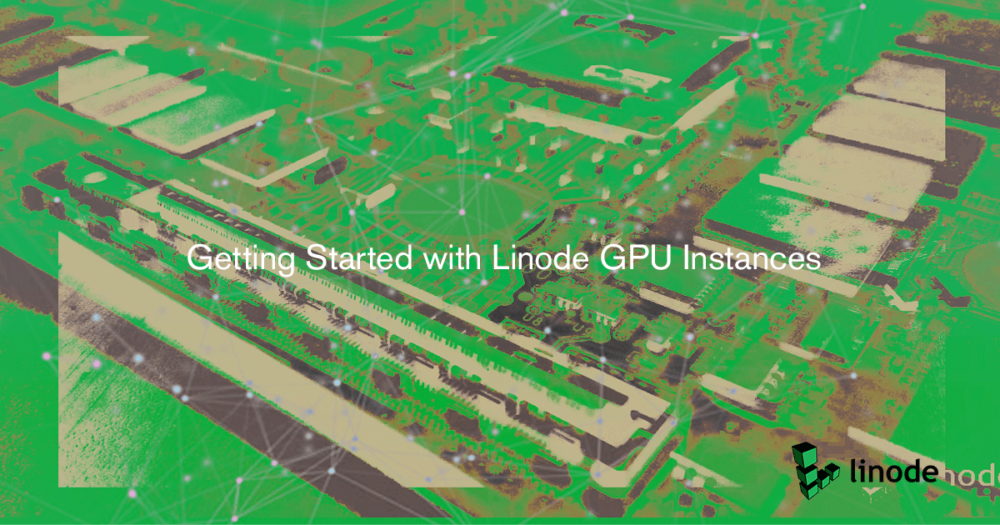

This guide helps you get your Linode GPU Instance up and running on a number of popular distributions. To prepare your Linode, you need to install NVIDIA's proprietary drivers using [NVIDIA's CUDA Toolkit](https://developer.nvidia.com/cuda-toolkit).

When using distributions that are not fully supported by CUDA, like Debian 9, you can install the NVIDIA driver without the CUDA toolkit. To only install the NVIDIA driver, complete the [Before You Begin](#before-you-begin) section and then move on to the [Manual Install](#install-manually) section of this guide.

For details on the CUDA Toolkit's full feature set, see the [official documentation](https://docs.nvidia.com/cuda/cuda-installation-guide-linux/index.html#introduction).


Linode has chosen not to bundle NVIDIA's proprietary closed-source drivers with its standard Linux distribution images. While some operating systems are packaged with the open source [Nouveau](https://nouveau.freedesktop.org/wiki/) driver, the NVIDIA proprietary driver provides optimal performance for your GPU-accelerated applications.



This guide’s example instructions creates several billable resources on your Linode account. If you do not want to keep using the GPU that you create, be sure to delete it when you have finished the guide.

If you remove the resources afterward, you are only be billed for the hour(s) that the resources were present on your account. Consult the [How Linode Billing Works](/docs/guides/how-linode-billing-works/) guide for detailed information about how hourly billing works, and visit our [pricing page](https://www.linode.com/pricing/#row--compute) for a table of hourly and monthly GPU costs.


## Before You Begin

1. Follow our [Getting Started](/docs/guides/getting-started/) and [Securing Your Server](/docs/guides/securing-your-server/) guides for instructions on setting up your Linodes.

1. Make sure that your GPU is currently available on your deployed Linode:

        lspci -vnn | grep NVIDIA

    You should see a similar output confirming that your Linode is currently running a NVIDIA GPU. The example output was generated on Ubuntu 18.04. Your output may vary depending on your distribution.

    
00:03.0 VGA compatible controller [0300]: NVIDIA Corporation TU102GL [Quadro RTX 6000/8000] [10de:1e30] (rev a1) (prog-if 00 [VGA controller])
    Subsystem: NVIDIA Corporation Quadro RTX 6000 [10de:12ba]


    
Depending on your distribution, you may need to install lspci manually first. On current CentOS and Fedora systems, you can install this utility with the following command:

    sudo yum install pciutils


1. Move on to the next section to [install the dependencies](#install-nvidia-driver-dependencies) that NVIDIA's drivers rely on.

## Install NVIDIA Driver Dependencies



## NVIDIA Driver Installation

After installing the required dependencies for your Linux distribution, you are ready to install the NVIDIA driver. If you are using Ubuntu 18.04, CentOS 7, and OpenSUSE, proceed to the [Install with CUDA](#install-with-cuda) section. If you are using Debian 9, proceed to the [Install Manually](#install-manually) section.

### Install with CUDA



### Install Manually


