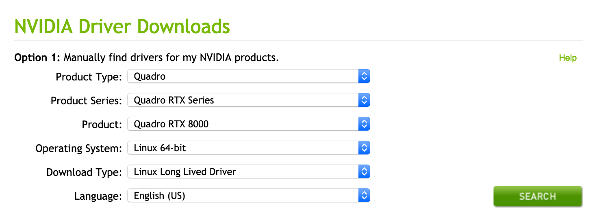
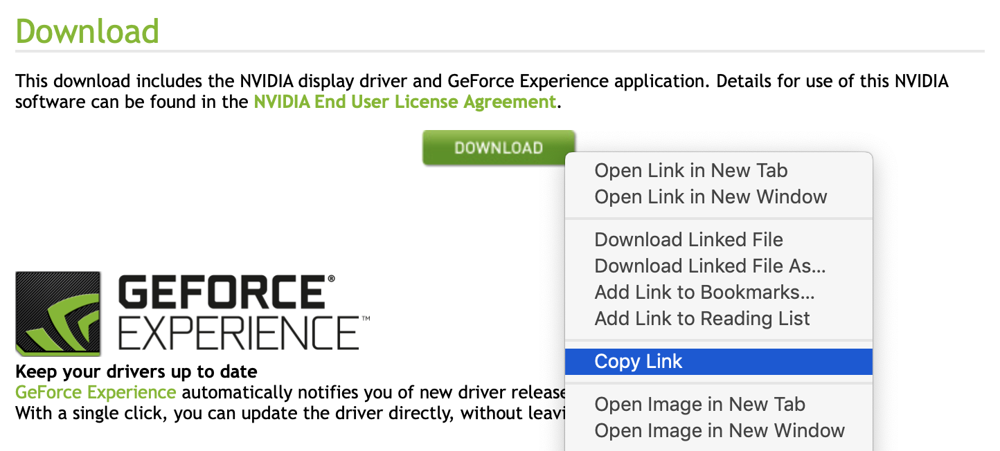


If you are using **Debian 9**, follow the steps below. If you are using **Ubuntu 18.04, CentOS 7, or OpenSUSE**, proceed to the [Install with CUDA](/docs/products/compute/gpu/guides/install-nvidia-drivers-with-cuda) instructions instead.


This section will walk you through the process of downloading and installing the latest NVIDIA driver on Debian 9. This process can also be completed on another distribution of your choice, if needed:

1. Visit NVIDIA's [Driver Downloads Page](https://www.nvidia.com/Download/index.aspx?lang=en-us).

1. Make sure that the options from the drop-down menus reflect the following values:

    | **Prompt** | **Selection** |
    |--------|-----------|
    | Product Type | Quadro |
    | Product Series | Quadro RTX Series |
    | Product | Quadro RTX 8000 |
    | Operating System | Linux 64-bit |
    | Download Type | Linux Long Lived Driver |
    | Language | English (US) |

    The form will look as follows when completed:

    

1. Click the **Search** button, and a page will appear that shows information about the driver. Click the green **Download** button on this page. The file will not download to your computer; instead, you will be taken to another download confirmation page.

1. Copy the link for the driver installer script from the green **Download** button on this page:

    

1.  On your Linode, enter the `wget` command and paste in the download link you copied. This example shows the syntax for the command, but you should make sure to use the download link you copied from NVIDIA's site:

        wget http://us.download.nvidia.com/XFree86/Linux-x86_64/430.26/NVIDIA-Linux-x86_64-430.26.run

1. After wget completes, run your version of the installer script on your Linode. Follow the prompts as necessary:

        sudo bash NVIDIA-Linux-x86_64-*.run

1. Select `OK` and `Yes` for all prompts as they appear.

1. Once the installer has completed, use `nvidia-smi` to make sure that you're currently using your NVIDIA GPU with its associated driver:

        nvidia-smi

    You should see a similar output:

        +-----------------------------------------------------------------------------+
        | NVIDIA-SMI 430.26       Driver Version: 430.26       CUDA Version: 10.2     |
        |-------------------------------+----------------------+----------------------+
        | GPU  Name        Persistence-M| Bus-Id        Disp.A | Volatile Uncorr. ECC |
        | Fan  Temp  Perf  Pwr:Usage/Cap|         Memory-Usage | GPU-Util  Compute M. |
        |===============================+======================+======================|
        |   0  Quadro RTX 6000     Off  | 00000000:00:03.0 Off |                  Off |
        | 34%   59C    P0     1W / 260W |      0MiB / 24220MiB |      6%      Default |
        +-------------------------------+----------------------+----------------------+

        +-----------------------------------------------------------------------------+
        | Processes:                                                       GPU Memory |
        |  GPU       PID   Type   Process name                             Usage      |
        |=============================================================================|
        |  No running processes found                                                 |
        +-----------------------------------------------------------------------------+
