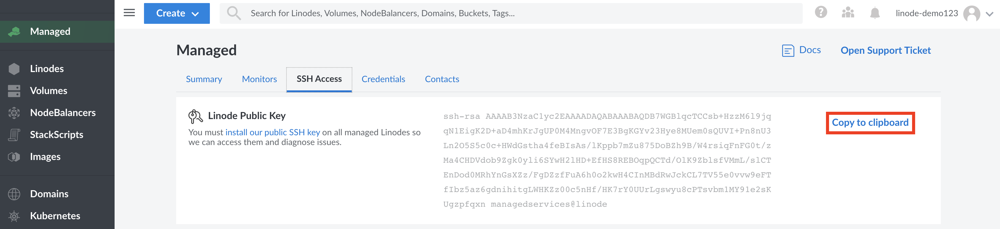
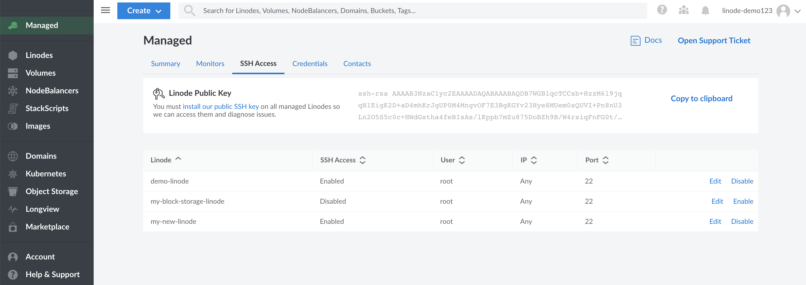
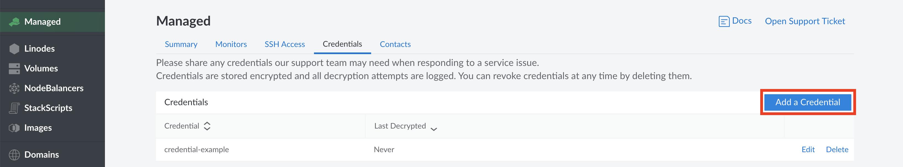
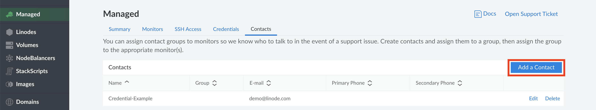

[Linode Managed](https://www.linode.com/products/managed/) is a 24/7 incident response service.
These services include incident response, Longview Pro, the Linode Backup service, cPanel, additional dashboard metrics, and free site migrations. This robust, multi-homed monitoring system distributes monitoring checks to ensure that your servers remain online and available at all times. Linode Managed can monitor any service or software stack reachable over TCP or HTTP. Once you add a service to Linode Managed, Linode will monitor it for connectivity, response, and total request time. This guide shows you how to start monitoring your services with Linode Managed.


Linode Managed applies to all Linodes on an account **Except** for nodes created and implemented by the [Linode Kubernetes Engine (LKE)](https://www.linode.com/products/kubernetes/). All eligible nodes are billed at a rate of $100 per month for each Linode. If this service is not needed for all Linodes, a second account can be created to separate Managed Linodes from non-Managed Linodes. If needed, Linodes can be transferred by [opening up a Support ticket](/docs/platform/billing-and-support/support/#contacting-linode-support) from both accounts and requesting the transfer. You can also contact the support team to install cPanel, add a license, or transfer a license, and other services such as backup, and migration.


## Benefits

- **Incident response:** The core benefit of Linode Managed is 24/7 monitoring and incident response. Our Support team will review any alerts generated by your configured monitors (such as web sites or services) and will perform troubleshooting to get them back up and running. If they are not able to fix the issue, they'll let you know their findings and the steps they've taken so far. Please note that this does not include assistance with maintenance, updates, or configuration of software on your Linode. For that, you'll want to contact our [Professional Services](https://www.linode.com/products/pro-services/) team.

- **Included Services and Software:** The following services and software applications are included at no additional charge to Linode Managed customers
    - [cPanel](https://cpanel.net/): A cPanel license is included for each Linode on your account. cPanel is typically licensed by the number of accounts within the cPanel installation, each account typically corresponding to a single website or group of similar websites. This license will automatically scale based on the number of cPanel accounts you've configured.
    - [Backups](https://www.linode.com/products/backups/): Each Linode on your account will also be subscribed to our Backup service for no extra charge. This service automatically backs up each Linode every day and allows you to restore from the last daily backup, last week's backup, or the previous week's backup.
    - [Longview Pro](/docs/guides/linode-longview-pricing-and-plans/): Longview is our own metric service designed to help you keep track of Linode's performance. Whereas the free version of Longview provides 12 hours worth of data refreshed every 5 minutes, Longview Pro dramatically expands this functionality. It provides all historical data at increased data resolution, including data points for every minute over the last 24 hours.

- **Professional Services:**
    - **Discounted services:** Linode Managed customers receive a 20% discount for any projects completed by our [Professional Services](https://www.linode.com/products/pro-services/) team.
    - **Free migrations:** Customers who sign up with Linode Managed for a minimum of 3 months will receive 2 free site migrations, performed by our Professional Services team. Use the [Professional Services contact form](https://www.linode.com/products/pro-services/#contactus) to learn more and to schedule your site migrations.

All of the benefits for Linode Managed are also discussed on the [Linode Managed](https://www.linode.com/products/managed/) product page.

## Pricing

The cost for Linode Managed is $100 per Linode Compute Instance per month. For example, if there are 10 Linodes on your account, your total monthly cost will be $1,000.


Nodes created and implemented by the [Linode Kubernetes Engine (LKE)](https://www.linode.com/products/kubernetes/) are not considered Linode Compute Instances for Managed billing purposes. LKE nodes will not be billed when enrolling in the Managed service.


## Signing Up for Managed Services



## Initial Setup

After you've signed up for the service, you'll next want to let Support know about the websites and services you run, how to log into them, and who to contact if needed.


Your Managed service dashboard will be blank and the Linode Support Team won't receive health-check notifications for your services until these steps are completed. Please contact Linode Support if you have any questions when working through the initial setup.


1.  [Configuring Credentials](/docs/guides/linode-managed/#configuring-credentials): In order to investigate any issues with your servers, our Support team will need access to those servers. As part of this, you'll want to install our public key on any servers you intend for us to monitor. You'll also want to add any credentials that are specific to the applications or services you are running. For example, if you run a WordPress site that communicates with a MySQL database, you should provide the MySQL username and password if you would like us to troubleshoot it in the event of outage for your site.

1.  [Configuring Contacts](/docs/guides/linode-managed/#configuring-contacts): If our Support team detects any issues, we'll need to know who we should contact. Please follow this section to add general contact details as well as specific people we might want to contact if something happens with a particular service.

1.  [Configuring Monitors](/docs/guides/linode-managed/#configuring-monitors): Here's where you'll configure the actual monitors that are responsible for watching a particular website or service and checking for issues. You can even add checks to make sure specific strings of text appear on your monitored website or in the response body of your service.

## Configuring Credentials

To investigate any alerts received for your services, the Linode Support team will need access to your servers and the applications you run on them. There are two primary ways that they'll authenticate with your servers and applications:

- The Linode Support Team uses SSH to connect to your servers. Specifically, they use public key authentication for the connection. To support this, they generate a unique public/private keypair for your Managed service, and they ask that you [upload the public key to your servers](#adding-the-public-key).

- If you run any applications which require a password to administer, you can [supply those credentials to us in the Managed dashboard](#adding-service-credentials). They'll then refer to your list of credentials when troubleshooting.

### Adding the Public Key

Linode generates and assigns a unique public/private keypair to your account's Managed service. This keypair will be used by Linode Support to log into your server whenever an issue needs to be investigated. You can locate your Linode Managed public key through the following steps:

1.  Log into the [Linode Cloud Manager](https://cloud.linode.com).

1.  Click the **Managed** link in the sidebar.

1.  Navigate to the **SSH Access** tab.

1.  Linode's public key is displayed under this tab, and a **Copy to clipboard** button will appear next to it. Click on this button to copy it.

    

1.  After you've copied the key, you can install it on your server, either [under your root user](#installing-as-root) or [under another user](#installing-as-another-user). If you install it under another user, be sure to also update your [Linode's Managed SSH settings](#specifying-linode-ssh-settings) to reflect that user.

#### Installing as Root

Installing the public SSH key for the `root` user is the easiest way to add Linode's public key to your server. However, if your server's SSH configuration doesn't allow [root login](/docs/guides/set-up-and-secure/#ssh-daemon-options), you may want to skip to the next section to add the public key to another user's account.

To install Linode's SSH key for the `root` user:

1.  Open a terminal window and [log into your Linode via SSH](/docs/guides/set-up-and-secure/#connect-to-the-instance).

1.  Log in as `root`:

        su

    
If you followed the instructions in the [Securing Your Server](/docs/securing-your-server) guide to disable root login via SSH, you will need to reenable that feature to install the public key for the `root` user. Follow [these instructions](/docs/guides/set-up-and-secure/#ssh-daemon-options) to edit the `sshd_config` file and reenable root login via SSH.


1.  Open the `authorized_keys` file in a text editor (for example, [nano](/docs/guides/use-nano-to-edit-files-in-linux/)):

        nano /root/.ssh/authorized_keys

    
The `/root/.ssh/` directory may not exist yet. If this is the case, you must create the directory using the following command before opening the `authorized_keys` file:

     mkdir /root/.ssh/


1.  Paste Linode's public key in a new line in the file.

1.  Save the changes to the `authorized_keys` file and exit your text editor. In the `nano` editor, enter **Control-X**, and then **Y** to confirm.

1. You have successfully added Linode's public key for the `root` user. If you have a firewall installed, you may need to allow access to our infrastructure (see [Configuring Firewall Rules](#configuring-firewall-rules)). To test, you can [open a support ticket](/docs/platform/billing-and-support/support/#contacting-linode-support) to have the Linode Support team confirm that they have access. Repeat this process on every Linode you want to monitor with Linode Managed.

#### Installing as Another User

You can also install Linode's public SSH key for another non-root user. This allows you to disable SSH [root login](/docs/guides/set-up-and-secure/#ssh-daemon-options) and still allow our support staff to log into your servers.

To install Linode's SSH key as a non-root user:

1.  [Log into your Linode via SSH](/docs/getting-started#connect-to-your-linode-via-ssh).

1.  If you haven't already created a non-root user on your server, you should do so now. See [Adding a New User](/docs/guides/set-up-and-secure/#add-a-limited-user-account) for instructions.

    
After logging into your Linode as a non-root user, the Linode Support team will generally need [sudo privileges](/docs/tools-reference/linux-users-and-groups/#understanding-sudo) to run troubleshooting commands, so you should make sure to give your user sudo privileges.

The [Adding a New User](/docs/guides/set-up-and-secure/#add-a-limited-user-account) guide shows how to add your user to the `sudo` group (or `wheel` or `admin` group, depending on your distribution), which will grant this privilege. When your user is in this group, your system will ask for the user's password whenever a sudo command is run. Because of this, you will also need to tell us your Linux user and password by following the [Adding Service Credentials](#adding-service-credentials) section.

Alternatively, you can set up *passwordless sudo* for your user, which means that your user's password won't be requested by the system when running sudo commands. To do this:

1.  Open the `sudoers` file for editing (this command will open the [Vim](https://en.wikipedia.org/wiki/Vim_(text_editor)) text editor):

        sudo visudo

1.  Type `i` to enter *insert mode* in Vim.

1.  In the *User privilege specification* section of the file, add the following line, replacing `example_user` with your user name:

    
example_user ALL=(ALL) NOPASSWD: ALL


1.  Press **Esc** to exit *insert mode*.

1.  Make sure this user is not in any other groups listed in `/etc/sudoers`, as this may override the passwordless sudo setting.

1.  Type `:wq` and press **Enter** to save and quit the file.


1.  Open the `authorized_keys` file for your user in a text editor (for example, [nano](/docs/guides/use-nano-to-edit-files-in-linux/)):

        nano /home/example_user/.ssh/authorized_keys

    
The `/home/example_user/.ssh/` directory may not exist yet. If so, create it with the following command before opening the `authorized_keys` file:

    mkdir -p /home/example_user/.ssh/


1.  Paste Linode's public key in a new line in the file.

1.  Save the changes to the `authorized_keys` file and exit your text editor. In the `nano` editor, enter **Control-X**, and then **Y** to confirm.

1. You have successfully added Linode's public key for the `root` user. If you have a firewall installed, you may need to allow access to our infrastructure (see [Configuring Firewall Rules](#configuring-firewall-rules)). To test, you can [open a support ticket](/docs/platform/billing-and-support/support/#contacting-linode-support) to have the Linode Support team confirm that they have access. Repeat this process on every Linode you want to monitor with Linode Managed.

### Specifying Linode SSH Settings

You can customize Linode Managed's SSH settings for each of your Linodes:

- The Linux user that Support should attempt to log in as.
- Which of your Linode's IP addresses Support should connect via, if your Linode has more than one IP address.
- The port that Support should connect to, if your SSH service is listening on a non-standard port.

As well, you can disable Managed SSH access for one or more of your servers. This does not turn off the SSH service on your Linode or uninstall our public key from it. Instead the Linode Support Team's client software will simply not attempt connections if you have disabled access.


If you want us to investigate issues, it's important to keep SSH access enabled, which is the default.


To access these settings:

1.  Log into the [Linode Cloud Manager](https://cloud.linode.com).

1.  Click the **Managed** link in the sidebar.

1.  Select the **SSH Access** tab. Your Linodes and their Managed SSH settings will appear in the table below:

    

1.  To enable or disable Managed SSH access for a Linode, click on the **Enable** or **Disable** option that corresponds to the Linode you'd like to interact with.

1.  To change other Managed SSH settings for a Linode, click on the **Edit** option. A form appears with fields for each setting.

### Adding Service Credentials

Many of the applications running on your servers can only be accessed with the appropriate username and password combination. To provide Linode's staff with access to those applications, you should upload *credentials* for them to the Linode Cloud Manager. Once uploaded, you can also link credentials to specific Managed services to communicate which ones Linode Support should use when troubleshooting the service.


All credentials are securely stored in our encrypted database.


To add a credential:

1.  Log into the [Linode Cloud Manager](https://cloud.linode.com).

1.  Click the **Managed** link in the sidebar.

1.  Select the **Credentials** tab, then click on the **Add Credentials** link under this tab.

    

    
The table that lists your uploaded credentials will feature a **Last Decrypted** column. This column will show the most recent date/time that a member of Linode Support viewed each credential.


1.  A form for your new credentials will appear with these fields:

    | Field Name | Description |
    |------------|-------------|
    | Credential Label | A descriptive name for the credential that tells the Linode Support Team what it should be used for. For example, if you are entering the MySQL `root` password, you might label it as `MySQL Root`. |
    | Username (optional) | The username to supply when authenticating with the application. |
    | Password/Passphrase | The password or passphrase to supply when authenticating with the application. |

1.  Fill out the form and click the **Add** button.

## Configuring Contacts

Linode Managed allows you to specify *contacts* that will be contacted if an issue is detected with one of your services. Contacts are categorized in groups and can be linked to specific Managed services. You can create separate groups for the administrators responsible for your different services and systems. For example, you might add all of your database administrators to a group named *DBAs* and then link that group to your monitored MySQL service. When Linode Managed detects an issue with MySQL, all of your database administrators will be notified at the same time.

To add a contact to Linode Managed:

1.  Log into the [Linode Cloud Manager](https://cloud.linode.com).

1.  Click the **Managed** link in the sidebar.

1.  Select the **Contacts** tab, then click on the **Add a Contact** link under this tab.

    

1.  A form for your new contact will appear. The form accepts a primary and secondary phone number, which Linode Support may call if they need additional information to troubleshoot an issue on your servers.

    In the **Group** field, enter a group name. As described at the beginning of this section, groups can hold multiple contacts. Ideally, you'll combine all of the individuals responsible for a particular service or system into one group.

    
A Managed service can only be linked to a contact group and not to individual contacts, so you should  create at least one group, even if it only contains one contact.


1.  Fill out the form and click the **Save** button.

## Configuring Monitors

Linode Managed monitors the *services* running on your Linodes. Setting up services is an essential step in the configuration process--Linode Managed can't monitor anything until you add services to be monitored.

### Adding a New Monitor



### Temporarily Disabling Monitors



### Reenabling Disabled Monitors



### Removing Monitors



## Configuring Firewall Rules

If a firewall is configured on your Linode Compute Instance, you may need to add or modify your firewall rules to allow access from our infrastructure. The exact procedure will vary based on the firewall software in use. See the following guides for help configuring firewalls:

- [How to Configure a Firewall with UFW](/docs/guides/configure-firewall-with-ufw/)
- [Introduction to FirewallD on CentOS](/docs/guides/introduction-to-firewalld-on-centos/)
- [Controlling Network Traffic with iptables - A Tutorial](/docs/guides/control-network-traffic-with-iptables/)

### Incident Response Infrastructure IPs

Allow the following hostnames and IPs so that our incident response team can access your server.

    blackbox1-dallas.linode.com 50.116.31.27
    blackbox1-newark.linode.com 66.175.214.213

### Monitor Infrastructure IPs

Allow the following hostnames and IPs so that our infrastructure can perform the checks configured on your monitors.

-   **Atlanta:**

        monitor1-atlanta.linode.com 2600:3c02::f03c:91ff:feae:8540 66.228.57.137
        monitor2-atlanta.linode.com 2600:3c02::f03c:91ff:feae:69d5 50.116.38.168

-   **Dallas:**

        monitor1-dallas.linode.com 2600:3c00::f03c:91ff:feae:8351 50.116.25.212
        monitor2-dallas.linode.com 2600:3c00::f03c:91ff:feae:47d9 198.58.98.236

-   **Frankfurt:**

        monitor1-frankfurt.linode.com 2a01:7e01::f03c:91ff:fe26:e120 139.162.128.25
        monitor2-frankfurt.linode.com 2a01:7e01::f03c:91ff:fe26:8a6a 139.162.128.26

-   **Fremont:**

        monitor1-fremont.linode.com 2600:3c01::f03c:91ff:feae:85e2 50.116.11.198
        monitor2-fremont.linode.com 2600:3c01::f03c:91ff:feae:47d3 66.175.221.50

-   **London:**

        monitor1-london.linode.com 2a01:7e00::f03c:91ff:feae:6965 176.58.113.114
        monitor2-london.linode.com 2a01:7e00::f03c:91ff:feae:6924 178.79.189.96

-   **Mumbai:**

        monitor1-mum1.linode.com 2400:8904::f03c:91ff:fe5d:25b5 172.105.41.4
        monitor2-mum1.linode.com 2400:8904::f03c:91ff:fe5d:2595 172.105.42.4

-   **Newark:**

        monitor1-newark.linode.com 2600:3c03::f03c:91ff:feae:832c 198.74.56.5
        monitor2-newark.linode.com 2600:3c03::f03c:91ff:feae:4766 198.74.59.104

-   **Singapore:**

        monitor1-singapore.linode.com 2400:8901::f03c:91ff:fe33:54f2 103.3.60.25
        monitor2-singapore.linode.com 2400:8901::f03c:91ff:fe33:5401 103.3.60.26

-   **Sydney:**

        monitor1-syd1.linode.com 2400:8907::f03c:92ff:fe67:b794 172.105.176.9
        monitor2-syd1.linode.com 2400:8907::f03c:92ff:fe67:b74f 172.105.162.10

-   **Tokyo:**

        monitor1-shg1.linode.com 2400:8902::f03c:91ff:fe2c:ff57 139.162.65.25
        monitor2-shg1.linode.com 2400:8902::f03c:91ff:fe2c:6eda 139.162.65.26

-   **Toronto:**

        monitor1-tor1.linode.com 2600:3c04::f03c:91ff:fe82:1151 172.105.0.13
        monitor2-tor1.linode.com 2600:3c04::f03c:91ff:fe82:de74 172.105.14.4

## Optional: Installing cPanel

Each Linode Compute Instance on a Managed account is eligible to receive a [cPanel](https://cpanel.net/) license at no additional charge.

1. **Installing cPanel:** The easiest method to quickly get cPanel up and running is to deploy a new Linode using the [cPanel Marketplace App](https://www.linode.com/marketplace/apps/cpanel/cpanel/). Review the [How to Deploy cPanel with Marketplace Apps](/docs/products/tools/marketplace/guides/cpanel/) guide for additional instructions. If the cPanel Marketplace App does not support your desired Linux distribution, you can also follow the instructions within the [Install cPanel on CentOS](/docs/guides/install-cpanel-on-centos/) guide or the [Installation Guide](https://docs.cpanel.net/installation-guide/) on cPanel's documentation site. At this time, cPanel fully supports the following Linux distributions: CentOS 7, CentOS 8, AlmaLinux 8, Rocky Linux 8, and Cloud Linux. CentOS 8 is not recommended as it is due to reach end of life on December 31st 2021 (see the [CentOS 8 End-of-Life](https://www.linode.com/blog/linux/centos-8-end-of-life-linode-distributions/) blog post).

1. **Obtaining a License:** Contact the Support team to obtain a cPanel license for your Linode. If you do not subscribe to Linode Managed, you will need to obtain your license directly from cPanel. cPanel is typically licensed by the number of accounts within the cPanel installation, each account typically corresponding to a single website or group of similar websites. The license we provide will automatically scale based on the number of cPanel accounts you've configured.