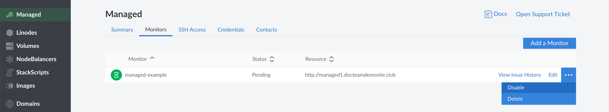

Service monitoring can be temporarily disabled:


Linode Managed continuously monitors your services for availability. If you are going to perform scheduled maintenance on a service that temporarily makes it unavailable, you will receive a support ticket from Linode when they are alerted of the service's outage. You can disable monitoring for that service during the maintenance to avoid receiving these reports.


1.  Log into the [Linode Cloud Manager](https://cloud.linode.com).

1.  Click the **Managed** link in the sidebar.

1.  Select the **Monitors** tab. A table which lists your monitored services will appear below the tab.

1.  Find the service that you want to temporarily disable and click on the corresponding **more options ellipsis**. Select the **Disable** option from the menu that appears.

    

The service is now temporarily disabled. Linode Managed won't resume monitoring this service until you reenable monitoring, as described in the next section.
