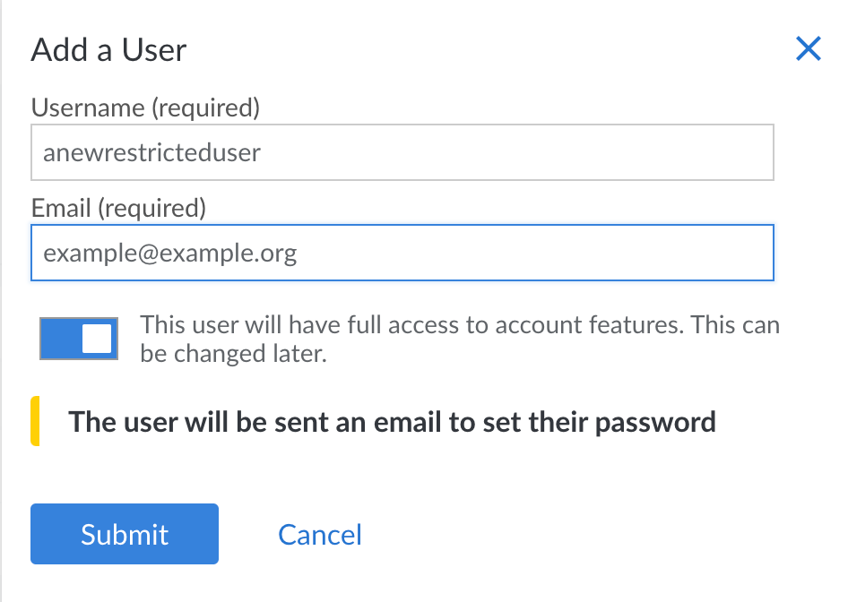

When you add a user, you give that individual permission to log in to the Linode Cloud Manager and, depending on the access level they are assigned, receive email notifications. Users can have either limited or full access to account features.

Here's how to add a user to your Linode account:

1.  Log in to the [Cloud Manager](https://cloud.linode.com).
1.  Click the **Account** link in the sidebar.
1.  Click the **Users & Grants** tab.
1.  Click on **Add a User**. The *Add a User* menu appears.

    

1.  Enter a username for the user in the **Username** field.
1.  Enter the user's email address in the **Email** field. A password creation link is sent to the new user's email address.
1.  Toggle the **Account Access** button to give the user full or limited access to account features.
1.  Click **Submit**.

If you granted the user full access, the account is created and no further action is required. If you granted the user limited access, continue with [setting user permissions](/docs/guides/accounts-and-passwords/#setting-user-permissions).
