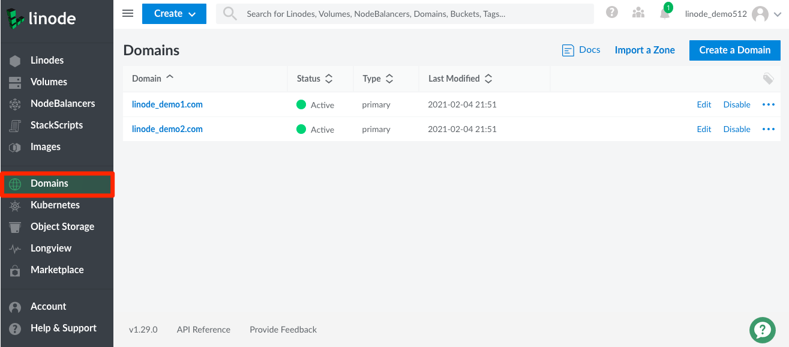

The DNS Manager allows you to control and manage your domains. You can access the DNS Manager by navigating to the **Domains** link in the Cloud Manager's sidebar.

For more information on Cloud Manager's DNS Manager, see the following guides:

- [DNS Manager](/docs/products/networking/dns-manager/).
- [Common DNS Configurations](/docs/products/networking/dns-manager/guides/common-dns-configurations/)
- [Configure Your Linode for Reverse DNS](/docs/products/compute/compute-instances/guides/configure-rdns/)
