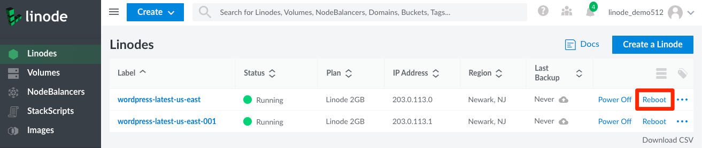
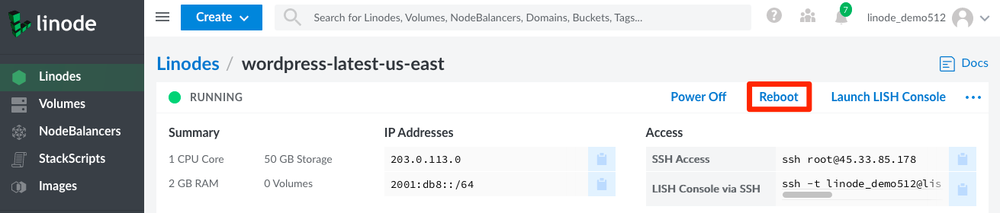

You can reboot a Linode from two places within the Cloud manager.

1. From your [Linodes listing page](https://cloud.linode.com/linodes), click **Reboot** for the desired Linode. For smaller windows, first click the **More Options Ellipses** and then select **Reboot**.

    

1. You can also reboot your Linode from within any Linode details page by clicking on the **Reboot** option. For smaller windows, first click the **More Options Ellipses** and then select **Reboot**.

    

