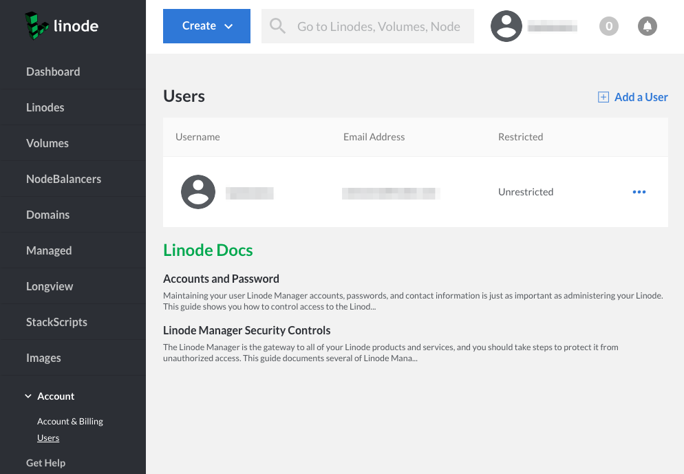
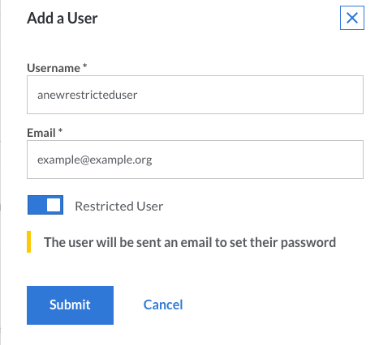

When you add a user, you give that individual permission to log in to the Linode Cloud Manager and, depending on the access level they are assigned, receive email notifications. There are two types of users: *Restricted users*, who have limited access to the Linode Cloud Manager, and *unrestricted users*, who have full access.

Here's how to add a user to your Linode account:

1.  Log in to the [Cloud Manager](https://cloud.linode.com).
1.  Click the **Account** link in the sidebar.
1.  Click the **Users** link.

    

1.  Click on **Add a User**. The *Add a User* menu appears.

    

1.  Enter a username for the user in the **Username** field.
1.  Enter the user's email address in the **Email** field. A password creation link will be sent to the new user's email address.
1.  To give the new user restricted access, toggle the **Restricted Access** button.
1.  Click **Submit**.

If you granted the user full access, the account will be created and no further action is required. If you opted to restrict the user, follow the instructions in the next section.
