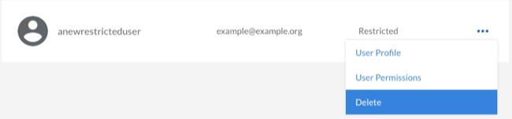

You can permanently remove a user account from the Linode Cloud Manager. Here's how:

1.  Click the **Account** link in the sidebar.
1.  Click the **Users** tab.
1.  Locate the user in the list and click on the **more options ellipsis** to the right of the user.
1.  Select the **Delete** link from the menu. A warning appears asking you to confirm that you want to delete the user.

    

1.  Click **Delete**.

The account will be removed, and the user will no longer be able to access the Linode Cloud Manager.
