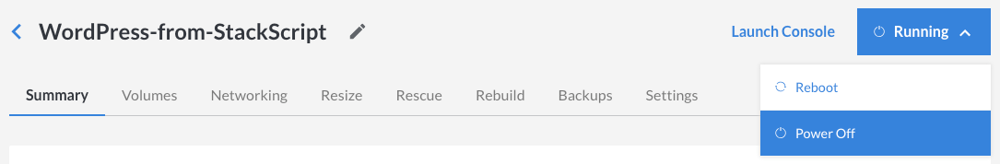

If you can't remember the password for the `root` user on a Linode, use the Linode Cloud Manager to reset it. Here's how:

1.  Click the **Linodes** link in the sidebar.
1.  Select a Linode. The Linode's details page appears.
1.  Click **Power Off** from the status menu to turn off your Linode. Monitor your bell notifications at the top of the page for a message indicating that your Linode has shut down.

    

1.  Click the **Settings** tab.
1.  Under the **Reset Root Password** panel, select your primary disk from the **Disk** menu.
1.  Enter a new password for the `root` user in the **Password** field.
1.  Click **Save**. The Linode's dashboard appears.
1.  Click **Power On** to turn on your Linode.

Now you can use the new `root` user password to log in to your Linode. See [Connecting to Your Linode](/docs/getting-started#connect-to-your-linode-via-ssh) for more information about connecting. If you are unable to connect with the `root` credentials via SSH, try connecting with [Lish](/docs/platform/manager/using-the-linode-shell-lish/) instead. If you are able to connect via Lish but not SSH, you may need to troubleshoot your SSH configuration and firewall rules.
