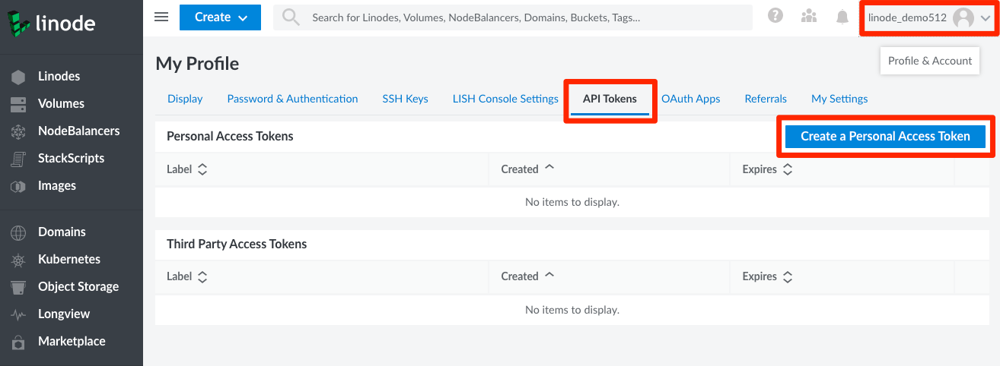
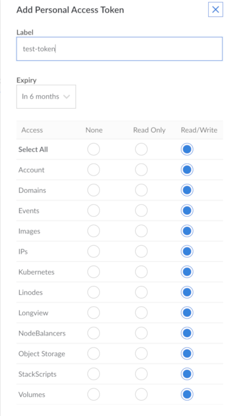

API Tokens (personal access tokens) are used in token-based authentication to provide users or programming scripts with different levels of access to your Linode account's resources and services via the [Linode API v4](https://developers.linode.com/api/v4). You can create and manage your API tokens using the Cloud Manager.

1.  To generate a new personal access token, navigate to your profile by clicking on your username and select **My Profile** from the drop down menu. Then click on the **API Tokens** tab.

    

1.  Click **Add a Personal Access Token**. A panel will display allowing you to give this token a label and choose the access rights you want users authenticated with the new token to have.

    

1.  When you have finished, click **Submit** to generate a new Personal Access Token. Copy the token and save it to a secure location before closing the popup. **You will not be able to view this token through the Cloud Manager after closing the popup.**
