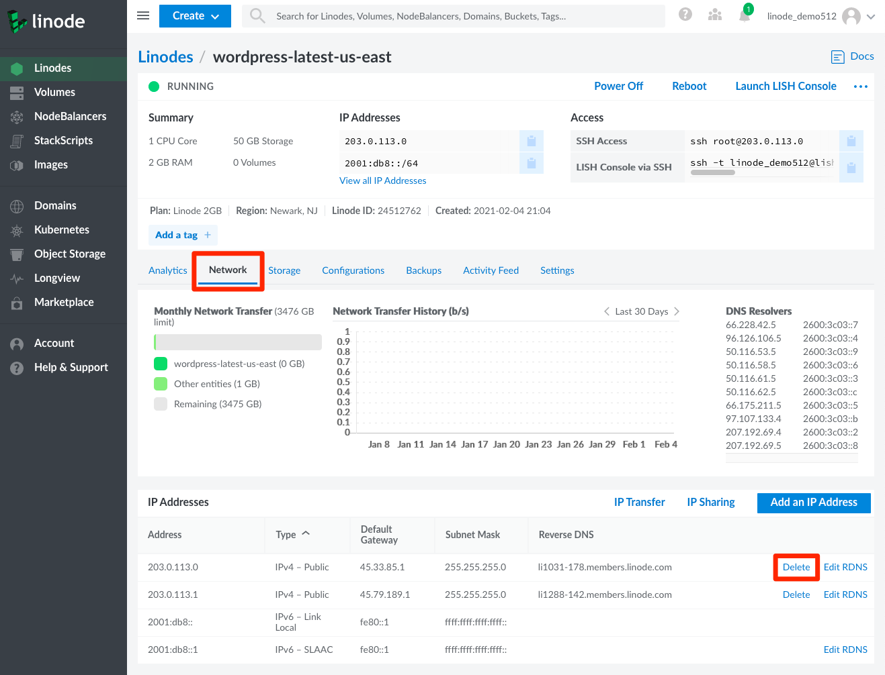

You can delete a public IP addresses within the Cloud Manager from the **Networking** tab in a Linode's details page.

1.  Click **Linodes** from the sidebar menu.

1.  Choose the Linode you wish to modify to enter the Linode detail screen. Then, click on the **Networking** tab. Your IPv4 and IPv6 addresses will be listed here.

1.  Next to the public IPv4 address you wish to delete, click on the **more options ellipses**. Select the option to **Delete IP** from the drop down menu.

    

1.  A confirmation popup will appear where you can confirm the operation.

    
You must have at least one public IP on a Linode. If you attempt to delete the last public IP on a Linode you will receive an error message *after* you confirm the deletion.

