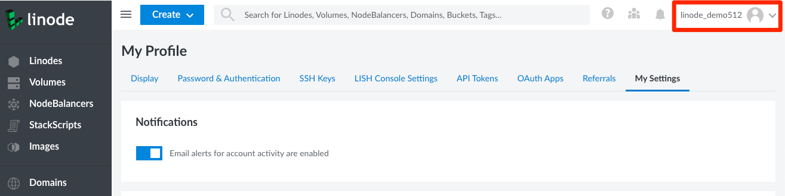

Email event notifications alert you when new events such as booting, shutting down, or updates to a Linode occur on your account. You can enable or disable email event notifications using the Cloud Manager.

You can manage your event notifications in the **Settings** tab from the [**My Profile**](https://cloud.linode.com/profile/display) section of the Cloud Manager.

