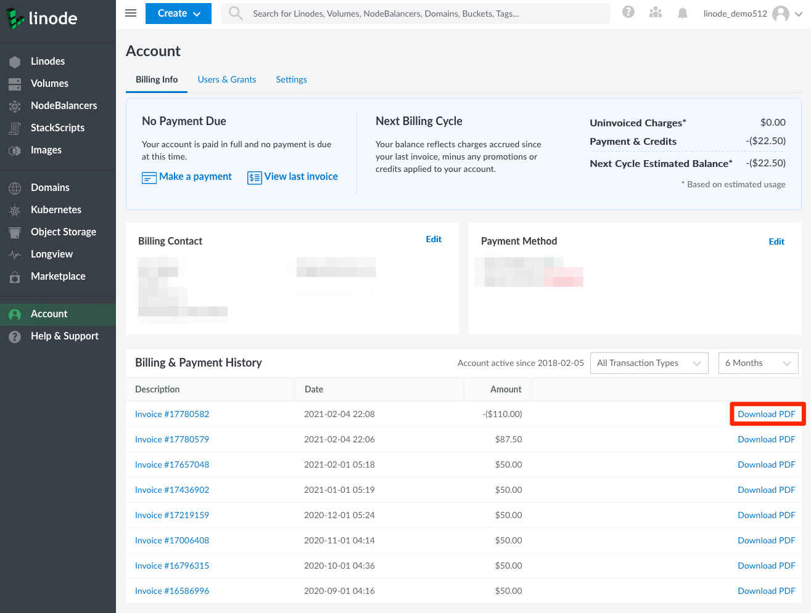
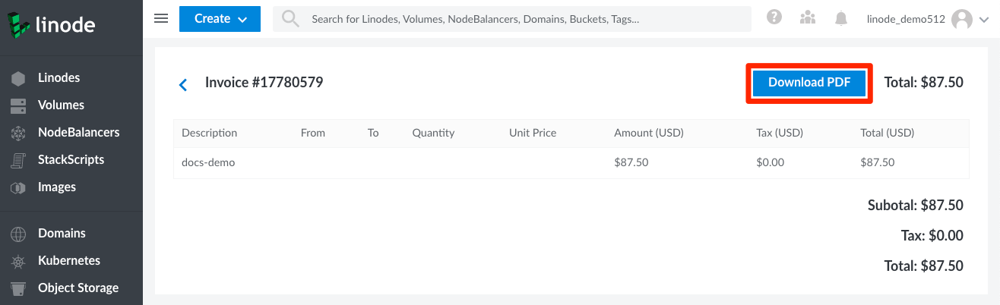

You can download a printable PDF of your billing invoice from your list of invoices or from within an individual invoice.

1.  Navigate to your Account by clicking on **Account** in the sidebar.

1.  Click on the **Recent Invoices** menu item in the **Billing** section. This will expand to show you a list of your recent invoices. Each invoice has a **Download PDF** link next to it.

    

1.  You can also click on any invoice to view it within the Cloud Manager. At the top of the invoice there is a **Download PDF** button.

    
