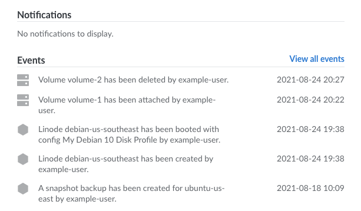

Most actions that occur on an account or to a particular service are logged as *events*. These events include services being created (or deleted), a change in a Linode's power state (such as powering off or rebooting), and many other actions. All events are stored to an account for 90 days.


Events are only shown to a logged in user if that event is within the scope of the user's permissions. This means that a restricted user only sees events for services that they have been granted access to. For more information, see our [Accounts and Passwords](/docs/products/platform/accounts/guides/manage-users/#users-and-permissions) guide.


## Viewing Events

Events for all services and account functions can be viewed in the Cloud Manager, either through the Events panel or the [Events](https://cloud.linode.com/events) page.

1.  Log in to the [Cloud Manager](https://cloud.linode.com/) and press the notification bell on the top right of the page.

    

    This displays an Events panel containing notifications and the most recent events for all services on the account. Each item in the **Events** list includes a brief description of the action, the label of the service, the user who initiated the action, the duration, and the timestamp.

    

1. To view more events, click the **View all events** link at the top of the **Events** list. This displays the [Events](https://cloud.linode.com/events) page, which contains the same information as the previous list. All events that occurred during the last 90 days are listed on this page.

## Viewing a Linode's Activity Feed

A Linode's Activity Feed is similar to the Account's [Events](#events) page. However, this is a filtered list of events only relevant to the specific Linode. Follow the instructions below to access a Linode's Activity Feed.

1.  Log in to the [Cloud Manager](https://cloud.linode.com/) and select **Linodes** from the sidebar menu.

1.  Locate the Linode you wish to see events for and click on the Linode's label.

1. Within the chosen Linode's page, navigate to the **Activity Feed** tab.

    

    This displays a list of events for the selected Linode that have occurred during the last 90 days. Each item includes a brief description of the action, the label of the service, the user who initiated the action, the duration, and the timestamp.

## Managing Email Notifications for Events

Each time an event occurs, you can automatically receive an email notifying you of the event. If desired, you can enable or disable these email event notifications using the Cloud Manager.


Only unrestricted users can receive threshold notification emails.


1.  Log in to the [Cloud Manager](https://cloud.linode.com/) and click the user dropdown menu on the top right of the page.

    

1.  Within the dropdown, click the **My Settings** link under **My Profile**.

1. In the [My Settings](https://cloud.linode.com/profile/settings) page that opens, toggle the *Email alerts for account activity are enabled* option (under **Notifications**) to the desired setting.

    
