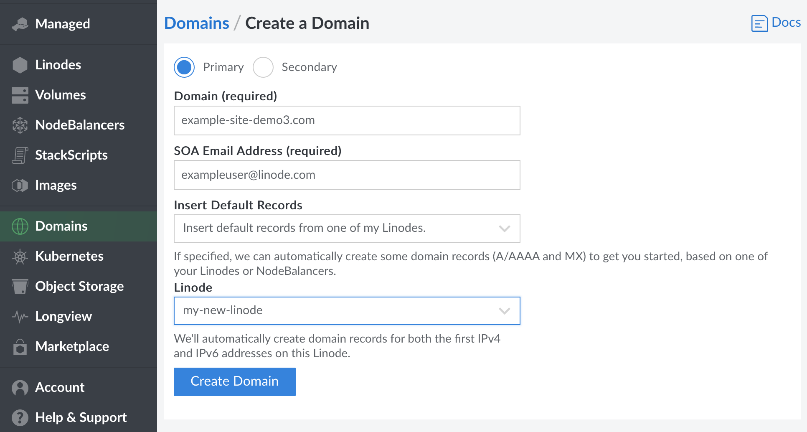
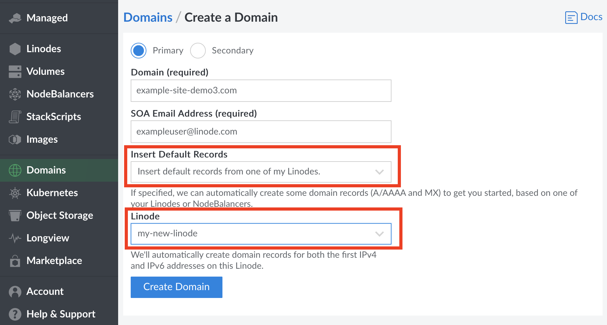

If you're new to Linode, or if you've just purchased a new domain name, the first step is to add a new domain in the **Domains** section of the Cloud Manager. If you don't know what DNS records to add, the DNS Manager can insert some basic records when you create the new domain.


Creating a domain also creates its corresponding domain zone.


1.  From the **Domains** section, click on **Add a Domain**. The **Add a New Domain** panel will appear where you can fill out the form fields with your domain's information.

    

1. If you want to add a *slave zone* instead of a master zone, click the **Slave** radio button. If not, you may skip to the next step.

In order for Linode's DNS servers to function as slaves, your DNS master server must notify and allow AXFR requests from the following IP addresses:

    104.237.137.10
    65.19.178.10
    74.207.225.10
    207.192.70.10
    109.74.194.10
    2600:3c00::a
    2600:3c01::a
    2600:3c02::a
    2600:3c03::a
    2a01:7e00::a


On **December 15th, 2020** the IP address `74.207.225.10` was added to replace the deprecated IP address `75.127.96.10`. The IP address `75.127.96.10` is no longer used for AXFR requests.


1.  Enter your domain name in the **Domain** field. An example is shown above.
1.  Enter an administrator's email address in the **SOA Email Address** field.
1.  If you are unfamiliar with DNS, the DNS Manager can automatically create some basic DNS records to get you started. To have it insert these records, select **Yes, insert a few records to get me started**, then select from the drop-down menu the Linode with which you want this domain zone associated.

    

     Alternatively, to keep the domain zone empty and prevent the DNS Manager from creating DNS records, select **No, I want the zone empty**.

1.  Click **Create**. If you selected the option to have the DNS Manager insert basic DNS records, those records will be visible on the Domains detail page. The created records should include SOA, NS, MX, and A/AAA.

    If you elected to keep the zone empty, you can start adding DNS records now. The Domain detail page will contain an SOA and NS record for the domain. Skip to the [Adding DNS Records](/docs/networking/dns/dns-manager-overview/##add-dns-records) section for instructions.

<!--
1.  If you are unfamiliar with DNS, the DNS Manager can automatically create some basic DNS records to get you started. To have it insert these records, select **Yes, insert a few records to get me started**, then select from the drop-down menu the Linode with which you want this domain zone associated.

    Alternatively, to keep the domain zone empty and prevent the DNS Manager from creating DNS records, select **No, I want the zone empty**.

If you selected the option to have the DNS Manager insert basic DNS records, those records will be visible, as shown above. If you elected to keep the zone empty, you can start adding DNS records now. Skip to the [Adding DNS Records](/docs/networking/dns/dns-manager-overview/#add-records) section for instructions.

-->
