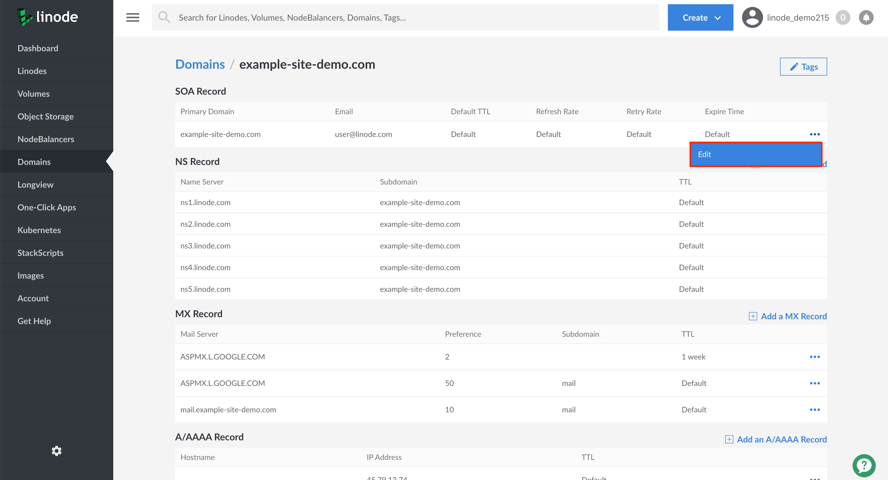

Linode's DNS servers allow Domain zone transfers to non-Linode DNS servers that you designate and trust. This feature can be used to transfer a Domain zone to another hosting provider's DNS servers. To enable this capability, you will need to alter your Domain's SOA record. This section will cover these steps.

  
Granting another server access to zone information is potentially dangerous. Do not add any IP addresses that you do not know or trust.
  

1. From the **Domains** section of the Cloud Manager, find the domain for which you would like to enable Domain zone transfer and click on the entry to access its Domain records.

1. Viewing your Domain's records, under the **SOA Record** section, click on the **more options ellipsis** corresponding to your Domain's SOA records and select **Edit**.

    

1. In the **Edit SOA Record** pane, find the **Domain Transfers** form field and enter in a comma separated list of IP addresses corresponding to the DNS servers you'd like to give access to your Domain's zone file.

1. When you've completed your update, click on **Save**.

    
When the DNS servers no longer need access to your Domain's zone file, remove the IP address from the **Domain Transfers** field.
    
