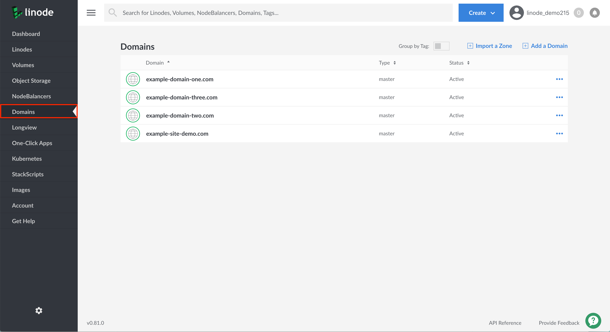
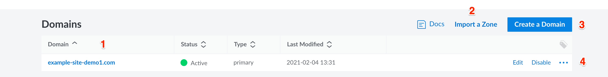
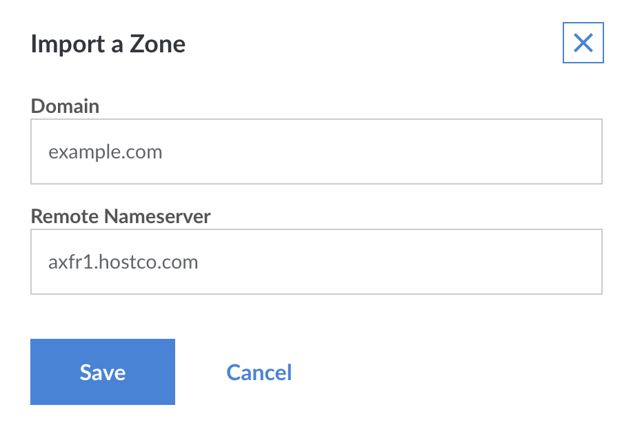
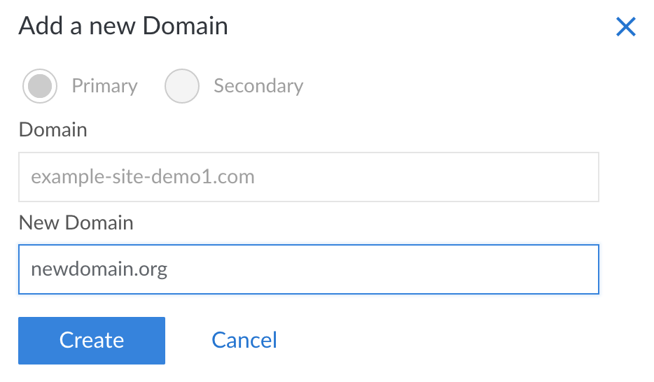

<!--  -->

The *Domains* section of the [Linode Cloud Manager](https://cloud.linode.com/domains) is a comprehensive DNS management interface that allows you to add DNS records for all of your domain names. This guide covers the use of the **Domains** section and basic domain setup. For an introduction to DNS in general, see our [Introduction to DNS Records](/docs/networking/dns/dns-records-an-introduction/) guide.


Linode's DNS service employs [Cloudflare](https://cloudflare.com) to provide denial of service (DDoS) mitigation, load balancing, and increased geographic distribution for our [name servers](/docs/networking/dns/dns-records-an-introduction/#name-servers). These factors make our service reliable, fast, and a great choice for your DNS needs.



To use the Linode DNS Manager to serve your domains, you must have an active Linode on your account. If you remove all active Linodes, your domains will no longer be served.


## Getting Started

The Domain Name System (DNS) attaches human-readable domain names to machine-usable IP addresses. In many ways, it is the phone book of the Internet. Just like a phone book can help you find the phone number of a business, DNS can take a domain name like `google.com` and translate it into an IP address like `74.125.19.147`. This global system allows users to remember the names of websites instead of their numeric IP addresses.


All steps in this guide are completed within the **[Domains](https://cloud.linode.com/domains)** section of the [Linode Cloud Manager](https://cloud.linode.com/).


## DNS Set-Up Checklist

DNS records are only actively hosted on accounts with at least one Linode. When setting up a domain name on your Linode, make sure you perform the following steps:

1.  Register (purchase) a domain name if you haven't already.
2.  Set your domain name to [use Linode's name servers](#use-linode-s-name-servers-with-your-domain). You'll need to do this on your domain registrar's website and then wait up to 24 hours for the change to take effect.
3.  Use the DNS Manager to [add a domain](#add-a-domain), and then start [adding some basic DNS records](#add-dns-records).
4.  [Set reverse DNS](/docs/networking/dns/configure-your-linode-for-reverse-dns/).
5.  If you have any special DNS requirements, such as when using a third-party email server, add additional DNS records [for your specific needs](/docs/networking/dns/common-dns-configurations/).

## Use Linode's Name Servers with Your Domain

After you purchase a domain, log in to your domain registrar's control panel and set the name servers for your domain name to the entries below. See the instructions on your domain name registrar's website for more information.

-   `ns1.linode.com`
-   `ns2.linode.com`
-   `ns3.linode.com`
-   `ns4.linode.com`
-   `ns5.linode.com`

 
DNS changes can take up to 24 hours to propagate throughout the internet, although the changes are usually visible within several hours.


## Create and Manage Domains

The Linode DNS Manager allows you to create and manage domains. The DNS manager can be accessed from the **Domains** section of the Linode Cloud Manager. To find this area, log in to your [Cloud Manager](https://cloud.linode.com/) account and click the **Domains** link in the sidebar.

### DNS Manager Options Overview

The section below provides a detailed description of the available options within the **Domains** section of the Linode Cloud Manager:

1.  All of your domains are listed under the **Domains** heading. To access your Domain's DNS records, click the name of a Domain.

    Click the name of a domain to add or edit its DNS records. When you add a domain, the Cloud Manager will automatically create a zone file for your Domain.  Before you can add any DNS records, you must [add a domain](#add-a-domain).

    
A *domain zone* is a collection of DNS records for a single domain name. **Creating a domain also creates its corresponding domain zone.** [Linode's APIv4](https://developers.linode.com/api/v4/), which is the backbone of the Cloud Manager, will validate the created zone file for any errors.

The term *domain zone* becomes synonymous with the term *domain*, both in terms of use and administration.


1.  If you have a zone that can be exported from a server or another hosting provider, click **Import a Zone** to import it.

1.  Click **Add a Domain** to create a new domain zone.

1.  Click on the **more options ellipsis** to corresponding to a domain zone to edit DNS records within a zone, clone an existing zone, or remove a zone.

### Add a Domain



### Add DNS Records



### Edit DNS Records



### Subdomains

Add a subdomain by adding an entry under the *A/AAAA Record* heading, with just the subdomain. For example, for `subdomain.example.com`

1. Add `subdomain` under *Host*.

1. Set the IP address.

1. Adjust the TTL if necessary.

1. Click **Save**. It will only take a few minutes for the record to be updated.

### Wildcards

A wildcard DNS record will match requests for domains that do not exist. Wildcards are often used to point all non-existing subdomains to an existing top level domain. For example, if a queried first-level subdomain does not exist, the IP address specified in the wildcard DNS record will respond.

To create a [wildcard DNS record](https://en.wikipedia.org/wiki/Wildcard_DNS_record):

1. Navigate to the **Domains** section of the Cloud Manager and click on the Domain that you'd like to add a wildcard DNS record to.

1. Find the **A/AAAA Record** section and select **Add an A/AAAA Record**.

1. When the **Create A/AAAA Record** panel appears, enter an asterisk (`*`) in the **Hostname** field and provide a valid IP address in the **IP Address** field.

1. Click **Save**. It will only take a few minutes for the record to be updated.


A wildcard must always be the furthest subdomain from the TLD (top level domain), i.e. `*.example.com`. If you would like to add a wildcard as a subdomain for a subdomain, you will need to add a new domain zone for that subdomain and then add the wildcard record to it. For example, to create `*.subdomain.example.com`, you must add a separate domain zone for `subdomain.example.com` first, then add an A/AAAA DNS record to that zone as indicated above.


### Sub-Subdomains

The Linode Cloud Manager does not support the addition of a subdomain on top of an existing subdomain in the same domain zone. For example, if you have `example.com` as a domain with an A record for `subdomain.example.com`, you cannot create `another.subdomain.example.com` within that same domain zone.

Instead, [add the subdomain](#add-a-domain) to the Cloud Manager as a separate domain with its own domain zone and DNS records. Then add an A/AAAA record for the second-level subdomain. In the previous example, you would create a domain zone named `subdomain.example.com`, the create an A/AAAA record with hostname `another` inside of it.

### Import Domains with AXFR

If you're migrating domains to Linode from another hosting provider and that provider allows zone transfers from its DNS server, it may be possible to import your existing domain and its DNS records into the Linode Cloud Manager. If the import is successful, the domain along with all of its existing DNS records will be available in the **Domains** section of the Cloud Manager.

Here's how to import a zone file:

1.  From the **Domains** section, click on **Import a Zone**.

    

1.  Enter the domain name in the **Domain** field, as shown in the example above.

1.  Enter the name server in the **Remote Nameserver** field.

    
The name server must allow zone transfers (AXFR) from the following IP addresses:

    96.126.114.97
    96.126.114.98
    2600:3c00::5e
    2600:3c00::5f


1.  Click **Save**. The Linode Cloud Manager will connect to the remote name server and import your existing DNS records.

### Clone DNS records

The *Clone* feature allows you to copy DNS records from an existing domain in your Linode account to a new domain. If you've already set up DNS records for one of the services you host on your Linode account, this is a good way to quickly assign another domain to that same service.

Here's how to clone DNS records for an existing domain:

1.  Click on the **more options ellipsis** corresponding to the domain whose DNS records you would like to clone and select **Clone** from the menu.

1.  Enter the name of the new domain in the **New Domain** field.

    

1.  Click **Create**. The DNS records will then be copied from the existing domain to the domain.

### Remove Domains



### Transfer a Domain Zone



## DNSSEC Limitations

The Linode DNS Manager does not support DNSSEC at this time. If you have DNSSEC enabled at your domains registrar it will cause name resolution failures such as `NXDOMAIN` when an attempt is made to access the DNS.

## Next Steps

Now that you are familiar with Linode's DNS Manager, you should set up your [reverse DNS configuration](/docs/networking/dns/configure-your-linode-for-reverse-dns/), and consider reading through at our [Common DNS Configurations](/docs/networking/dns/common-dns-configurations/) guide. For help with DNS records, see our [Troubleshooting DNS](/docs/platform/manager/troubleshooting-dns) guide.
