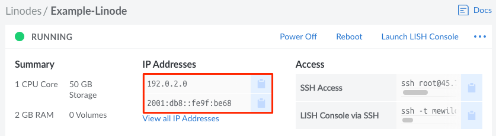
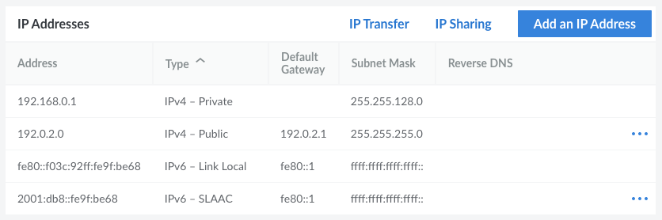
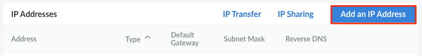
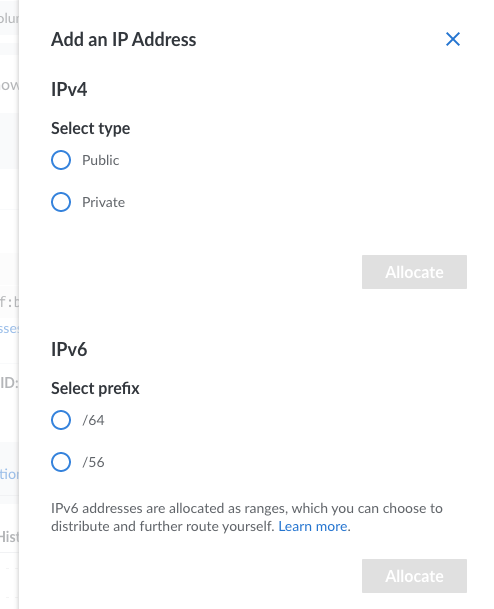
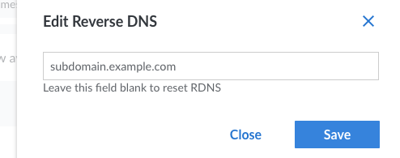
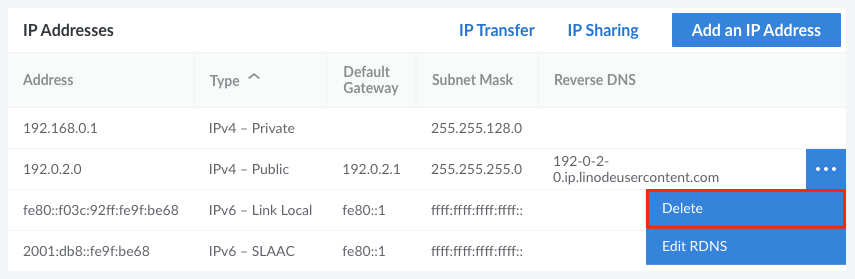
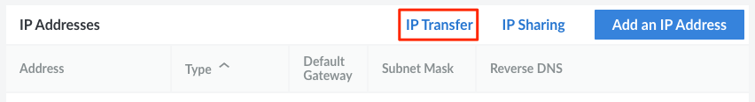
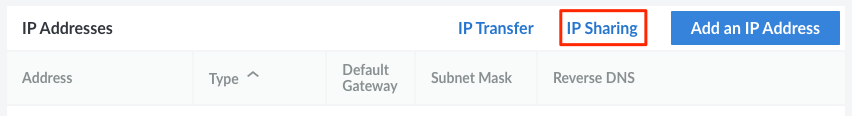
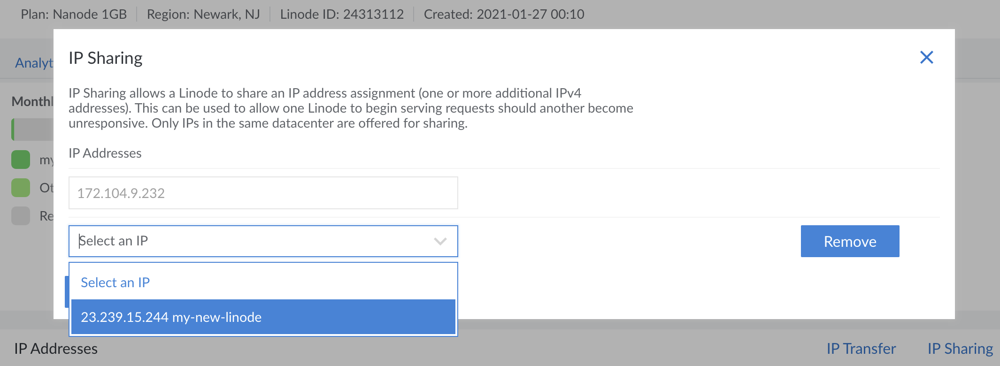
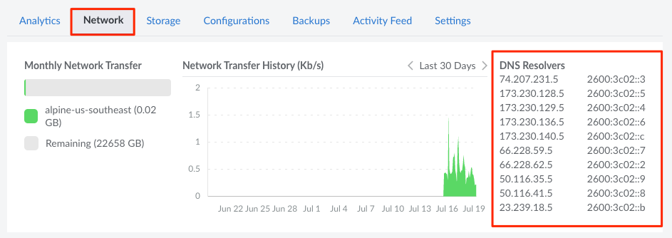

Each Linode Compute Instance is equipped with several IP addresses, which enable it to be accessible over the public Internet and to other Linode services. This guide covers how to manage these IP addresses (including viewing, adding, removing, transferring, or sharing them) through the Cloud Manager.

## Viewing IP Addresses

1.  Log in to the [Cloud Manager](https://cloud.linode.com) and click the **Linodes** link in the sidebar.

1.  Click on your Linode Compute Instance from the list to view more details.

1.  Within the top *Summary* section, you can view the primary IPv4 and IPv6 addresses.

    

1.  To view all of your IP address for this Instance (along with any associated rDNS values), click the **View all IP Addresses** link or navigate to the **Network** tab and review the **IP Addresses** section.

    

## Types of IP Addresses

### IPv4

- **Public IPv4 Address:** All Compute Instances are created with at least one public IPv4 address, which enables your applications to be accessible over the Internet. Additional addresses can be provided with technical justification.

- **Private IPv4 Address:** Optionally, private IPv4 addresses can be assigned to a Compute Instance. This allows it to connect to other services located in the same data center, such as NodeBalancers or other Compute Instances.

    
All private IPs in the same data center can communicate with each other over the private network. This means a Compute Instance's private IP address is accessible to all other Instances in that data center. It's recommended to set up firewall rules for your Linode to secure its network traffic. See our [firewall guides](/docs/security/firewalls/) for details on setting up firewall rules. In many cases, using [Private VLANs](/docs/products/networking/vlans/) is preferred over private IPv4.


### IPv6 Addresses

- **IPv6 SLAAC Address:** This is the main IPv6 address used to communicate over the public Internet and with other services in the same data center. All Compute Instances are assigned a single SLAAC address, which cannot be removed or transferred. Additional SLAAC addresses cannot be provided. If you need an additional IPv6 address, consider using a /64 range (see below).

- **IPv6 Link Local:** This IPv6 address is assigned to each Compute Instance and used for internal routing.

- **/64 Routed Range:** This is the most common range provided to our customers and sufficient for most applications that require additional IPv6 addresses. A single /64 range provides 18,446,744,073,709,551,616 addresses that can be used when configuring the applications within your system. See the [Linux Static IP Configuration](/docs/guides/linux-static-ip-configuration/) guide for instructions on configuring specific addresses from a range. By default, up to one /64 range can be added per customer per data center.

- **/56 Routed Range:** These larger ranges are typically only required by specialized systems or networking applications. A single /56 range provides 4,722,366,482,869,645,213,696 addresses that can be used when configuring the applications within your system. See the [Linux Static IP Configuration](/docs/guides/linux-static-ip-configuration/) guide for instructions on configuring specific addresses from a range. By default, up to one /56 range can be added per customer per data center.

- **/116 Pool:** *(4,096 addresses)* An IPv6 pool is accessible from every Linode on your account within the assigned data center. Addresses from that pool can be configured on each Linode within that data center. This can enable features like IPv6 failover. By default, up to one /116 pool can be added per customer per data center.

    
The IPv6 /116 prefix has been deprecated and is not available in the Toronto, Atlanta, Sydney, or Mumbai data centers. To add a /116 pool in a supported data center, [contact our Support team](https://www.linode.com/support/) with your request.


## Adding an IP Address

Follow the instructions below to add an public IPv4, private IPv4, or IPv6 range to your Compute Instance. By default, up to one /64 and /56 range can be added per customer per data center.

1.  Log in to the [Cloud Manager](https://cloud.linode.com) and click the **Linodes** link in the sidebar.
1.  Click on your Linode Compute Instance from the list and navigate to the **Network** tab.
1.  Click the **Add an IP Address** button under the *IP Address* section. This displays the *Add an IP Address* panel.

    

1.  Within the form, select the type of IP address (or range) you wish to add. If you aren't sure, review the [Types of IP Addresses](#types-of-ip-addresses) section and consider your own use case.

    

1.  Click the **Allocate** button to add the additional address. If you receive a message similar to the following, you need to [contact our Support team](https://www.linode.com/support/) to request the IP address. Make sure to include any additional information or technical reasoning for the request.

    > Additional IPv4 addresses require technical justification. Please open a Support Ticket describing your requirement

    Once the IP address or range has been added, it should be visible in the *IP Address* section.

1.  To make sure the new IP address is configured within the internal system of the Compute Instance, verify that [Network Helper](/docs/guides/network-helper/) is enabled and reboot the Compute Instance.

    If Network Helper is turned off *and* you've [configured a static IP address](/docs/guides/linux-static-ip-configuration/), you need to update the configuration files with the new IP address or enable Network Helper.


Due to the [impending exhaustion of the IPv4 address space](http://en.wikipedia.org/wiki/IPv4_address_exhaustion), Linode requires users to provide technical justification for additional public IPv4 addresses. If you have an application that requires multiple IP addresses, consider using an IPv6 /64 range instead.


## Configuring rDNS

The ability to point a domain name to an IP address is referred to as *forward* DNS resolution. *Reverse* DNS (rDNS) lookup is the inverse process, where an IP address resolves to a domain name. Official Internet documents state that "every Internet-reachable host should have a name," and that the name should match a reverse pointer record. (See [RFC 1033](http://tools.ietf.org/html/rfc1033) and [RFC 1912](http://tools.ietf.org/html/rfc1912).)

You are able to configure rDNS (or reset it) through the Cloud Manager using the instructions below:


Before setting reverse DNS, verify that you have created a matching forward DNS record for the IP address. For instructions, see [Adding DNS Records](/docs/websites/hosting-a-website/#add-dns-records). If you use a third-party DNS provider, create the forward DNS record with your provider's management tool.


1.  Log in to the [Cloud Manager](https://cloud.linode.com) and click the **Linodes** link in the sidebar.
1.  Click on your Linode Compute Instance from the list and navigate to the **Network** tab.
1.  Select the **Edit RDNS** menu option for the IP address to which you'd like to add a reverse pointer record, as shown in the below image.

    

1.  The *Edit Reverse DNS* menu appears. Enter a domain as shown in the below image. If you wish to reset the rDNS back to its original `*.members.linode.com` (or `*.ip.linodeusercontent.com`) domain, make sure this field is empty.

    

1.  Click **Save** to make the change.

    
If you receive the message that **no match was found**, this indicates that you need to update the forward DNS for this domain. Make sure the domain or subdomain in question resolves to the IP address for which you are trying to set the reverse DNS. If you've recently made a DNS change, you may need to wait 24-48 hours for it to propagate.


You can verify the reverse DNS entry was properly submitted within the *IP addresses* table under the Reverse DNS column.

## Deleting an IP Address

1.  Log in to the [Cloud Manager](https://cloud.linode.com) and click the **Linodes** link in the sidebar.
1.  Click on your Linode Compute Instance from the list and navigate to the **Network** tab.
1.  Select the **Delete** menu option for the IP address you'd like to remove

    

1.  A pop-up confirmation dialog appears. Click the **Delete Range** button to confirm the request.

1.  To make sure the IP address is removed from the internal system of the Compute Instance, verify that [Network Helper](/docs/guides/network-helper/) is enabled and reboot the Compute Instance.

    If Network Helper is turned off *and* you've [configured a static IP address](/docs/guides/linux-static-ip-configuration/), you need to update the configuration files to remove the IP address or enable Network Helper.

## Transferring IP Addresses

If you have two Compute Instances in the same data center, you can use the *IP transfer* feature to move or swap their IP addresses. This feature is especially useful when replacing one Compute Instance with another. It allows you to quickly move the IP addresses to the new Instance without needing to manually adjust DNS records with the new addresses.


This process only transfers IPv4 addresses and IPv6 ranges, not IPv6 SLAAC addresses. See [Transferring an IPv6 SLAAC Address](#transferring-an-ipv6-slaac-address) below for a workaround.


1.  Log in to the [Cloud Manager](https://cloud.linode.com) and click the **Linodes** link in the sidebar.

1.  Click on your Linode Compute Instance from the list and navigate to the **Network** tab.

1.  Press the **IP Transfer** button in the *IP Addresses* table.

    

1.  Locate the IP address or range you would like to transfer and select an action from the dropdown menu:

    - **Move To:** moves the IP address to another Compute Instance. When choosing this option, select the destination Compute Instance in the next dropdown menu that appears. If you are moving a public IPv4 address, there needs to be at least one remaining public IPv4 address on the source Compute Instance.
    - **Swap With:** swaps the IP addresses of two Compute Instances. When choosing this option, select the destination Compute Instance in the next dropdown menu that appears. Then select the IP address (belonging to the destination Compute Instance) you would like to swap with the originally selected IP address.

    

    
The *IP Transfer* form only displays Compute Instances hosted in the same data center as the current Instance.


1.  Click **Save** to transfer the requested IPs.

1.  To make sure the new IP addresses take affect within the internal configuration of each Compute Instance, verify that [Network Helper](/docs/guides/network-helper/) is enabled and reboot the affected Instance(s). It may take up to 1-2 minutes for the transfer to take affect.

    If Network Helper is turned off *and* you've [configured a static IP address](/docs/guides/linux-static-ip-configuration/), you need to update the configuration files with the new IP addresses or enable Network Helper.

    
If the IP is unreachable after a few minutes, you may need to notify the router directly of the IP change with the `arp` command run on your Compute Instance:

    arping -c5 -I eth0 -s 198.51.100.10 198.51.100.1
    ping -c5 198.51.100.10 198.51.100.1

Replace `198.51.100.10` with your new IP address, and `198.51.100.1` with the gateway address listed in your Networking tab under the **Default Gateways** column of the *IP Addresses* table.


### Transferring an IPv6 SLAAC Address

IPv6 SLAAC addresses are not able to be transferred between Compute Instances. If this is something you need to do, consider moving the applications you want to be hosted on that IPv6 address over to the Compute Instance containing that IPv6 address. One way to accomplish this is to clone the disks containing the data. See the [Cloning to an Existing Linode](/docs/guides/clone-your-linode/#cloning-to-an-existing-linode) section of the **Cloning a Linode** guide. After the cloning process has completed, transfer any required IPv4 addresses.

## Configuring IP Sharing

*IP Sharing* is a feature that enables two Compute Instances to be assigned the same IP address for the purpose of configuring failover. Within a typical failover setup, traffic on the shared IP address is routed to the primary instance. In the event that instance fails or goes down, traffic is automatically re-routed to the secondary instance. While IP Sharing can be configured in the Cloud Manager, failover must be manually configured within the internal system of both Compute Instances. See [Configuring IP Failover](/docs/guides/ip-failover/) to learn more about configuring failover.


Not all data centers currently support IP Sharing. Additionally, some data centers only support IPv4 sharing, while others also support IPv6 routed ranges (/64 and /56). To determine if IP Sharing is supported in a particular data center, see [Configuring IP Failover > IP Sharing Availability](/docs/guides/ip-failover/#ip-sharing-availability).


To learn how to enable IP Sharing within the Cloud Manager, review the following steps.

1. Log in to the [Cloud Manager](https://cloud.linode.com) and click the **Linodes** link in the sidebar.
1. Determine which two Compute Instances are to be used within your failover setup. They both must be located in the same data center. Make sure the IP address you wish to share has been added to one of those instances. If not, add it now. See [Adding an IP Address](#adding-an-ip-address).

1.  Of those two Compute Instance, select the one that does not yet have the Shared IP addresses assigned to it. Then, navigate to the **Network** tab.
1.  Click the **IP Sharing** button under the *IP Addresses* section.

    

1.  The *IP Sharing* form appears with a list of IP addresses that are available to be shared. Select the IP address you wish to share with this Compute Instance.

    

    
If your desired IP address does not appear in that list, verify that the Compute Instance to which it belongs has at least two public IPv4 addresses or has been assigned an IPv6 routed range (/56 or /64).


1.  Click **Save** to enable IP Sharing.

1.  After enabling IP Sharing in the Cloud Manager, the next step is to configure a failover service (such as FRR, lelastic, or Keepalived) within the internal system on each Compute Instance. For more information, see our guide on [Configuring IP Failover](/docs/guides/ip-failover/).

## Viewing the DNS Resolvers' IP Addresses

Each data center has its own set of DNS resolvers, which are accessed through both IPv4 or IPv6 addresses. To view the DNS resolvers, follow the instructions below.

1.  Log in to the [Cloud Manager](https://cloud.linode.com) and click the **Linodes** link in the sidebar.

1.  Click on your Linode Compute Instance from the list to view more details.

1.  Navigate to the **Network** tab and review the **DNS Resolvers** list, which should appear to the right of (or below) the network transfer graph.

    