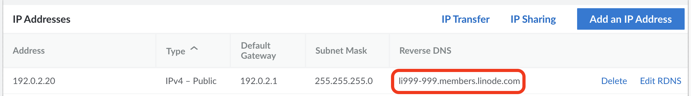
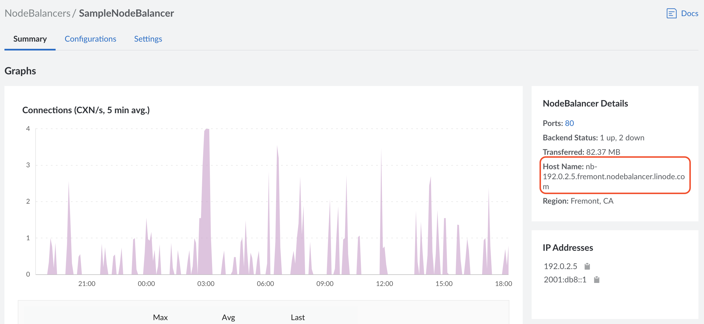

## What are members.linode.com and nodebalancer.linode.com?

All Linode Compute Instances and NodeBalancers are created with a default domain (*forward* DNS address) and a preconfigured rDNS (*reverse* DNS) entry for that domain. These default domains use the following patterns:

-   **Compute Instance:**

        li[signifier].members.linode.com

    (*Example:* `li999-999.members.linode.com`)

-   **NodeBalancer:**

        nb-[ip-address].[region].nodebalancer.linode.com

    (*Example:* `nb-192-0-2-1.dallas.nodebalancer.linode.com`)

Linode Instances and NodeBalancers are accessible at these addresses for testing and other non-production purposes. While it's much more favorable to provide access to these services with a personal or company domain name, it's possible that some users have referenced the default domain within their own workflows, scripts, and applications.

## What's Changing?

Linode is changing the default domain and rDNS entry associated with every Linode Instance and NodeBalancer. This new domain name follows a new pattern, where *[ip-address]* is replaced with the primary public IPv4 address for your server:

-   **Compute Instances and NodeBalancers:**

        [ip-address].ip.linodeusercontent.com

    (*Example:* `192-0-2-1.ip.linodeusercontent.com`)

Note that dashes (**not periods**) separate the values of the IP address.

## What Action Should I Take?

If you *don't* actively use the `members.linode.com` or `nodebalancer.linode.com` forward or reverse DNS in any of your scripts, applications, or domain settings, then this migration does not impact your properties.

If you *do* use your Linode Instance's `members.linode.com` or NodeBalancer's `nodebalancer.linode.com` forward or reverse DNS, please change your scripts, applications, or domain settings to either the new default domain, the IP address of your service, or your own FQDN (fully qualified domain name) if you've configured one for the service. In the future, Linode will end support for `members.linode.com` and `nodebalancer.linode.com`.

### How to Adopt the New Domain Addresses

For forward DNS, all Linodes and NodeBalancers can be accessed at the new address of `[ip-address].ip.linodeusercontent.com` without further configuration. However, you should locate all instances of prior `members.linode.com` or `nodebalancer.linode.com` domain addresses in your codebase, application configuration files, etc., and change them to the new address.

#### Finding a Linode's IP Address

1. In [Cloud Manager](https://cloud.linode.com), select **Linodes** from the navigation menu, then select the Linode for which you'd like to find the IP Address.

1. Under *IP Addresses*, select the top IPv4 address. This is the IP address that you can use with the new forward DNS.

#### Finding a NodeBalancer's IP Address

1. In [Cloud Manager](https://cloud.linode.com), select **NodeBalancers** from the navigation menu, then select the NodeBalancer for which you'd like to find the IP Address.

1. On the right hand of the screen, under *IP Addresses*, note the top IPv4 Address. This is the address you can use to access your NodeBalancer's forward DNS.

#### Finding an Existing members.linode.com Address

To find an existing `members.linode.com` address:

1. In [Cloud Manager](https://cloud.linode.com), select **Linodes** from the navigation menu, then select the Linode for which you'd like to find the domain.

1. Click on the **Network** tab.

1. Under **IP Addresses**, find the Linode Instance's IP address and it's corresponding reverse DNS entry.

    

    The value under reverse DNS is the Linode Instance's current `members.linode.com` address.


If you're following these instructions and do not find a `members.linode.com` address, and instead find an `ip.linodeusercontent.com` address, then your Linode Instance has already been configured to use the new domain.


#### Finding an Existing nodebalancer.linode.com Address

To find an existing `nodebalancer.linode.com` address:

1. In [Cloud Manager](https://cloud.linode.com), select **NodeBalancers** from the navigation menu, then select the NodeBalancer for which you'd like to find the domain.

1. On the **Summary** page, on the right of the page, find the NodeBalancer's Hostname.

    

    This is your NodeBalancer's existing forward DNS.


If you're following these instructions and do not find a `nodebalancer.linode.com` address, and instead find an `ip.linodeusercontent.com` address, then your NodeBalancer has already been configured to use the new domain.


### Updating Reverse DNS

To change a Linode's reverse DNS records, review the [Configure Your Linode for Reverse DNS](/docs/products/compute/compute-instances/guides/configure-rdns/) guide. The new forward DNS records already exist for your Linode's IP, so you can set your Linode's reverse DNS records to match the new name by following the linked guide.
