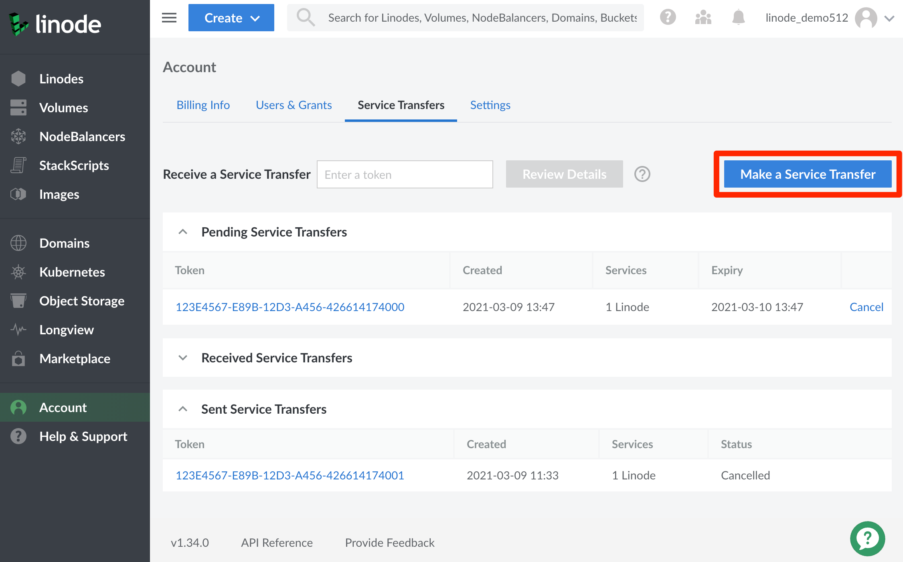
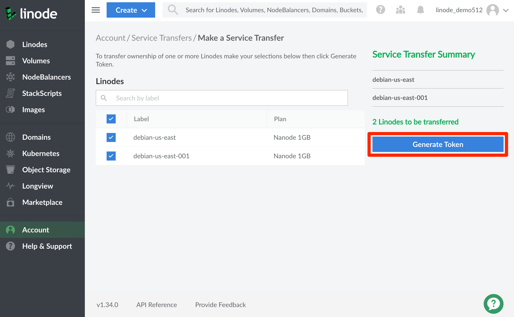
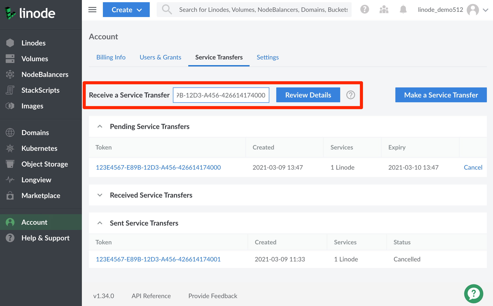
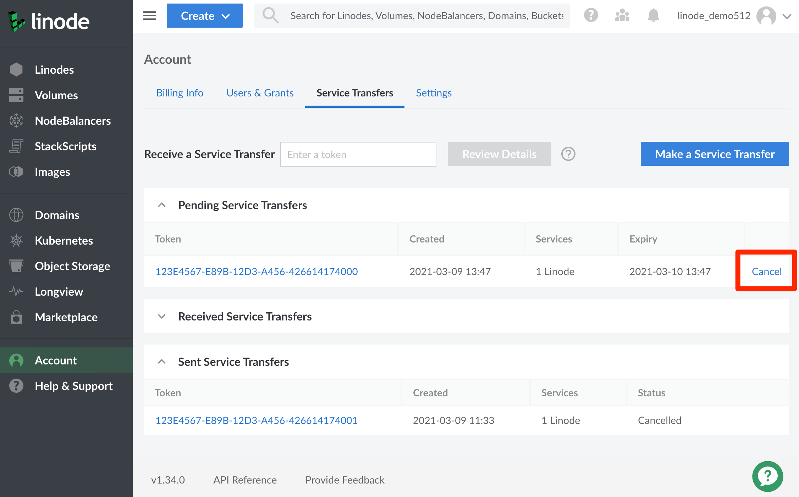

## Linode Service Transfers

The Service Transfer feature in [Cloud Manager](https://cloud.linode.com) can be used to transfer ownership of certain Linode services to another account. Here's how they work:

1. The sending account initiates a transfer by generating a Service Transfer token.

1. The sending account sends the Service Transfer token to the receiving account by email or other method.

1. The receiving account uses the Service Transfer token within 24 hours to accept the transfer between the two accounts.

1. Once completed, billing for transferred services ends for the sending account and begins for the receiving account. Linode services will not experience interruptions due to the transfer process.


Only users with full account access can use Service Transfers. To adjust user permissions, see our [Set User Permissions](/docs/products/platform/accounts/guides/user-permissions/) guide. Users with full account access can view and interact with all of the transfers associated with the account, regardless of which user created or accepted the transfer.


## Sending Linode Services

1. Click the [Account](https://cloud.linode.com/account) link in the sidebar.

1. Click the **Service Transfers** tab on the Account page.

1. Click the **Make a Service Transfer** button on the Service Transfers page to begin.

    

1. Select the services to include in the transfer by checking the empty boxes next to them. Checking the box in the heading for a service type selects all of the services for that type. You can also use the search bar to filter services by label. As you select services, they are added to the **Service Transfer Summary**.

    
Only Linodes are available for transfer at this time.


1. Once you have selected all of the services to include in the transfer, click the **Generate Token** button to submit a transfer request.

    

1. If the request is successful, a summary window appears that contains a Service Transfer token and a sample message to send to the receiving account. A confirmation email is also sent to the sending account with details of the transfer, including the Service Transfer token.

    
Linode does not send the Service Transfer token on your behalf. You must send the token to the receiving account by email or other method.


    
Service Transfers automatically expire 24 hours after creation. You can view the expiry dates of your pending transfers from the [Service Transfers](https://cloud.linode.com/account/service-transfers) page. Dates and times are displayed for your configured timezone, which you can adjust from your [Cloud Manager User Profile](https://cloud.linode.com/profile/display).


    
Backups for Linodes are transferred as well.


    
DNS records that are associated with requested services will not be transferred or updated. Please ensure that associated DNS records have been updated or communicated to the recipient prior to the transfer.


    
Service Transfers cannot be [cancelled](#cancelling-service-transfers) once they have been accepted by a receiving account. Take care when sharing your Service Transfer token, and only transmit it in a secure manner.


1. If the request is unsuccessful, a list of conditions that are blocking the transfer displays on the Service Transfer page. These conditions must be corrected before the transfer can be created, and must be maintained for the transfer to be accepted. Here is a full list of conditions that must be met for a successful transfer request:

    - The sending account must not have a past due balance or active Terms of Service violation.

    - The service must be owned by the sending account.

    - The service must not be assigned to another Service Transfer that is pending or that has been accepted and is
    incomplete.

    - Linodes must not:

        - be assigned to a NodeBalancer, Firewall, or Managed Service.

        - have any attached Block Storage Volumes.

        - have any shared IP addresses.

        - have any assigned /56, /64, or /116 IPv6 ranges.

## Receiving Linode Services

1. Click the [Account](https://cloud.linode.com/account) link in the sidebar.

1. Click the **Service Transfers** tab on the Account page.

1. In the **Receive a Service Transfer** field, enter the Service Transfer token you have received from the sender and click the **Review Details** button.

    

1. If the services are eligible for transfer, you are prompted to confirm responsibility for billing associated with those services. Billing begins for the receiving account after the transfer has been completed. Confirm billing responsibility and click **Accept Transfer** to begin transfer of services to your account. A confirmation email is sent to both the sending and receiving accounts.

    
Service Transfers can take up to 3 hours to complete once accepted. Another confirmation email is sent to both the sending and receiving accounts once the transfer has been completed. If the transfer fails after being accepted, the sending account must initiate a new Service Transfer.


1. If there are any conditions in place that are blocking the transfer, they are displayed on the Service Transfer page. These conditions must be corrected by the sending or receiving account as is applicable before the transfer can be accepted. Here is a full list of conditions that must be met for a successful transfer request:

    - Only pending transfers can be accepted. A transfer cannot be accepted if it has expired or been cancelled.

    - The receiving account must have a registered payment method and must not have a past due balance or other account limitations making it ineligible to own the transferred services.

    - Both the sending and receiving accounts must not have any active Terms of Service violations.

    - The service must still be owned by the sending account.

    - Linodes must not:

        - be assigned to a NodeBalancer, Firewall, or Managed Service.

        - have any attached Block Storage Volumes.

        - have any shared IP addresses.

        - have any assigned /56, /64, or /116 IPv6 ranges.


When receiving Linode transfers, it is important to make sure that **Any Longview Key** is fully revoked and removed from the received Linode by removing the Longview agent. If Client keys are not revoked and removed, this can give the transferring user access to all data visible to any Longview client by using the pre-existing API key, even after the transfer has been completed. Users will not be informed by default if the received Linode has a Longview key installed, and should always follow the process for removing the Longview agent to be sure.

For more information on revoking and removing a Longview key and uninstalling the Longview agent, see our [Documentation on Uninstalling Longview](/docs/guides/what-is-longview/#uninstall-the-longview-client).


## Cancelling Service Transfers


Only the sending account can cancel a Service Transfer. Once accepted, a transfer cannot be cancelled.



Cancellations are irreversible. Once cancelled, you must start a new Service Transfer if you still wish to send those services.


1. Click the [Account](https://cloud.linode.com/account) link in the sidebar.

1. Click the **Service Transfers** tab on the Account page.

1. Under **Pending Service Transfers**, locate the transfer you wish to cancel, click the corresponding **Cancel** button, and confirm the cancellation. A confirmation email is sent to the sending account.

    
