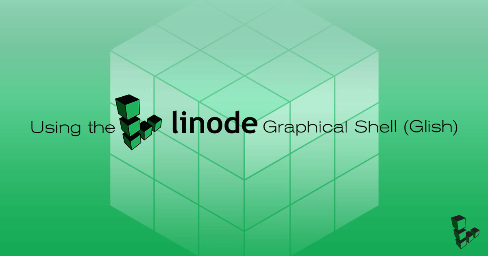
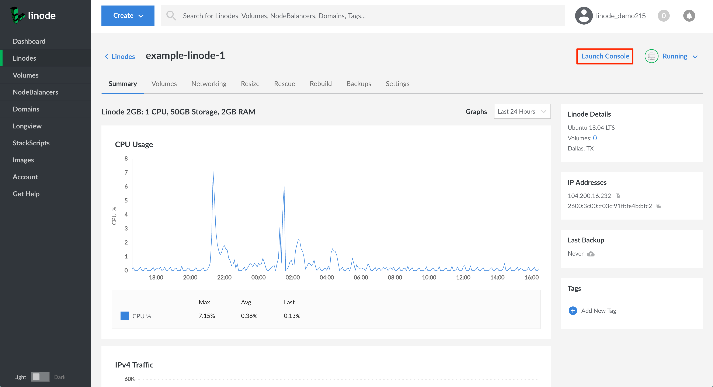
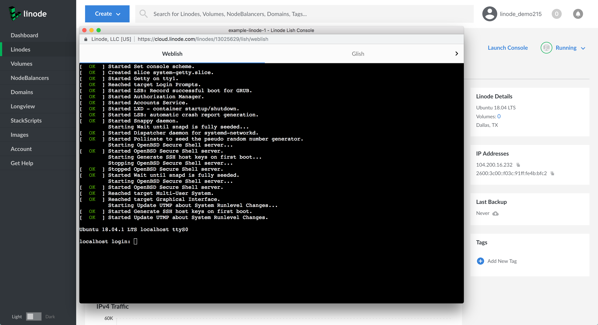
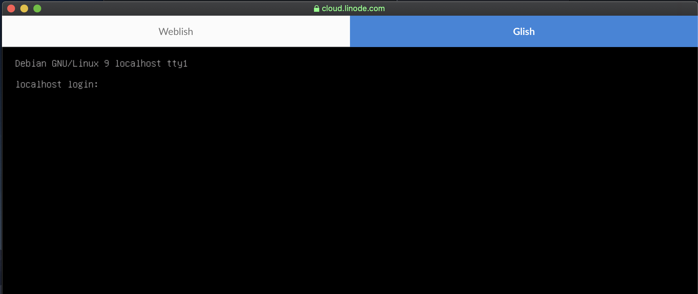
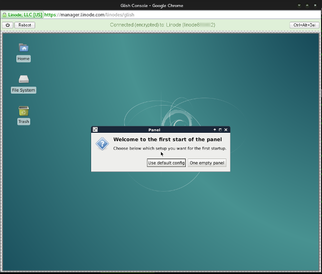

Glish is the graphical version of the [Linode Shell](/docs/platform/manager/using-the-linode-shell-lish/) (Lish). It allows you to use a graphic environment running natively on your Linode's operating system.


Linode base distribution images do not have graphic environments installed. You will need to install one, or use a [Custom Distro](/docs/tools-reference/custom-kernels-distros/custom-distro-on-kvm-linode/) with a graphic environment pre-installed.

Glish is only available on KVM Linodes.


## Enable Glish on a Linode-Supplied Image

Ensure that your Linode is booted with the latest Linode kernel, which has mouse drivers enabled. You may need to reboot to access the latest kernel version.

When using one of Linode's distribution templates with Distro Helper turned on, Glish accesses the `tty1` console over the virtual VGA device. If you aren't using Distro Helper, or haven't rebooted since Glish was released, manually launch a getty on `tty1`:

    exec /sbin/getty -8 38400 tty1 &


The process for launching a getty may differ depending on your distribution.


## Access Glish

1. Log in to the [Linode Cloud Manager](https://cloud.linode.com).
2. Click on the Linodes link in the sidebar and select the desired Linode.
3. Click on the **Launch Console** link in the top right-hand corner of the Manager.

    

4. The Lish Web Console window appears with your Linode's console, as shown below.

    

5. Select the **Glish** tab.

    

1.  Update and upgrade the Linux distribution’s packages. For this Debian example Linode, the command is:

        sudo apt-get update && sudo apt-get upgrade

6.  You will need to install a desktop environment. On our Debian example Linode, we're using Xfce4:

        sudo apt-get install xfce4

7.  After installation, launch your desktop environment from the Glish console:

        sudo startxfce4

    
